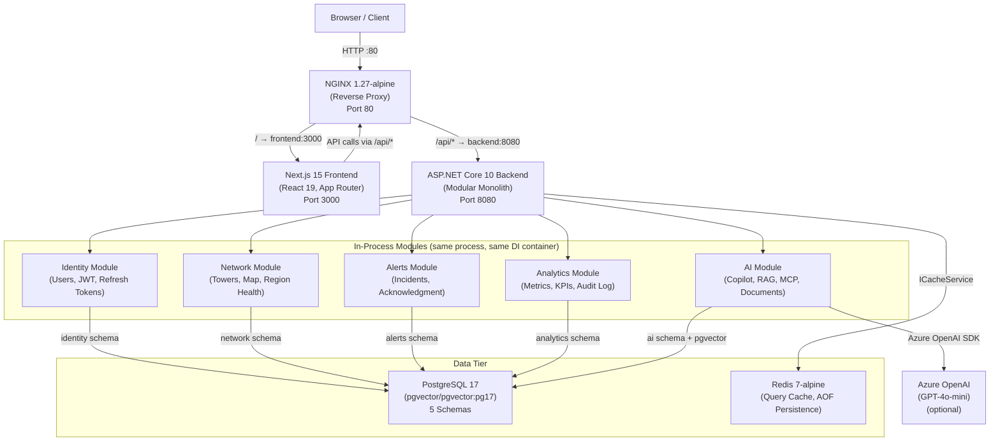
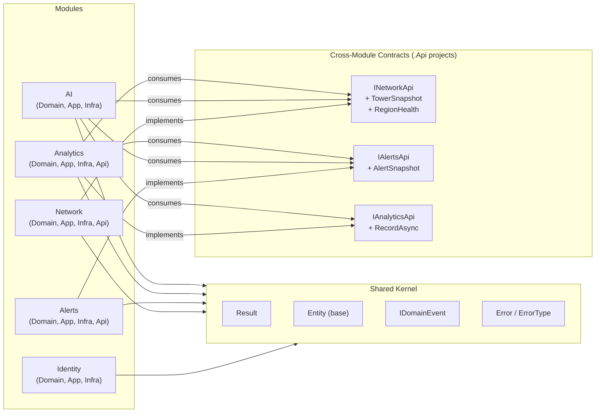
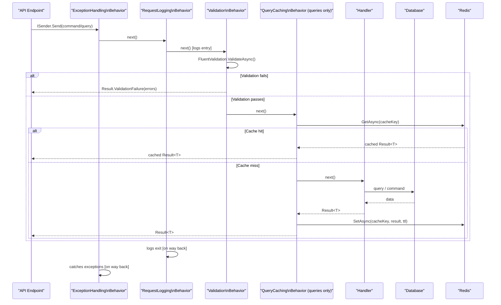
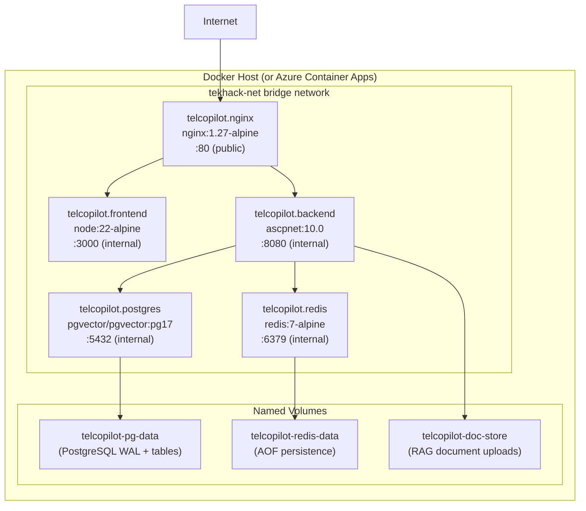

# System Architecture

This document describes TelcoPilot's high-level architecture, the rationale for the modular monolith pattern, module communication strategies, and the complete system topology illustrated with Mermaid diagrams.

---

## High-Level Architecture Overview

TelcoPilot is structured as a **modular monolith** with a clear separation between the presentation tier (Next.js frontend), the API gateway (NGINX), the application tier (ASP.NET Core backend), and the data tier (PostgreSQL + Redis).

The central architectural commitment is that all five backend modules — Identity, Network, Alerts, Analytics, and AI — run in the same process, share the same HTTP lifecycle, and communicate in-process via MediatR and strongly-typed cross-module API contracts. This is intentional and load-bearing.

---

## Modular Monolith: Why Not Microservices?

The choice of a modular monolith over microservices is a deliberate architectural decision, not a limitation. The reasoning is specific to TelcoPilot's design constraints:

### In-Process MediatR is the Contract

TelcoPilot's pipeline behaviors — ExceptionHandling, Logging, Validation, and QueryCaching — are applied uniformly to every command and query through MediatR's `IPipelineBehavior<TRequest, TResponse>` chain. This works because every handler is resolved from the same DI container in the same process. Splitting into microservices would require each module to either replicate these behaviors or introduce a distributed middleware layer, adding complexity with no benefit at the current scale.

### Shared Transaction Boundary

The Analytics module records an audit entry as part of the same logical operation as the AI module's Copilot response. In `AskCopilotCommandHandler`, the ChatLog is saved and `analytics.RecordAsync()` is called within the same handler — they share the same HTTP request scope. Making this a distributed operation would require two-phase commit or eventual consistency patterns for what is a single logical operation.

### Cross-Module API Contracts Without HTTP Hops

Modules communicate through strongly-typed contracts registered in the DI container:
- `INetworkApi` — exposes `ListTowersAsync`, `ListByRegionAsync`, `GetByCodeAsync`, `GetRegionHealthAsync`
- `IAlertsApi` — exposes `ListActiveAsync`, `ListAllAsync`
- `IAnalyticsApi` — exposes `RecordAsync` (audit entry recording)

These contracts are implemented in each module's `.Infrastructure` project and injected wherever needed. The AI module's `DiagnosticsSkill` calls `INetworkApi.ListByRegionAsync()` — this is a direct method call, not an HTTP request. The latency is sub-millisecond. Splitting into microservices would turn this into a network call, adding latency, requiring service discovery, and introducing partial failure modes.

### Clear Path to Microservices If Needed

The modular structure is designed so that any single module can be extracted into an independent service when operational load demands it. Each module has its own:
- Domain layer (entities, value objects, domain events)
- Application layer (commands, queries, validators)
- Infrastructure layer (DbContext, repositories, seeders)
- API contract (`.Api` project with interfaces and snapshot types)

Extraction requires replacing the in-process interface implementation with an HTTP or gRPC client, updating the DI registration in the consuming module, and splitting the deployment. The application-layer code in consuming modules does not change — they still call `INetworkApi.ListByRegionAsync()`.

---

## Module Boundaries and Communication Patterns

**Key rule**: modules never reference each other's Domain or Application projects directly. Communication is exclusively through the `.Api` contract interfaces. This enforces the boundary — a module's internal entities are never exposed to other modules. Only the read-only snapshot types (`TowerSnapshot`, `AlertSnapshot`) cross the boundary.

---

## Request Lifecycle Through the Pipeline

Every command and query flows through a four-stage MediatR pipeline before reaching the handler:

**Important note on QueryCachingBehavior**: it is only registered for requests that implement `ICachedQuery`. Commands do not implement this interface and therefore skip the cache stage. The ordering of behaviors matters: ExceptionHandling must be outermost so it catches exceptions thrown anywhere in the chain; Logging wraps the full operation including validation and cache time; Validation must run before the handler to prevent invalid requests from reaching the database.

---

## Full Container Topology

---

## Key Architectural Decisions and Trade-offs

| Decision | Choice | Rationale | Trade-off |
|---|---|---|---|
| **Architecture pattern** | Modular monolith | In-process MediatR, shared transaction boundary, simpler ops | Single scaling unit; extraction needed if modules diverge in load profile |
| **API gateway** | NGINX | Battle-tested, zero-config for this topology, single upstream invariant | Not cloud-native load balancer; production would add Azure Front Door or AGIC |
| **Database** | Single PostgreSQL instance, 5 schemas | Schema isolation without cross-service joins; pgvector available natively | Not physically isolated; schema ownership conventions must be respected |
| **Caching** | Redis with ICachedQuery marker interface | Consistent opt-in caching without handler modifications | Cache invalidation is TTL-based; write-through not implemented |
| **JWT strategy** | Stateless access + rotating refresh | Stateless scales horizontally; rotation limits token theft window | No server-side session revocation (short-lived access tokens compensate) |
| **AI provider abstraction** | ICopilotOrchestrator | Zero-cost demo mode; provider swap without redeployment | MockOrchestrator doesn't exercise the full LLM reasoning path |
| **Database migrations** | EnsureCreatedAsync + seeders | Fast demo startup; no migration tooling required | Not suitable for production schema evolution; EF migrations required for prod |
| **Event bus** | In-memory (InMemoryMessageQueue) | No external dependency for integration events | Events lost on process restart; production requires durable bus (Azure Service Bus) |
