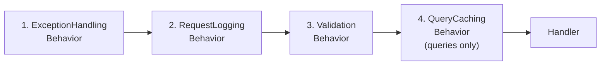
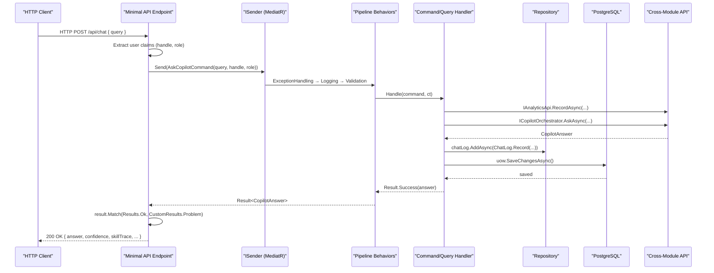

# Backend Architecture

This document describes the internal structure of TelcoPilot's ASP.NET Core backend: module layout, CQRS with MediatR, the pipeline behavior chain, the Result<T> pattern, domain events, cross-module API contracts, and dependency injection wiring.

---

## Module Layout Pattern

Each of TelcoPilot's five modules follows the same four-layer structure. This is not a convention — it is enforced by the project reference graph. No layer can reference a layer above it.

```
Modules/
└── {ModuleName}/
    ├── Modules.{ModuleName}.Domain/          ← Entities, value objects, domain events, repository interfaces
    ├── Modules.{ModuleName}.Api/             ← Cross-module contract interfaces + snapshot DTOs (no domain types)
    ├── Modules.{ModuleName}.Application/     ← Commands, queries, validators, DI registration
    └── Modules.{ModuleName}.Infrastructure/  ← DbContext, repositories, seeders, external service adapters
```

**Domain** contains pure domain objects: entities (inheriting `Entity` from SharedKernel), domain events (implementing `IDomainEvent`), and repository interfaces. It has no dependencies outside of SharedKernel.

**Api** contains the cross-module contract — the interface that other modules see — and snapshot record types that carry only the data that crosses the boundary. For example, `INetworkApi` exposes `ListTowersAsync()` returning `IReadOnlyList<TowerSnapshot>`. No domain entity (`Tower`) ever crosses a module boundary.

**Application** contains MediatR commands and queries, their handlers, FluentValidation validators, and the `DependencyInjection.cs` extension method that registers everything with the DI container.

**Infrastructure** contains the EF Core `DbContext`, entity configurations, repository implementations, seeders, and adapters for external dependencies (Azure OpenAI, Redis, etc.). It is the only layer that touches the database or external services.

---

## CQRS Pattern with MediatR

TelcoPilot uses CQRS (Command Query Responsibility Segregation) exclusively via MediatR. Every operation is either a command (mutates state, returns `Result` or `Result<T>`) or a query (reads state, returns `Result<T>`).

### Command and Query Abstractions

```csharp
// Commands — change state
public interface ICommand : IRequest<Result> { }
public interface ICommand<TResponse> : IRequest<Result<TResponse>> { }

// Queries — read state
public interface IQuery<TResponse> : IRequest<Result<TResponse>> { }

// Cached queries — a query that opts into Redis caching
public interface ICachedQuery<TResponse> : IQuery<TResponse>
{
    string CacheKey { get; }
    TimeSpan? Expiration { get; }
}
```

**Why separate interfaces?** The `ICachedQuery<T>` marker interface is detected by `QueryCachingPipelineBehavior` via the generic type constraint `where TRequest : ICachedQuery`. Commands can never accidentally be cached — the behavior is not registered for `ICommand`.

### Example: GetMapQuery

```csharp
// Query definition (Network module)
public sealed record GetMapQuery : IQuery<MapResponse>, ICachedQuery<MapResponse>
{
    public string CacheKey => "map:lagos";
    public TimeSpan? Expiration => TimeSpan.FromSeconds(15);
}

// Handler
internal sealed class GetMapQueryHandler(INetworkApi network)
    : IQueryHandler<GetMapQuery, MapResponse>
{
    public async Task<Result<MapResponse>> Handle(GetMapQuery request, CancellationToken ct)
    {
        var towers = await network.ListTowersAsync(ct);
        var regions = await network.GetRegionHealthAsync(ct);
        return Result.Success(new MapResponse(towers, regions, towers.Count, ...));
    }
}
```

### Example: AskCopilotCommand

```csharp
// Command definition (AI module)
public sealed record AskCopilotCommand(string Query, string ActorHandle, string ActorRole)
    : ICommand<CopilotAnswer>;

// Handler — orchestrates AI + audit + persistence
internal sealed class AskCopilotCommandHandler(
    ICopilotOrchestrator orchestrator,
    IChatLogRepository chatLog,
    IUnitOfWork uow,
    IAnalyticsApi analytics,
    ILogger<AskCopilotCommandHandler> logger)
    : ICommandHandler<AskCopilotCommand, CopilotAnswer>
{
    public async Task<Result<CopilotAnswer>> Handle(AskCopilotCommand request, CancellationToken ct)
    {
        // 1. Call the AI orchestrator
        CopilotAnswer answer = await orchestrator.AskAsync(request.Query, request.ActorRole, ct);
        // 2. Persist the chat log
        await chatLog.AddAsync(ChatLog.Record(...), ct);
        await uow.SaveChangesAsync(ct);
        // 3. Record audit entry cross-module
        await analytics.RecordAsync(actor: request.ActorHandle, ...);
        return Result.Success(answer);
    }
}
```

---

## Pipeline Behaviors Chain

The four pipeline behaviors are registered in `Application/DependencyInjection.cs` in a specific order. MediatR resolves them as a chain — the first registered is the outermost wrapper.



### 1. ExceptionHandlingPipelineBehavior

Catches any unhandled exception thrown by the inner chain. Returns `Result.Failure(Error.Problem(...))` instead of allowing the exception to propagate to the `GlobalExceptionHandler`. This ensures that even a `DbException` from EF Core surfaces as a structured `Result` rather than an unhandled 500.

### 2. RequestLoggingPipelineBehavior

Logs `Request {RequestName} started` on entry and `Request {RequestName} completed in {ElapsedMs}ms` on exit using Serilog. Because it wraps the validation and handler, the elapsed time includes the full operation including database I/O. Structured log properties include the request type name and elapsed milliseconds for query performance monitoring.

### 3. ValidationPipelineBehavior

Resolves all registered `IValidator<TRequest>` implementations from the DI container and runs them concurrently via `Task.WhenAll`. If any validation fails, it short-circuits and returns `Result.ValidationFailure(validationError)` without calling the handler. Uses reflection to invoke the correct `Result<T>.ValidationFailure` static factory for generic result types.

### 4. QueryCachingPipelineBehavior

Only engaged for requests implementing `ICachedQuery<TResponse>`. On entry, attempts to deserialise the cached result from Redis using the query's `CacheKey`. On cache miss, calls the handler and — if the result is successful — stores it in Redis with the query's `Expiration`. Failed results are never cached.

**Cached queries and their TTLs:**
- `GetMapQuery` — key `"map:lagos"`, TTL 15 seconds
- `GetMetricsQuery` — cached with a configurable TTL

---

## Result<T> Monad Pattern

All operations in TelcoPilot's backend — from handlers to domain methods — return `Result` or `Result<T>`. This eliminates uncaught exceptions as a control flow mechanism.

```csharp
// Non-generic: operation either succeeds or carries an Error
public class Result
{
    public bool IsSuccess { get; }
    public bool IsFailure => !IsSuccess;
    public Error Error { get; }

    public static Result Success() => new(true, Error.None);
    public static Result Failure(Error error) => new(false, error);
}

// Generic: success carries a value; failure carries an Error
public class Result<TValue> : Result
{
    public TValue Value => IsSuccess ? _value! 
        : throw new InvalidOperationException("...");

    public static implicit operator Result<TValue>(TValue? value)
        => value is not null ? Success(value) : Failure(Error.NullValue);
}
```

### Error Types

`Error` carries a `Code` (machine-readable), `Description` (human-readable), and `Type` (ErrorType enum: NotFound, Problem, Validation, Conflict, Unauthorized). The `ResultExtensions.Match()` extension method translates `Result<T>` to an HTTP response:

```csharp
// Endpoint usage
Result<LoginResponse> result = await sender.Send(new LoginCommand(...));
return result.Match(Results.Ok, CustomResults.Problem);
```

`CustomResults.Problem` maps `ErrorType` to HTTP status codes:
- `NotFound` → 404
- `Validation` → 400 with validation detail
- `Conflict` → 409
- `Unauthorized` → 401
- `Problem` → 500

---

## Domain Events Pattern

Domain entities raise events by calling `RaiseDomainEvent()` (inherited from `Entity` in SharedKernel). Events implement `IDomainEvent`. The infrastructure `UnitOfWork.SaveChangesAsync()` dispatches domain events via `IPublisher` (MediatR) after the database write completes.

```csharp
// Domain entity raises an event
public static Result<User> Create(string email, ...)
{
    var user = new User(email, ...);
    user.RaiseDomainEvent(new UserCreatedDomainEvent(user.Id));
    return user;
}

// Domain event
public sealed record UserCreatedDomainEvent(Guid UserId) : IDomainEvent;
```

Integration events (cross-process) are handled separately by `IEventBus` and the `IntegrationEventProcessorJob` background service, which drains an in-memory queue. In production this would be replaced with Azure Service Bus.

---

## Cross-Module API Contracts

The `.Api` project for each module is the only point of public surface area that other modules can reference. This is enforced by the project reference graph.

### INetworkApi

```csharp
public interface INetworkApi
{
    Task<IReadOnlyList<TowerSnapshot>> ListTowersAsync(CancellationToken ct = default);
    Task<IReadOnlyList<TowerSnapshot>> ListByRegionAsync(string region, CancellationToken ct = default);
    Task<TowerSnapshot?> GetByCodeAsync(string code, CancellationToken ct = default);
    Task<IReadOnlyList<RegionHealth>> GetRegionHealthAsync(CancellationToken ct = default);
}

// Read-only snapshot — no domain types cross the boundary
public sealed record TowerSnapshot(
    string Code, string Name, string Region,
    double Lat, double Lng, double MapX, double MapY,
    int SignalPct, int LoadPct, string Status, string? Issue);
```

### IAlertsApi

```csharp
public interface IAlertsApi
{
    Task<IReadOnlyList<AlertSnapshot>> ListActiveAsync(CancellationToken ct = default);
    Task<IReadOnlyList<AlertSnapshot>> ListAllAsync(CancellationToken ct = default);
}
```

### IAnalyticsApi

```csharp
public interface IAnalyticsApi
{
    Task RecordAsync(string actor, string role, string action, 
                     string target, string sourceIp, CancellationToken ct = default);
}
```

Each contract is implemented in the corresponding module's Infrastructure layer and registered in its `DependencyInjection.cs`. Consumers receive the interface through constructor injection — they never reference the concrete implementation.

---

## CQRS Flow Diagram



---

## Module Dependency Graph

```mermaid
graph TD
    WebApi["Web.Api\n(ASP.NET Core host)"]
    App["Application\n(shared abstractions, pipeline behaviors)"]
    Infra["Infrastructure\n(shared Redis, EventBus)"]
    SK["SharedKernel\n(Result, Entity, Error, IDomainEvent)"]

    IdentityApp["Identity.Application"]
    IdentityInfra["Identity.Infrastructure"]
    IdentityDomain["Identity.Domain"]

    NetworkApp["Network.Application"]
    NetworkInfra["Network.Infrastructure"]
    NetworkDomain["Network.Domain"]
    NetworkApi["Network.Api\n(INetworkApi)"]

    AlertsApp["Alerts.Application"]
    AlertsInfra["Alerts.Infrastructure"]
    AlertsDomain["Alerts.Domain"]
    AlertsApi["Alerts.Api\n(IAlertsApi)"]

    AnalyticsApp["Analytics.Application"]
    AnalyticsInfra["Analytics.Infrastructure"]
    AnalyticsDomain["Analytics.Domain"]
    AnalyticsApi["Analytics.Api\n(IAnalyticsApi)"]

    AiApp["AI.Application\n(ICopilotOrchestrator, RAG, MCP interfaces)"]
    AiInfra["AI.Infrastructure\n(SemanticKernel, pgvector, MCP plugins)"]
    AiDomain["AI.Domain"]

    WebApi --> App
    WebApi --> Infra
    WebApi --> IdentityApp
    WebApi --> IdentityInfra
    WebApi --> NetworkApp
    WebApi --> NetworkInfra
    WebApi --> AlertsApp
    WebApi --> AlertsInfra
    WebApi --> AnalyticsApp
    WebApi --> AnalyticsInfra
    WebApi --> AiApp
    WebApi --> AiInfra

    IdentityApp --> IdentityDomain
    IdentityApp --> SK
    IdentityApp --> App
    IdentityInfra --> IdentityApp
    IdentityInfra --> IdentityDomain

    NetworkApp --> NetworkDomain
    NetworkApp --> NetworkApi
    NetworkApp --> SK
    NetworkApp --> App
    NetworkInfra --> NetworkApp
    NetworkInfra --> NetworkDomain
    NetworkInfra --> NetworkApi

    AlertsApp --> AlertsDomain
    AlertsApp --> AlertsApi
    AlertsApp --> SK
    AlertsApp --> App
    AlertsInfra --> AlertsApp
    AlertsInfra --> AlertsDomain
    AlertsInfra --> AlertsApi

    AnalyticsApp --> AnalyticsDomain
    AnalyticsApp --> AnalyticsApi
    AnalyticsApp --> SK
    AnalyticsApp --> App
    AnalyticsApp --> NetworkApi
    AnalyticsApp --> AlertsApi
    AnalyticsInfra --> AnalyticsApp

    AiApp --> AiDomain
    AiApp --> SK
    AiApp --> App
    AiApp --> NetworkApi
    AiApp --> AlertsApi
    AiApp --> AnalyticsApi
    AiInfra --> AiApp
    AiInfra --> AiDomain
    AiInfra --> NetworkApi
    AiInfra --> AlertsApi
```



---

## Dependency Injection Wiring

Each module registers its own dependencies via extension methods on `IServiceCollection`. The Web.Api `Program.cs` chains them:

```csharp
builder.Services
    .AddApplication()          // Shared pipeline behaviors, MediatR scan
    .AddInfrastructure(config) // Redis, EventBus, DateTimeProvider
    .AddIdentityApplication()
    .AddIdentityInfrastructure(config)  // IdentityDbContext, BCryptHasher, JwtTokenService
    .AddNetworkApplication()
    .AddNetworkInfrastructure(config)   // NetworkDbContext, NetworkApi impl
    .AddAlertsApplication()
    .AddAlertsInfrastructure(config)    // AlertsDbContext, AlertsApi impl
    .AddAnalyticsApplication()
    .AddAnalyticsInfrastructure(config) // AnalyticsDbContext, AnalyticsApi impl
    .AddAiApplication()
    .AddAiInfrastructure(config);       // AiDbContext, SK Kernel, pgvector, MCP, RAG
```

**Lifetime conventions:**
- `DbContext` — scoped (one per HTTP request)
- `Repository` — scoped (same lifetime as DbContext)
- `IUnitOfWork` — scoped
- `ICopilotOrchestrator` — scoped (SK Kernel is scoped because DiagnosticsSkill injects INetworkApi which is scoped)
- `IEmbeddingGenerator` — singleton (stateless, expensive to initialise for AzureOpenAiEmbeddingGenerator)
- `NpgsqlDataSource` — singleton (connection pool owner)
- `ICacheService` — singleton (Redis connection is reused)
