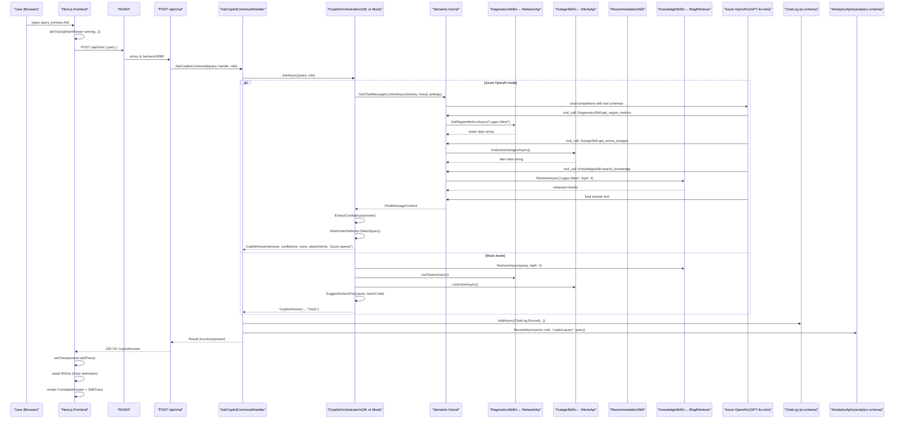

# AI and Intelligence Architecture

This document provides a deep dive into TelcoPilot's AI layer: the orchestrator abstraction, Semantic Kernel configuration, the five Kernel plugins, the RAG knowledge pipeline, the MCP plugin architecture, MockCopilotOrchestrator design, the SkillTrace mechanism, and the extensibility path.

---

## ICopilotOrchestrator Abstraction

The entire AI layer is hidden behind a single interface in `Modules.Ai.Application`:

```csharp
public interface ICopilotOrchestrator
{
    Task<CopilotAnswer> AskAsync(string query, string userRole, CancellationToken ct = default);
}

public sealed record CopilotAnswer(
    string Answer,
    double Confidence,
    IReadOnlyList<SkillTraceEntry> SkillTrace,
    IReadOnlyList<string> Attachments,
    string Provider);

public sealed record SkillTraceEntry(
    string Skill,
    string Function,
    int DurationMs,
    string Status);
```

**Why this abstraction matters:**
- The `AskCopilotCommandHandler` depends on `ICopilotOrchestrator`, not on any concrete AI provider
- Switching between Mock and Azure OpenAI is a DI registration swap — no handler code changes
- The `Provider` field in `CopilotAnswer` lets the frontend display which orchestrator served the response
- The `SkillTrace` field is populated by both orchestrators, making the frontend skill trace animation provider-agnostic

---

## SemanticKernelOrchestrator: Deep Dive

The `SemanticKernelOrchestrator` is the production AI orchestrator, registered when `Ai__Provider=AzureOpenAi` and valid credentials are provided.

### System Prompt Design

The system prompt is constructed dynamically, embedding the caller's role:

```csharp
string systemPrompt = $"""
You are TelcoPilot, an AI assistant embedded in MTN Nigeria Network Operations Center
for a Lagos, Nigeria metro carrier. The user is an {userRole} (engineer, manager, or admin).

You have these plugins available — call them as needed before composing the answer:
  - DiagnosticsSkill   : live tower & region metrics (signal, load, status, issue)
  - OutageSkill        : active and recent incidents (severity, root-cause, subs affected)
  - RecommendationSkill: operator runbook playbooks (3 concrete actions per cause class)
  - KnowledgeSkill     : RAG over historical incident reports, outage summaries, engineering
                         SOPs, tower performance trends, alert history.
  - InternalToolsSkill : MCP-style internal tools — get_network_metrics, get_outages,
                         analyze_latency, find_best_connectivity.

Response Format:
ROOT CAUSE
<2-3 sentences identifying the most likely cause, citing specific data and any KB sources>

AFFECTED
<bullet list of 2-4 items: regions, tower IDs, subscriber counts>

RECOMMENDED ACTIONS
<numbered list of 3 concrete actions>

CONFIDENCE
<single number 0-100 followed by " %" and a one-line justification>
""";
```

**Why the role is embedded**: The system prompt tailors the response depth to the caller's role. An engineer gets technical tower IDs and specific runbook steps; a manager gets higher-level impact framing. The same LLM call produces contextually appropriate answers for different audiences.

**Why the response format is enforced**: The ROOT CAUSE / AFFECTED / RECOMMENDED ACTIONS / CONFIDENCE structure maps directly to the incident report format expected by NOC management and compliance systems. The frontend's `FormattedAnswer` component parses this structure to apply visual styling — section headers are rendered as small-caps labels, tower codes (TWR-*) and incident IDs (INC-*) are highlighted with accent colour backgrounds, and confidence percentages are displayed in warning orange.

### Automatic Function Calling

```csharp
OpenAIPromptExecutionSettings settings = new()
{
    FunctionChoiceBehavior = FunctionChoiceBehavior.Auto(),
    Temperature = 0.2,
};
```

`FunctionChoiceBehavior.Auto()` instructs Semantic Kernel to expose the JSON schema of all registered Kernel plugins to the model. The model then autonomously decides which functions to call, in what order, and with what arguments — before composing the final answer.

This is agentic reasoning: the model is not prompted with "call DiagnosticsSkill first, then OutageSkill." It receives the query, the available tools, and decides the tool invocation chain itself. For a query like *"Why is Lagos West slow?"*, the model may invoke:
1. `DiagnosticsSkill.get_region_metrics("Lagos West")` — get live tower state
2. `OutageSkill.get_outages_in_region("Lagos West")` — get active incidents
3. `RecommendationSkill.suggest_actions("fiber_cut", "TWR-LAG-W-014")` — get runbook steps
4. `KnowledgeSkill.search_knowledge("Lagos West fiber cut")` — retrieve historical context

### SkillTrace Recovery

After the LLM call completes, the orchestrator walks the ChatHistory to recover which functions were actually invoked:

```csharp
foreach (ChatMessageContent msg in history)
{
    if (msg.Role == AuthorRole.Tool && msg.AuthorName is { } fn)
    {
        string[] parts = fn.Split('-', 2);
        string skill = parts.Length == 2 ? parts[0] : "Skill";
        string func  = parts.Length == 2 ? parts[1] : fn;
        trace.Add(new SkillTraceEntry(skill, func, 200, "done"));
    }
}
```

If the model answered without calling any tool, a synthetic `IntentParser.parseQuery` trace entry is added — the UI always renders at least one trace entry. A final `LlmComposer.compose` entry with the actual elapsed milliseconds for the LLM call is always appended.

### Confidence Extraction

```csharp
internal static double ExtractConfidence(string answer)
{
    int idx = answer.IndexOf("CONFIDENCE", StringComparison.OrdinalIgnoreCase);
    // ... parses the number before "%" in the CONFIDENCE section
    return int.TryParse(slice, out int n) ? Math.Clamp(n / 100.0, 0, 1) : 0.85;
}
```

The confidence score is extracted from the model's free-text response using the known format from the system prompt (`<n> %`). If parsing fails (model deviated from format), the default is 0.85 — a conservative but not alarming fallback.

---

## The Five Kernel Plugins

### DiagnosticsSkill

Surfaces live network data to the LLM. Calls `INetworkApi` — the in-process cross-module contract.

| Function | Description | Arguments |
|---|---|---|
| `get_region_metrics` | Current signal, load, and status for every tower in a named region | `region: string` (e.g. "Lagos West", "Lekki") |
| `get_tower_metrics` | Diagnostic snapshot for a single tower by code | `towerCode: string` (e.g. "TWR-LEK-003") |

**Why this is powerful**: The LLM never queries the database directly. All data goes through `INetworkApi`, which is backed by `NetworkDbContext` with the Redis cache layer. A question about Lekki gets the same cached tower state that the map page would show — there is no AI-specific data path.

### OutageSkill

Surfaces alert and incident data to the LLM. Calls `IAlertsApi`.

| Function | Description | Arguments |
|---|---|---|
| `get_active_outages` | All currently active or under-investigation incidents | none |
| `get_outages_in_region` | Active and recent outages limited to a specific region | `region: string` |

### RecommendationSkill

Emits operator playbooks. Pure business logic — no database queries. Maps a root-cause classification to a numbered list of three concrete actions aligned with MTN Nigeria's NOC runbooks.

| Function | Description | Arguments |
|---|---|---|
| `suggest_actions` | 3 concrete actions for a root-cause class | `rootCause: string`, `towerCode: string` |

Root-cause classes handled: `fiber`, `power`/`grid`, `congest`/`load`, `thermal`/`predict`. Any unrecognised class triggers a generic P2 ticket workflow.

### KnowledgeSkill

RAG retrieval from the pgvector knowledge base. Calls `IRagRetriever.RetrieveAsync()`.

| Function | Description | Arguments |
|---|---|---|
| `search_knowledge` | Semantic search over historical incident reports, SOPs, tower performance history | `query: string`, `topK: int` |

The system prompt instructs the model to call `search_knowledge` for questions like *"has this happened before?"*, *"what's the runbook?"*, or *"why is X slow?"* — queries that benefit from historical context beyond live telemetry.

### InternalToolsSkill

MCP-style structured tool wrappers. Dispatches through MediatR to `ToolQuery` handlers that call the cross-module APIs.

| Function | Description |
|---|---|
| `get_network_metrics` | Structured numeric summary of tower fleet metrics |
| `get_outages` | Active outage list in structured format |
| `analyze_latency` | Latency analysis for a region |
| `find_best_connectivity` | Identifies towers with best signal in a given area |

---

## MockCopilotOrchestrator: Design and Value

The `MockCopilotOrchestrator` is not a stub that returns hardcoded text. It is a fully functional deterministic orchestrator that:

1. **Calls `IRagRetriever.RetrieveAsync(query, topK: 4)`** — hits the real pgvector knowledge base
2. **Calls `INetworkApi.ListTowersAsync()`** — gets live tower state from the network module
3. **Calls `IAlertsApi.ListActiveAsync()`** — gets real active alerts from the alerts module
4. **Synthesises a structured answer** based on the highest-severity active alert, incorporating real tower telemetry and RAG hits
5. **Generates a real SkillTrace** with measured `DurationMs` for each step

The key distinction: only the LLM call is mocked. Everything else — data retrieval, RAG pipeline, skill trace — is real. This means the demo in Mock mode is not fake; it shows real network state and real historical context. The only difference from Azure OpenAI mode is that the answer synthesis logic is deterministic (cause-based switch expression) rather than LLM-generated.

**Why this matters for a demo**: Azure OpenAI has a cost per token. A hackathon demo with multiple judges running queries could accumulate non-trivial API charges. Mock mode eliminates this risk entirely while maintaining full UI fidelity. Judges see the SkillTrace animation, the structured answer format, and the attachment suggestions — all identical to what Azure OpenAI mode produces.

**Fallback intelligence in Mock mode:**

```csharp
// Picks the highest-severity active alert as the focal incident
AlertSnapshot? focal = active
    .OrderByDescending(a => SeverityRank(a.Severity))
    .ThenByDescending(a => a.SubscribersAffected)
    .FirstOrDefault();

// Maps cause class to runbook actions
string actions = focal.Cause switch
{
    var x when x.Contains("fiber", ic) => $"1. Dispatch field-team-3 ...",
    var x when x.Contains("power", ic) => "1. Engage genset failover ...",
    // ...
};
```

---

## CopilotAnswer: Structure and Frontend Rendering

```typescript
type CopilotAnswer = {
  answer: string;          // Full structured text: ROOT CAUSE / AFFECTED / ...
  confidence: number;      // 0.0–1.0 extracted from CONFIDENCE section
  skillTrace: SkillTraceEntry[];  // Which plugins were invoked, in order
  attachments: string[];   // Chart/map suggestion keys (e.g. "lekkiChart", "outageTable")
  provider: string;        // "azure-openai" | "mock" | "azure-openai-error"
};
```

### FormattedAnswer Rendering

The `FormattedAnswer` component applies rich rendering to the plain-text answer:
- Section headers (`ROOT CAUSE`, `AFFECTED`, etc.) → small-caps accent-coloured labels
- Tower codes (`TWR-LEK-003`) → monospace pill with accent background
- Incident IDs (`INC-2841`) → same pill treatment
- Percentages (`92 %`) → warning orange, bold

### Attachment Selector

`AttachmentSelector.Select(query)` applies keyword matching to the query to suggest relevant chart/map attachments. These are surfaced in the frontend as contextual data panels that accompany the answer.

| Query keywords | Attachment suggestions |
|---|---|
| "lagos west", "surulere", "mushin", "yaba" | `lagosWestChart`, `miniMap-lagosWest` |
| "lekki", "fiber", "packet" | `lekkiChart`, `miniMap-lekki` |
| "outage", "incident", "down" | `outageTable` |
| "predict", "fail", "forecast" | `predictChart` |
| "ikeja", "allen" | `miniMap-ikeja`, `ikejaChart` |
| (default) | `lagosWestChart`, `outageTable` |

---

## Full Copilot Query Flow (End-to-End)



---

## AI Provider Abstraction: Switching Without Redeployment

The provider switch is controlled by the `Ai__Provider` environment variable:

```yaml
# docker-compose.yml (excerpt)
- Ai__Provider=${AI_PROVIDER:-Mock}
- Ai__AzureOpenAi__Endpoint=${AZURE_OPENAI_ENDPOINT:-}
- Ai__AzureOpenAi__ApiKey=${AZURE_OPENAI_API_KEY:-}
- Ai__AzureOpenAi__Deployment=${AZURE_OPENAI_DEPLOYMENT:-gpt-4o-mini}
```

In `DependencyInjection.cs`:

```csharp
bool useAzure =
    string.Equals(ai.Provider, "AzureOpenAi", StringComparison.OrdinalIgnoreCase) &&
    !string.IsNullOrWhiteSpace(ai.AzureOpenAi.Endpoint) &&
    !string.IsNullOrWhiteSpace(ai.AzureOpenAi.ApiKey);

if (useAzure)
    services.AddScoped<ICopilotOrchestrator, SemanticKernelOrchestrator>();
else
    services.AddScoped<ICopilotOrchestrator, MockCopilotOrchestrator>();
```

Switching from Mock to Azure OpenAI requires only:
1. Setting `AI_PROVIDER=AzureOpenAi` in `.env`
2. Setting `AZURE_OPENAI_ENDPOINT`, `AZURE_OPENAI_API_KEY`, `AZURE_OPENAI_DEPLOYMENT`
3. Running `docker compose up --build` (or just `docker compose restart backend`)

No code change. No frontend change. The `CopilotAnswer.Provider` field updates from `"mock"` to `"azure-openai"` and the frontend header updates accordingly.

---

## Future Extensibility

### Adding New Skills

A new Semantic Kernel plugin requires:
1. A class with `[KernelFunction]`-decorated methods and `[Description]` attributes
2. Registration in `DependencyInjection.cs`: `services.AddScoped<NewSkill>()`
3. Registration on the Kernel: `k.Plugins.AddFromObject(sp.GetRequiredService<NewSkill>(), nameof(NewSkill))`

The system prompt already lists all available plugins — updating it to mention the new skill is sufficient. The model will discover the new tool's JSON schema automatically.

### Multi-Turn Conversation

The `ChatHistory` object in `SemanticKernelOrchestrator` is currently created fresh for each query. Making it persistent (stored in Redis keyed by user session ID) would enable multi-turn conversation where the model has context of prior exchanges. The `ChatLog` entity already stores every exchange — a loader that populates a `ChatHistory` from recent `ChatLog` records would be the implementation path.

### Expanding the RAG Corpus

The `Documents` module provides a full document ingestion pipeline:
- Local file upload via `POST /api/documents/upload`
- Cloud document linking via `POST /api/documents/link` (Google Drive, OneDrive, SharePoint, Azure Blob)
- Re-indexing via `POST /api/documents/{id}/reindex`

Every ingested document is chunked by `RecursiveTextChunker`, embedded by `IEmbeddingGenerator`, and stored in the `ai.knowledge_chunks` table via `PgVectorKnowledgeStore`. The knowledge base grows as operations use the system.

### MCP Server Integration

The `IMcpPlugin` interface and `IMcpPluginRegistry` are designed for extensibility. Adding an external MCP server requires:
1. Creating an `ExternalMcpServerPlugin` (the adapter class already exists in infrastructure)
2. Registering it with the plugin registry
3. The capability is immediately discoverable via `GET /api/mcp/plugins` and callable via `POST /api/mcp/invoke`

See [07_MCP_and_RAG_Architecture.md](07_MCP_and_RAG_Architecture.md) for the full MCP roadmap.
