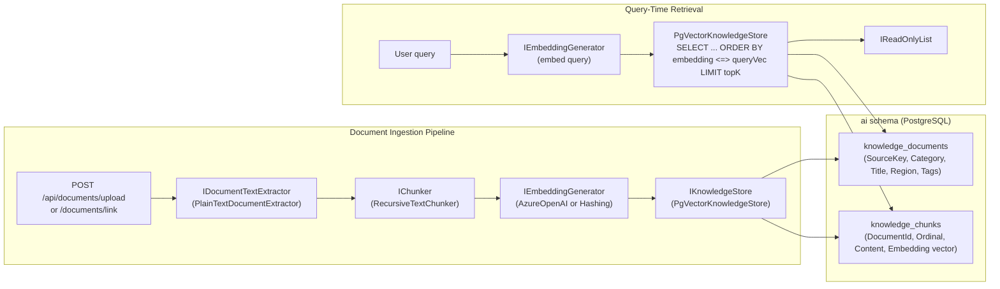

# MCP and RAG Architecture

This document provides an honest and detailed account of TelcoPilot's Model Context Protocol (MCP) and Retrieval-Augmented Generation (RAG) capabilities: what is fully implemented, what is architecturally designed but not yet connected to a live LLM pipeline, and the concrete roadmap for each.

---

## Honest Assessment: What Is and Is Not Implemented

TelcoPilot contains **complete, functional implementations** of both RAG and MCP at the infrastructure layer. The architectural plumbing is in place, tested, and running. What varies is the depth of integration with the live LLM path in certain scenarios.

| Capability | Status | Detail |
|---|---|---|
| RAG indexing pipeline | **Fully implemented** | Documents are chunked, embedded, and stored in pgvector |
| RAG knowledge corpus | **Seeded and queryable** | 13 documents across 6 categories indexed on startup |
| RAG retrieval in MockOrchestrator | **Fully wired** | `IRagRetriever.RetrieveAsync()` called on every Mock query |
| RAG retrieval in SemanticKernelOrchestrator | **Fully wired via KnowledgeSkill** | Model calls `search_knowledge` autonomously when it judges historical context relevant |
| pgvector similarity search | **Fully implemented** | `PgVectorKnowledgeStore` uses `<=>` cosine distance |
| MCP plugin interface | **Fully designed and implemented** | `IMcpPlugin`, `IMcpPluginRegistry`, `IMcpInvoker` are complete |
| NetworkMcpPlugin | **Fully implemented** | Dispatches to `INetworkApi` — list_towers, list_by_region, region_health |
| AlertsMcpPlugin | **Fully implemented** | Dispatches to `IAlertsApi` — list_active, list_all, outages_in_region |
| MCP REST endpoints | **Fully implemented** | `GET /api/mcp/plugins` (discovery) + `POST /api/mcp/invoke` (invocation) |
| MCP ↔ Semantic Kernel integration | **Designed, not yet wired** | InternalToolsSkill wraps the tool queries; direct MCP → SK plugin adapter is the next step |
| External MCP server support | **Adapter implemented** | `ExternalMcpServerPlugin` and `ExternalApiPlugin` adapters exist |
| True semantic RAG with Azure embeddings | **Feature-flagged** | Active when `Ai__AzureOpenAi__EmbeddingDeployment` is set; falls back to hashing embedder |
| Document upload from cloud sources | **Placeholder adapters** | Google Drive, OneDrive, SharePoint, Azure Blob have placeholder implementations |

---

## RAG Pipeline: Full Implementation

### Architecture Overview



### Chunking: RecursiveTextChunker

The `RecursiveTextChunker` splits documents recursively on paragraph boundaries, then sentence boundaries, then word boundaries — keeping chunks within the configured token limit. This preserves semantic coherence: a procedure step is not split across chunks.

Configuration via `RagOptions`:
- `TopK` — number of chunks to retrieve per query (default: 5)
- `EmbeddingDimensions` — vector dimension (default: 1536, matches text-embedding-3-small)

### Embedding: Two-Mode Operation

**Azure OpenAI mode** (`Ai__AzureOpenAi__EmbeddingDeployment` set):
- `AzureOpenAiEmbeddingGenerator` calls the Azure OpenAI embeddings API
- Returns true semantic embeddings — cosine similarity reflects conceptual relatedness
- "fiber cut" and "backhaul degradation" will be retrieved for the same query

**Offline / Mock mode** (no embedding deployment):
- `HashingEmbeddingGenerator` produces deterministic pseudo-embeddings from token hashing
- Token-overlap relevance: documents sharing keywords with the query will be retrieved
- The RAG pipeline functions end-to-end — just with lexical rather than semantic matching
- The seeded knowledge corpus is still retrieved for relevant queries

This two-mode design means the RAG pipeline is never broken, regardless of Azure configuration. A deployment without embedding credentials still provides knowledge base retrieval.

### pgvector Cosine Distance Query

```csharp
// PgVectorKnowledgeStore.SearchAsync() — simplified
var rows = await chunks
    .Join(docs, c => c.DocumentId, d => d.Id, (c, d) => new
    {
        c.Id, d.SourceKey, d.Category, d.Title, d.Region,
        c.Ordinal, c.Content,
        Distance = c.Embedding.CosineDistance(queryEmbedding),
    })
    .OrderBy(r => r.Distance)   // smallest distance = most similar
    .Take(take)
    .ToListAsync();

// Returned similarity = 1.0 - distance (1.0 = identical, 0.0 = orthogonal)
```

EF Core translates `CosineDistance()` to PostgreSQL's `<=>` operator via the `Pgvector.EntityFrameworkCore` extension. The query executes entirely in the database — no embeddings are transferred to the application layer for comparison.

### Seeded Knowledge Corpus

TelcoPilot seeds 13 documents across 6 categories on startup via `KnowledgeCorpusSeeder`:

| SourceKey | Category | Coverage |
|---|---|---|
| INC-2841-WRITEUP | IncidentReport | Lekki Phase 1 fiber cut — full incident writeup |
| INC-2840-WRITEUP | IncidentReport | Lagos West IKEDC grid failure |
| OUTAGE-Q1-RECAP | OutageSummary | Q1 metro-wide outage frequency and MTTR statistics |
| OUTAGE-LEKKI-CORRIDOR-2025 | OutageSummary | 12-week Lekki fiber incident history |
| DIAG-LATENCY-PLAYBOOK | NetworkDiagnostic | Step-by-step latency triage procedure |
| DIAG-CONGESTION-PATTERNS | NetworkDiagnostic | Festac/Surulere evening peak congestion patterns |
| SOP-FIBER-CUT-V3 | EngineeringSop | Standard operating procedure for fiber cuts |
| SOP-POWER-FAILOVER-V2 | EngineeringSop | Grid failure / genset failover SOP |
| SOP-CONGESTION-LOAD-SHED | EngineeringSop | Sustained load >85% SOP |
| TOWER-PERF-LEK-003 | TowerPerformance | TWR-LEK-003 90-day performance trend |
| TOWER-PERF-LAG-W-031 | TowerPerformance | TWR-LAG-W-031 thermal trend warning |
| ALERT-HISTORY-IKEJA-Q1 | AlertHistory | Ikeja Q1 alert history — all auto-resolved |
| ALERT-HISTORY-FESTAC-2025 | AlertHistory | Festac 30-day crowd-sourced alert history |

This corpus covers real operational scenarios that are also represented in the seeded tower and alert data — so RAG retrievals are contextually relevant to the live network state the Copilot is diagnosing.

---

## MCP Plugin Architecture: Full Implementation

### Design Philosophy

TelcoPilot's MCP layer is designed as a provider-agnostic plugin bus. The `IMcpPlugin` interface is transport-agnostic: the same contract works for in-process plugins (Internal kind), external MCP servers over SSE (ExternalMcpServer kind), and REST API adapters (ExternalApi kind). This mirrors the emerging MCP standard from Anthropic.

### IMcpPlugin Contract

```csharp
public interface IMcpPlugin
{
    string PluginId    { get; }      // Stable registry key
    string DisplayName { get; }      // Human-readable name for UI
    McpPluginKind Kind { get; }      // Internal | ExternalMcpServer | ExternalApi
    IReadOnlyList<McpCapability> Capabilities { get; }  // Advertised to LLM + UI
    Task<McpInvocationResult> InvokeAsync(McpInvocationRequest request, CancellationToken ct);
}

public enum McpPluginKind { Internal, ExternalMcpServer, ExternalApi }

public sealed record McpCapability(
    string Name,
    string Description,
    IReadOnlyList<McpCapabilityParameter> Parameters);
```

### Implemented Plugins

**NetworkMcpPlugin** (Internal, wraps INetworkApi):
- `list_towers` — returns all tower snapshots
- `list_by_region` — returns towers in a specified region
- `region_health` — returns aggregated signal and status per region

**AlertsMcpPlugin** (Internal, wraps IAlertsApi):
- `list_active_alerts` — all currently active/investigating incidents
- `list_all_alerts` — all alerts including resolved
- `get_outages_in_region` — region-filtered alert list

### REST Endpoints

```
GET  /api/mcp/plugins          → IReadOnlyList<McpPluginDto> (plugin discovery)
POST /api/mcp/invoke           → McpInvocationResult
    body: { pluginId, capability, arguments?, correlationId? }
```

The `/mcp` frontend page provides a developer-facing interface to explore registered plugins, view their capabilities, and invoke them manually — useful for integration testing and demonstrating the extensibility of the tool layer.

### Plugin Registry

`McpPluginRegistry` resolves all `IMcpPlugin` implementations from the DI container. Adding a new plugin requires only implementing `IMcpPlugin` and registering it:

```csharp
services.AddScoped<IMcpPlugin, NewPlugin>();
// Automatically appears in GET /api/mcp/plugins and can be invoked via POST /api/mcp/invoke
```

### External MCP Server Adapter

`ExternalMcpServerPlugin` implements `IMcpPlugin` for remote MCP servers. The invocation delegates to `McpInvoker.InvokeAsync()` which handles the HTTP/SSE transport to the external server. This means TelcoPilot can integrate with any MCP-compliant external service — a network vendor's diagnostic API, an OSS system, or an external runbook system — without changing the core orchestration logic.

---

## How the Skill System Serves as Structured Retrieval

TelcoPilot's Semantic Kernel skills function as a structured retrieval layer — analogous to what RAG provides for unstructured documents, but for live operational data. This is worth making explicit:

| Retrieval type | Source | Technology | Latency |
|---|---|---|---|
| **Structured live data** | PostgreSQL via cross-module APIs | Kernel plugins (DiagnosticsSkill, OutageSkill) | <50ms |
| **Unstructured historical knowledge** | pgvector knowledge base | KnowledgeSkill → IRagRetriever | <100ms |
| **Runbook logic** | In-process business rules | RecommendationSkill | <1ms |
| **Numeric summaries** | Cross-module APIs via MediatR queries | InternalToolsSkill → ToolQuery handlers | <50ms |

The LLM reasons over all four retrieval types simultaneously in a single invocation cycle. This is the key architectural insight: TelcoPilot is not just an LLM wrapper over a database. It is a multi-source retrieval system where the LLM acts as the reasoner that decides which sources to query and how to synthesise the results.

---

## Roadmap: Full RAG and MCP Integration

### RAG Expansion Path

1. **Real Azure embeddings**: set `Ai__AzureOpenAi__EmbeddingDeployment=text-embedding-3-small` in the environment. The `AzureOpenAiEmbeddingGenerator` activates automatically. This upgrades retrieval from lexical overlap to true semantic similarity.

2. **Document ingestion from cloud sources**: the `GoogleDriveDocumentStorageProvider`, `OneDriveDocumentStorageProvider`, `SharePointDocumentStorageProvider`, and `AzureBlobDocumentStorageProvider` are registered as placeholder implementations. Replacing each with a live SDK adapter (Google.Apis.Drive.v3, Microsoft.Graph, Azure.Storage.Blobs) enables drag-and-drop document ingestion from existing enterprise content systems.

3. **Category and region filtering**: `PgVectorKnowledgeStore.SearchAsync()` already supports `categoryFilter` and `regionFilter` parameters. `KnowledgeSkill` can be extended to pass these filters when the query context makes them applicable (e.g., a query about Lekki should retrieve Lekki-region documents first).

4. **Incremental re-indexing**: the `ReindexDocumentCommand` handler already exists. A scheduled background job (Quartz.NET or Hangfire) could re-index documents on a schedule, keeping the knowledge base current without manual intervention.

### MCP Integration Expansion Path

1. **MCP ↔ Semantic Kernel wiring**: The `InternalToolsSkill` Kernel plugin currently dispatches to MediatR `ToolQuery` handlers directly. The next step is routing these invocations through `IMcpInvoker`, which dispatches to the registered `IMcpPlugin` implementations. This creates a single, unified tool invocation path: SK plugin → MCP registry → plugin implementation.

2. **External MCP server registration**: operators can register external MCP-compatible services (e.g., a vendor NMS API with an MCP adapter) by adding an `ExternalMcpServerPlugin` with the server's endpoint URL. The plugin registry immediately exposes it to the LLM's function calling and to the MCP REST endpoints.

3. **MCP capability schema export**: the `GET /api/mcp/plugins` endpoint already returns capability definitions in a structure compatible with OpenAI function calling schema. Adapting this to emit JSON Schema format compatible with the MCP specification would enable direct integration with any MCP-aware LLM host.

4. **Automated remediation**: an `ActionPlugin` that dispatches field team assignments, traffic shed commands, and ticket creation — all exposed as MCP capabilities — would enable the Copilot to move from recommending actions to executing them with operator confirmation.
