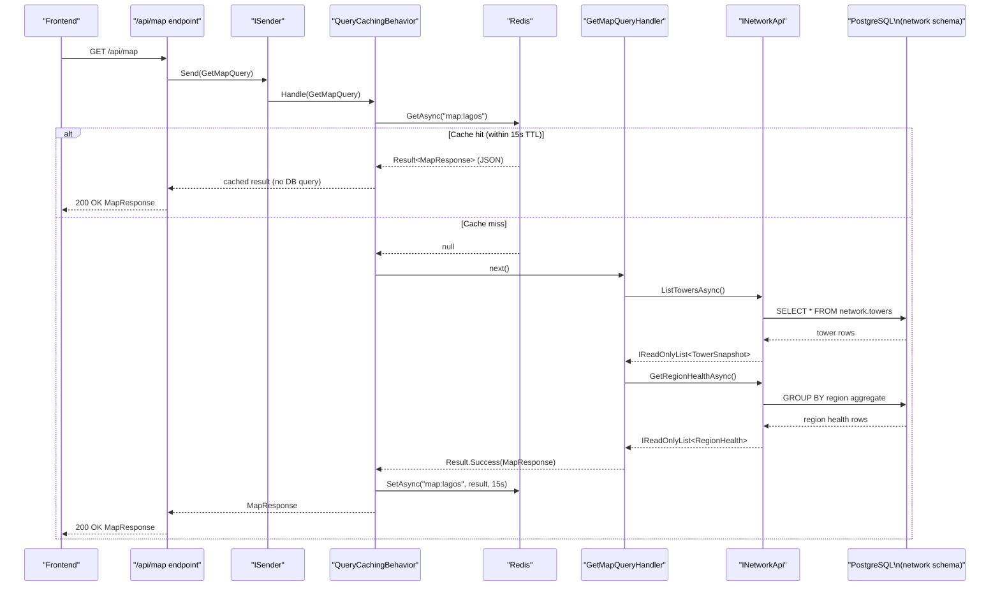
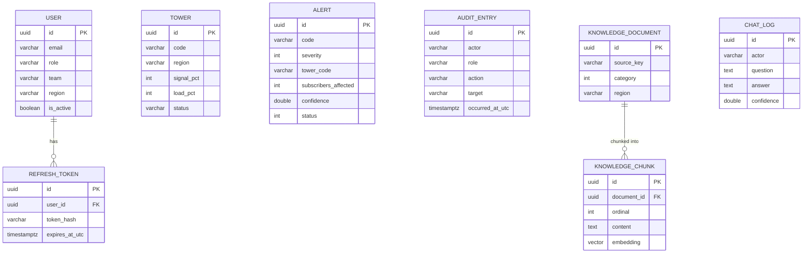

# Database and Data Flow

This document describes TelcoPilot's PostgreSQL schema isolation strategy, per-module DbContext pattern, entity relationships, seeding approach, Redis caching layer, and the complete data flow for both read and write operations.

---

## PostgreSQL Schema Isolation

TelcoPilot uses a **single PostgreSQL database** (`telcopilot`) with **five named schemas**, one per module. This design provides the benefits of logical data isolation without the operational complexity of multiple databases.

```
telcopilot (database)
├── identity    ← Users, RefreshTokens
├── network     ← Towers
├── alerts      ← Alerts
├── analytics   ← AuditEntries
└── ai          ← KnowledgeDocuments, KnowledgeChunks, ChatLogs, ManagedDocuments
```

**Why schema isolation?**
- Module data is physically separated in PostgreSQL's catalog — no accidental cross-schema joins in application code
- Each module owns its schema exclusively; no foreign key constraints cross schema boundaries
- Database-level access control can be applied per schema (e.g., the AI module's read user can be denied access to the identity schema)
- pgvector's `vector` column type and the `vector` extension live in the `ai` schema only — no impact on other modules

**Schema constants per module:**

```csharp
// Each module's Infrastructure project declares its schema constant
internal static class Schema
{
    public const string Identity  = "identity";   // Modules.Identity.Infrastructure
    public const string Network   = "network";    // Modules.Network.Infrastructure
    public const string Alerts    = "alerts";     // Modules.Alerts.Infrastructure
    public const string Analytics = "analytics";  // Modules.Analytics.Infrastructure
    public const string Ai        = "ai";         // Modules.Ai.Infrastructure
}
```

---

## Per-Module DbContext Pattern

Each module has its own EF Core `DbContext`. These are independent — they do not inherit from a shared base context, they have separate connection lifetimes, and they manage only the entities in their schema.

```csharp
// NetworkDbContext (example)
internal sealed class NetworkDbContext(DbContextOptions<NetworkDbContext> options) 
    : DbContext(options)
{
    public DbSet<Tower> Towers { get; set; }

    protected override void OnModelCreating(ModelBuilder mb)
    {
        mb.HasDefaultSchema(Schema.Network);
        mb.ApplyConfigurationsFromAssembly(typeof(NetworkDbContext).Assembly);
    }
}
```

All DbContexts use:
- `UseSnakeCaseNamingConvention()` — all table and column names are snake_case in PostgreSQL
- `HasDefaultSchema(Schema.*)` — all tables land in the correct schema automatically
- `ApplyConfigurationsFromAssembly()` — entity configurations are in separate `IEntityTypeConfiguration<T>` classes

### Registration Pattern

```csharp
services.AddDbContext<NetworkDbContext>((sp, opts) => opts
    .UseNpgsql(connectionString, npg =>
        npg.MigrationsHistoryTable("__ef_migrations_history", Schema.Network))
    .UseSnakeCaseNamingConvention());
```

Each module's migration history table is in its own schema — if EF migrations are adopted in production, each module maintains an independent migration history without conflicts.

---

## Entity Relationships per Module

### Identity Module

```
identity.users
  ├── id (uuid, PK)
  ├── email (varchar, unique)
  ├── full_name (varchar)
  ├── handle (varchar, unique)
  ├── password_hash (varchar)    ← BCrypt hash, never plaintext
  ├── role (varchar)             ← engineer | manager | admin | viewer
  ├── team (varchar)
  ├── region (varchar)
  ├── is_active (boolean)
  ├── created_at_utc (timestamptz)
  ├── updated_at_utc (timestamptz, nullable)
  └── last_login_at_utc (timestamptz, nullable)

identity.refresh_tokens
  ├── id (uuid, PK)
  ├── user_id (uuid, FK → users.id)
  ├── token_hash (varchar, unique)   ← SHA-256 hex of raw token, never raw
  ├── expires_at_utc (timestamptz)
  ├── revoked_at_utc (timestamptz, nullable)
  └── created_at_utc (timestamptz)
```

### Network Module

```
network.towers
  ├── id (uuid, PK)
  ├── code (varchar, unique)     ← e.g. "TWR-LEK-003"
  ├── name (varchar)             ← e.g. "Lekki Phase 1"
  ├── region (varchar)           ← e.g. "Lekki"
  ├── lat / lng (double)         ← real Lagos coordinates
  ├── map_x / map_y (double)     ← 0–100% canvas position
  ├── signal_pct (int)           ← current signal strength %
  ├── load_pct (int)             ← current load %
  ├── status (varchar)           ← ok | warn | critical
  └── issue (varchar, nullable)  ← human-readable issue description
```

**TowerStatus derivation rule** (applied at seeding and in business logic):
- `Critical`: signal_pct < 40 OR load_pct > 90 OR has_incident
- `Warn`: signal_pct < 70 OR load_pct > 80 OR elevated_packet_loss
- `Ok`: all metrics within normal bounds

### Alerts Module

```
alerts.alerts
  ├── id (uuid, PK)
  ├── code (varchar, unique)     ← e.g. "INC-2841"
  ├── severity (int)             ← enum: Info=0, Warn=1, Critical=2
  ├── title (varchar)
  ├── region (varchar)
  ├── tower_code (varchar)       ← references network.towers.code (no FK constraint by design)
  ├── ai_cause (varchar)         ← AI-attributed root-cause hypothesis
  ├── subscribers_affected (int)
  ├── confidence (double)        ← 0.0–1.0
  ├── status (int)               ← Active=0, Investigating=1, Monitoring=2, Resolved=3
  ├── acknowledged_by (varchar, nullable)
  ├── acknowledged_at_utc (timestamptz, nullable)
  └── raised_at_utc (timestamptz)
```

No foreign key from `tower_code` to `network.towers.code` — cross-schema foreign keys would couple module schemas. The application layer handles the correlation via `INetworkApi.GetByCodeAsync()`.

### Analytics Module

```
analytics.audit_entries
  ├── id (uuid, PK)
  ├── actor (varchar)            ← user handle or "system"
  ├── role (varchar)             ← engineer | manager | admin | system
  ├── action (varchar)           ← e.g. "copilot.query", "alert.acknowledge", "rbac.update"
  ├── target (varchar)           ← the subject of the action (query text, incident ID, etc.)
  ├── source_ip (varchar)        ← request IP or "-" for system-generated
  └── occurred_at_utc (timestamptz)
```

### AI Module

```
ai.knowledge_documents
  ├── id (uuid, PK)
  ├── source_key (varchar, unique)  ← e.g. "SOP-FIBER-CUT-V3", "INC-2841-WRITEUP"
  ├── category (int)               ← enum: IncidentReport, OutageSummary, NetworkDiagnostic, EngineeringSop, TowerPerformance, AlertHistory
  ├── title (varchar)
  ├── region (varchar, nullable)
  ├── tags (varchar)               ← JSON array serialised
  └── occurred_at_utc (timestamptz)

ai.knowledge_chunks
  ├── id (uuid, PK)
  ├── document_id (uuid, FK → knowledge_documents.id)
  ├── ordinal (int)                ← chunk sequence within document
  ├── content (text)               ← chunk text
  └── embedding (vector(1536))     ← pgvector column — cosine distance via <=>

ai.chat_logs
  ├── id (uuid, PK)
  ├── user_id (uuid, nullable)
  ├── actor (varchar)
  ├── question (text)
  ├── answer (text)
  ├── skill_trace (varchar)        ← e.g. "DiagnosticsSkill.get_region_metrics → OutageSkill.get_active_outages → LlmComposer.compose"
  ├── confidence (double)
  └── created_at_utc (timestamptz)

ai.managed_documents
  ├── id (uuid, PK)
  ├── title (varchar)
  ├── file_name (varchar)
  ├── content_type (varchar)
  ├── size_bytes (long)
  ├── category (int)
  ├── region (varchar, nullable)
  ├── tags (varchar)
  ├── source (int)                 ← enum: LocalUpload, GoogleDrive, OneDrive, SharePoint, AzureBlob
  ├── storage_key (varchar)        ← file path or cloud reference
  ├── external_reference (varchar, nullable)
  ├── status (int)                 ← enum: Pending, InProgress, Indexed, Failed
  ├── version (int)
  ├── uploaded_by (varchar)
  ├── uploaded_at_utc (timestamptz)
  ├── indexed_at_utc (timestamptz, nullable)
  └── last_index_error (varchar, nullable)
```

---

## Seeding Strategy

All modules use an **idempotent seeder** pattern: check if any rows exist, skip if yes, seed if no. This makes repeated startups safe.

```csharp
// Pattern used in all seeders
public static async Task SeedAsync(SomeDbContext db, ..., CancellationToken ct)
{
    if (await db.SomeEntities.AnyAsync(ct)) return;  // idempotent guard
    // ... seed data
    await db.SaveChangesAsync(ct);
}
```

**Seeded data summary:**

| Module | Seeded entities |
|---|---|
| Identity | 8 users (Oluwaseun/Engineer, Amaka/Manager, Tunde/Admin, Ifeanyi/Engineer, Halima/Engineer, Chioma/Manager, Baba/Engineer, Kemi/Viewer) |
| Network | 15 Lagos metro towers across 8 regions |
| Alerts | 6 incidents (2 critical, 3 warn, 1 info) |
| Analytics | 10 audit entries (last 30 minutes of simulated NOC activity) |
| AI | 13 knowledge documents (incident reports, SOPs, outage summaries, tower performance) |

Seeding is invoked in `Program.cs` via `app.SeedDataAsync()` in the Development environment. In production, seeding should be a one-time migration step rather than a startup check.

---

## Redis Caching Layer

TelcoPilot's `ICacheService` interface wraps `IDistributedCache` (backed by Redis via `AddStackExchangeRedisCache()`). The `QueryCachingPipelineBehavior` applies caching to any query implementing `ICachedQuery`.

### Cached Queries

| Query | Cache Key | TTL | Rationale |
|---|---|---|---|
| `GetMapQuery` | `map:lagos` | 15 seconds | Map data changes slowly; 15s prevents redundant DB queries during dashboard polling without serving stale status for too long |
| `GetMetricsQuery` | (configured) | Configurable | KPI data is computed from live queries; short TTL balances freshness vs. DB load |

### Cache Behaviour

```csharp
// On cache miss: call handler, cache the successful result
if (result.IsSuccess)
{
    await cacheService.SetAsync(request.CacheKey, result, request.Expiration, ct);
}
// Failed results are NEVER cached — errors are always fresh
```

**Key design decisions:**
- Only successful results are cached — a transient DB error does not poison the cache
- The cache key is defined by the query object itself (ICachedQuery.CacheKey), not by the behavior — the query author controls caching semantics
- Serialisation is JSON via `System.Text.Json` — Redis stores serialised `Result<T>` objects

### Cache Invalidation

Current TTL-based expiry is the only invalidation strategy. When a tower's status changes or a new alert is acknowledged, the cache will serve the previous state until TTL expires. For the 15-second map TTL, this means a tower going critical could be invisible for up to 15 seconds — acceptable for NOC operations where the Copilot provides on-demand fresh data.

Production invalidation options: write-through (cache update on every command), event-driven (domain event handler invalidates relevant keys), or shorter TTLs with Redis key-space notifications.

---

## Data Flow for a Read Query with Caching



---

## Key Entity Relationships (ER Overview)



Note: `ALERT.tower_code` references `TOWER.code` by value, not by foreign key — module boundaries are maintained in the schema.

---

## Production Path: EnsureCreatedAsync to EF Migrations

The current demo uses `EnsureCreatedAsync()` (called in `MigrationExtensions.ApplyMigrationsAsync()`), which creates tables from the EF model on first run. This is appropriate for a hackathon demo but not for production schema evolution.

**Production migration path:**

1. Generate the initial migration for each module's DbContext:
   ```bash
   dotnet ef migrations add InitialCreate --context IdentityDbContext --project Modules.Identity.Infrastructure
   ```

2. Apply migrations on startup instead of `EnsureCreatedAsync`:
   ```csharp
   await db.Database.MigrateAsync();
   ```

3. Each module's migration history is in its own schema table (`__ef_migrations_history` in `identity`, `network`, etc.) — migrations can be applied per-module independently.

4. The `telcopilot-pg-data` named volume in Docker Compose persists the PostgreSQL data directory across container restarts, so no data is lost when the backend container is updated.
