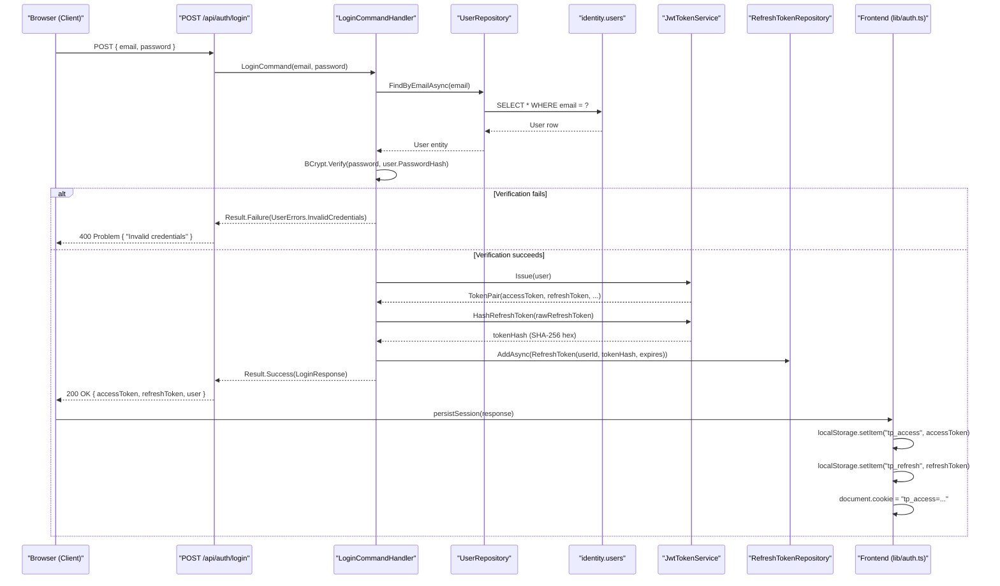
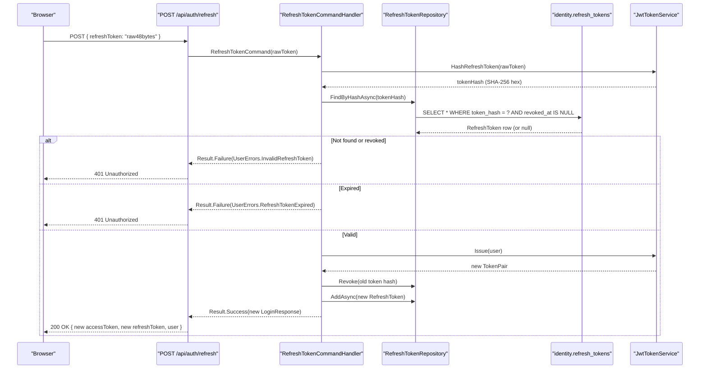

# Authentication and Security

This document describes TelcoPilot's complete security architecture: JWT bearer authentication, refresh token rotation with SHA-256 hashing, BCrypt password hashing, token expiry strategy, CORS configuration, secrets management, and a summary security posture table.

---

## JWT Bearer Authentication Flow

TelcoPilot uses stateless JWT bearer authentication. Every protected endpoint validates the `Authorization: Bearer <token>` header. There are no server-side sessions.

### Token Structure

JWT access tokens are signed with HMAC-SHA256 (`SecurityAlgorithms.HmacSha256`) using the `Jwt__Secret` environment variable as the symmetric key. The token payload includes:

| Claim | Type | Value |
|---|---|---|
| `sub` | string | User UUID |
| `email` | string | User email address |
| `name` | string | User full name |
| `handle` | string | User handle (e.g. `oluwaseun.a`) |
| `team` | string | User team assignment |
| `region` | string | User region assignment |
| `role` (ClaimTypes.Role) | string | Role: `engineer` / `manager` / `admin` / `viewer` |
| `jti` | string | Unique token ID (GUID) |

The `handle` claim is custom — it is used by `AskCopilotCommandHandler` to attribute Copilot queries to the correct user in the audit log without looking up the user by ID.

### ASP.NET Core JWT Configuration

```csharp
builder.Services
    .AddAuthentication(JwtBearerDefaults.AuthenticationScheme)
    .AddJwtBearer(options => options.TokenValidationParameters = new TokenValidationParameters
    {
        ValidateIssuer           = true,
        ValidateAudience         = true,
        ValidateLifetime         = true,
        ValidateIssuerSigningKey = true,
        ValidIssuer              = jwtOptions.Issuer,      // "telcopilot"
        ValidAudience            = jwtOptions.Audience,    // "telcopilot.api"
        IssuerSigningKey         = new SymmetricSecurityKey(
                                       Encoding.UTF8.GetBytes(jwtOptions.Secret)),
        ClockSkew                = TimeSpan.FromSeconds(30)
    });
```

**ClockSkew of 30 seconds** is deliberately small. The default is 5 minutes, which creates a 10-minute window (5 min before + 5 min after expiry) during which a stolen token remains valid. 30 seconds is a minimal but practically safe tolerance for clock drift between services in the Docker network.

---

## Refresh Token Rotation

### How It Works

On every successful login or token refresh, the `JwtTokenService` issues a `TokenPair`:

```csharp
public TokenPair Issue(User user)
{
    DateTime accessExpires  = DateTime.UtcNow.AddMinutes(_opt.AccessTokenMinutes);
    DateTime refreshExpires = DateTime.UtcNow.AddDays(_opt.RefreshTokenDays);

    // ... build JWT access token ...
    
    string accessToken  = new JwtSecurityTokenHandler().WriteToken(token);
    string refreshToken = GenerateRefreshToken();  // 48 cryptographic random bytes, Base64

    return new TokenPair(accessToken, refreshToken, accessExpires, refreshExpires);
}
```

The raw refresh token is a 48-byte cryptographically random value (`RandomNumberGenerator.Fill`), encoded as Base64 — 64 characters of high-entropy opaque string. It is never stored in the database.

### SHA-256 Hashing of Refresh Tokens

```csharp
public string HashRefreshToken(string token)
{
    byte[] bytes = SHA256.HashData(Encoding.UTF8.GetBytes(token));
    return Convert.ToHexStringLower(bytes);  // 64-char lowercase hex string
}
```

Only the SHA-256 hash (`token_hash`) is stored in `identity.refresh_tokens`. When a refresh request arrives:
1. Hash the incoming raw token
2. Look up the stored hash
3. Verify expiry
4. If valid: issue a new `TokenPair`, revoke the old hash by setting `revoked_at_utc`
5. If invalid or expired: return `401 Unauthorized`

**Why SHA-256, not BCrypt?** Refresh tokens are already 384 bits of random entropy — they are not passwords derived from a human-chosen string. An attacker who has database access would need to find a 48-byte random value that matches the hash, which is computationally infeasible. BCrypt's adaptive cost is designed for low-entropy human passwords. SHA-256 is the appropriate choice for high-entropy opaque tokens — it is deterministic (required for lookup), fast, and cryptographically irreversible.

### Token Lifetime Strategy

| Token | Default lifetime | Rationale |
|---|---|---|
| Access token | `AccessTokenMinutes` (configurable, e.g. 15 min) | Short-lived to limit the window of a stolen token; client refreshes silently |
| Refresh token | `RefreshTokenDays` (configurable, e.g. 7 days) | Long enough for a work shift or week without re-login; revoked on use (rotation) |

Refresh token rotation means that even if a refresh token is intercepted, using it invalidates it — the legitimate client's next refresh attempt will fail, alerting them that their session has been compromised.

---

## BCrypt Password Hashing

```csharp
// BCryptPasswordHasher (Identity.Infrastructure)
public string Hash(string password)   => BCrypt.Net.BCrypt.HashPassword(password, workFactor: 11);
public bool   Verify(string password, string hash) => BCrypt.Net.BCrypt.Verify(password, hash);
```

BCrypt cost factor 11 means 2^11 = 2,048 iterations of the Blowfish key schedule. On typical NOC server hardware this produces approximately 250–350ms per hash operation — negligible at human login speed, but making brute-force attacks against a leaked password hash extremely expensive.

The seeded demo password `Telco!2025` is hashed at cost 11 for all demo users. In real deployments, passwords are hashed at login/creation time — the hash is never stored in source code.

---

## Login + Token Refresh Sequence





---

## Authorization: RBAC Policies

ASP.NET Core authorization policies enforce RBAC on every protected endpoint:

```csharp
// Policies defined in Identity.Application
builder.Services.AddAuthorization(options =>
{
    options.AddPolicy(Policies.RequireEngineer, 
        p => p.RequireRole(Roles.Engineer, Roles.Manager, Roles.Admin));
    options.AddPolicy(Policies.RequireManager, 
        p => p.RequireRole(Roles.Manager, Roles.Admin));
    options.AddPolicy(Policies.RequireAdmin, 
        p => p.RequireRole(Roles.Admin));
});
```

Role names are lowercase strings in the JWT `role` claim (`engineer`, `manager`, `admin`, `viewer`). The `IdentitySeeder` includes a startup migration that normalises any uppercase roles from old data to lowercase — ensuring `ClaimsPrincipal.IsInRole()` works correctly (case-sensitive comparison).

Policy usage on endpoints:

```csharp
app.MapPost("chat",                  [Authorize]                             ...)  // All authenticated
app.MapGet("metrics",                [Authorize]                             ...)  // All authenticated
app.MapGet("metrics/audit",          [Authorize(Policy = "RequireManager")]  ...)  // Manager+
app.MapPost("alerts/{id}/ack",       [Authorize(Policy = "RequireEngineer")] ...)  // Engineer+
app.MapGet("auth/users",             [Authorize(Policy = "RequireManager")]  ...)  // Manager+
```

---

## CORS Configuration

```csharp
builder.Services.AddCors(opts => opts.AddDefaultPolicy(p => p
    .WithOrigins(
        "http://localhost:3000",    // Local Next.js dev server
        "http://localhost",         // Docker Compose NGINX
        "http://127.0.0.1:3000"     // Alternative localhost
    )
    .AllowAnyHeader()
    .AllowAnyMethod()
    .AllowCredentials()));
```

CORS is whitelisted to known origins. In Docker Compose production, the frontend is served from the same NGINX origin as the API (`http://localhost`), so CORS headers are not needed for the deployed topology — but they are required for local Aspire development where the frontend runs on `:3000` and the backend on a separate port.

For production deployment to a named domain (e.g., `telcopilot.mtn.ng`), `WithOrigins` should be updated to include the production domain.

---

## Secrets Management

| Secret | Local dev | Docker Compose | Production |
|---|---|---|---|
| `Jwt__Secret` | .NET user-secrets | `.env` file (not committed) | Azure Key Vault / secrets manager |
| `POSTGRES_PASSWORD` | local default (`postgres`) | `.env` file | Managed identity / Key Vault |
| `AZURE_OPENAI_API_KEY` | .NET user-secrets | `.env` file | Azure Key Vault reference |
| `AZURE_OPENAI_ENDPOINT` | .NET user-secrets | `.env` file | App configuration / Key Vault |

**Never committed to source control:**
- `.env` — listed in `.gitignore`
- User-secrets (`~/.microsoft/usersecrets/`) — local machine only
- JWT secret — the `dev-secret-replace-with-32+char-random-via-env-please` default in `docker-compose.yml` signals that it must be overridden

The `.env.example` file documents all required environment variables with placeholder values. Operators copy it to `.env` and fill in real values before deployment.

---

## Security Posture Summary

| Control | Implementation | Status |
|---|---|---|
| Password hashing | BCrypt cost 11 (adaptive, salt included) | Implemented |
| JWT signature | HMAC-SHA256, 30s clock skew | Implemented |
| Refresh token storage | SHA-256 hash only, never raw token | Implemented |
| Refresh token rotation | Revoke on use, issue new pair | Implemented |
| RBAC enforcement | ASP.NET Core policies at endpoint level | Implemented |
| RBAC — frontend | RoleGate component + rbac.ts rank system | Implemented |
| Secrets in source | None — env vars and user-secrets only | Implemented |
| CORS whitelist | Named origins only, not wildcard | Implemented |
| Audit trail | Every Copilot query + admin action recorded | Implemented |
| TLS in transit | NGINX handles TLS termination in production | Configured at infra level |
| Token revocation | Refresh tokens revocable; access tokens short-lived | Implemented |
| SQL injection | EF Core parameterised queries exclusively | Implemented |
| Input validation | FluentValidation in MediatR pipeline for all commands | Implemented |
| Query length limit | Chat endpoint: 500-character max enforced at endpoint | Implemented |
| Error detail leakage | Result<T> pattern — internal errors mapped to ProblemDetails | Implemented |
