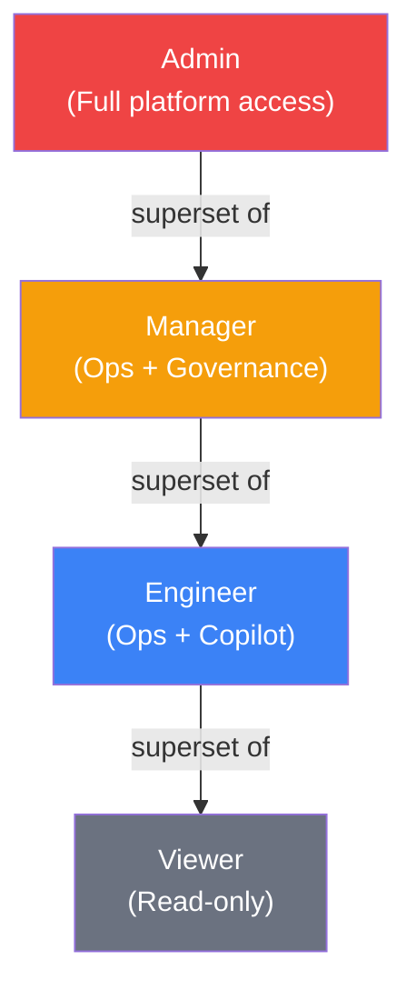

# User Roles and RBAC

This document defines TelcoPilot's four-role access control model, explains how each role maps to a real-world telecom NOC org structure, documents the full permission matrix, and describes how role enforcement is implemented at both the API layer (ASP.NET Core policies) and the UI layer (Next.js route gating).

---

## Role Definitions

TelcoPilot's RBAC model reflects the actual org structure of a Nigerian telco NOC. Roles are not arbitrary permission buckets — each one corresponds to a distinct job function with distinct accountability.

### Viewer

A read-only observer role. In a real NOC, this covers executives, regional managers, and regulatory liaisons who need situational awareness without the ability to modify state. A Viewer can see every dashboard, every alert feed, and the network map — but cannot interact with incidents, query the Copilot, or access governance records.

**Operational justification**: Viewers need live visibility for briefings and SLA reporting. Granting write access to non-operational personnel is a compliance and security risk — accidental acknowledgment of an alert by a non-technical observer could mask a real incident.

### Engineer

The primary operational role. NOC engineers work shifts, monitor alert queues, respond to incidents, and diagnose network anomalies. The Engineer role grants access to the AI Copilot and the ability to acknowledge alerts. It does not grant access to governance records (audit log) or user administration — concerns that belong to supervisory and administrative roles.

**Operational justification**: Engineers must be able to act fast. Restricting their access to user management prevents accidental changes to team access during a high-stress incident response.

### Manager

A supervisory role covering NOC shift leads and operations managers. Managers can do everything Engineers can do, plus access the full audit trail and manage user accounts. This reflects the real-world responsibility of a NOC shift lead: ensuring the team is staffed, reviewing audit records after incidents, and maintaining access hygiene.

**Operational justification**: Audit trail access requires supervisory accountability. An engineer should not be able to review (or suppress) their own audit records. Manager-only access enforces the principle of separation of duties.

### Admin

The platform administration role. Admins have unrestricted access to every feature. In practice, the Admin role is held by the platform owner, security officer, or senior infrastructure engineer responsible for TelcoPilot itself — not by NOC operations staff. This role can create and disable users, change roles, and access every governance record.

**Operational justification**: The Admin role is scoped to platform management, not NOC operations. Maintaining a clear separation between platform administrators and operational users is standard enterprise security practice.

---

## Role Hierarchy



Each role is a strict superset of the one below it. An Admin can do everything a Manager can do; a Manager can do everything an Engineer can do; an Engineer can do everything a Viewer can do.

---

## Permission Matrix

| Feature | Viewer | Engineer | Manager | Admin |
|---|:---:|:---:|:---:|:---:|
| Dashboard (read KPIs, sparklines) | ✅ | ✅ | ✅ | ✅ |
| Network Map (read tower status, regions) | ✅ | ✅ | ✅ | ✅ |
| Alerts — read feed | ✅ | ✅ | ✅ | ✅ |
| Alerts — acknowledge incident | ❌ | ✅ | ✅ | ✅ |
| Copilot — natural language queries | ❌ | ✅ | ✅ | ✅ |
| Insights — analytics, SLA compliance | ✅ | ✅ | ✅ | ✅ |
| Audit Log — read trail | ❌ | ❌ | ✅ | ✅ |
| User Management — list users | ❌ | ❌ | ✅ | ✅ |
| User Management — create/edit/disable | ❌ | ❌ | ✅ | ✅ |
| Best Signal Zones panel | ✅ | ✅ | ✅ | ✅ |

---

## API-Layer Enforcement: ASP.NET Core Policies

Role enforcement at the API layer uses ASP.NET Core's authorization policy system. Policies are registered in the Identity module's `DependencyInjection.cs` and applied as attributes on endpoint handlers.

### Policy Registration

```csharp
builder.Services.AddAuthorization(options =>
{
    options.AddPolicy("RequireEngineer", policy =>
        policy.RequireRole("engineer", "manager", "admin"));

    options.AddPolicy("RequireManager", policy =>
        policy.RequireRole("manager", "admin"));

    options.AddPolicy("RequireAdmin", policy =>
        policy.RequireRole("admin"));
});
```

The `RequireEngineer` policy accepts `engineer`, `manager`, and `admin` — reflecting the superset hierarchy. This means an Admin authenticating to a Copilot endpoint passes the `RequireEngineer` check without any special handling.

### Endpoint-Level Application

```csharp
// Copilot — engineer+
app.MapPost("/api/chat", ...)
   .RequireAuthorization("RequireEngineer");

// Alert acknowledgment — engineer+
app.MapPost("/api/alerts/{id}/ack", ...)
   .RequireAuthorization("RequireEngineer");

// Audit trail — manager+
app.MapGet("/api/metrics/audit", ...)
   .RequireAuthorization("RequireManager");

// User list — manager+
app.MapGet("/api/auth/users", ...)
   .RequireAuthorization("RequireManager");
```

Endpoints protected only by `[Authorize]` (without a named policy) require any valid Bearer token — covering Viewer through Admin.

### Role Extraction from JWT

The role claim in the JWT is `ClaimTypes.Role`. The role string is lowercase: `viewer`, `engineer`, `manager`, `admin`. ASP.NET Core's `RequireRole()` check is case-sensitive, so the token generation and policy registration use consistent lowercase strings throughout.

---

## Frontend RBAC

Frontend RBAC operates on two levels: server-side route protection and client-side conditional rendering.

### Route Protection

TelcoPilot's Next.js frontend uses a centralized auth context (`AuthContext`) that holds the decoded user profile from the JWT, including the role claim. Page components that require elevated access check the role before rendering.

**Users page** (`/users`) — restricted to Manager and Admin:

```typescript
// In the users page component
const { user } = useAuth();

if (!user || !['manager', 'admin'].includes(user.role)) {
  return <AccessDenied />;
}
```

**Audit page** (`/audit`) — restricted to Manager and Admin:

```typescript
if (!user || !['manager', 'admin'].includes(user.role)) {
  return <AccessDenied />;
}
```

### Navigation Gating

The sidebar navigation conditionally renders links based on the authenticated role. Engineer and below do not see the Audit or Users links in the navigation — the entries are simply not rendered rather than rendered as disabled, following the principle of least surprise.

### Why Dual Enforcement Matters

API-layer enforcement is the authoritative security boundary. A malicious client could bypass frontend checks by calling the API directly. The frontend RBAC is a UX affordance — it prevents legitimate users from navigating to features they cannot use, reducing confusion and accidental access attempts. The API always provides the final enforcement.

---

## Demo Accounts and Roles

| Email | Role | Password |
|---|---|---|
| oluwaseun.a@telco.lag | Engineer | Telco!2025 |
| amaka.o@telco.lag | Manager | Telco!2025 |
| tunde.b@telco.lag | Admin | Telco!2025 |
| kemi.a@telco.lag | Viewer | Telco!2025 |

---

## Real-World Alignment: Why These Roles Match a Telco NOC

A modern Nigerian telco NOC operates in tiered shifts. The Tier 1 analyst (Engineer in TelcoPilot's model) monitors dashboards and owns incident acknowledgment. The Tier 2/3 engineer (also Engineer) performs deeper diagnosis — exactly the Copilot use case. The shift lead (Manager) reviews the audit trail post-incident and owns staffing. The NOC director (Viewer or Manager) consumes executive dashboards. The IT/Security administrator (Admin) manages platform access.

TelcoPilot's four roles map directly to this structure without over-engineering — there is no role for "senior engineer vs junior engineer" because the Copilot democratizes expertise across all Engineers, which is precisely the point of the platform.

---

## Cross-References

- Role enforcement in JWT: [09_Authentication_and_Security.md](09_Authentication_and_Security.md)
- User management API endpoints: [12_API_Documentation.md](12_API_Documentation.md)
- Frontend auth context and route protection: [05_Frontend_Architecture.md](05_Frontend_Architecture.md)
