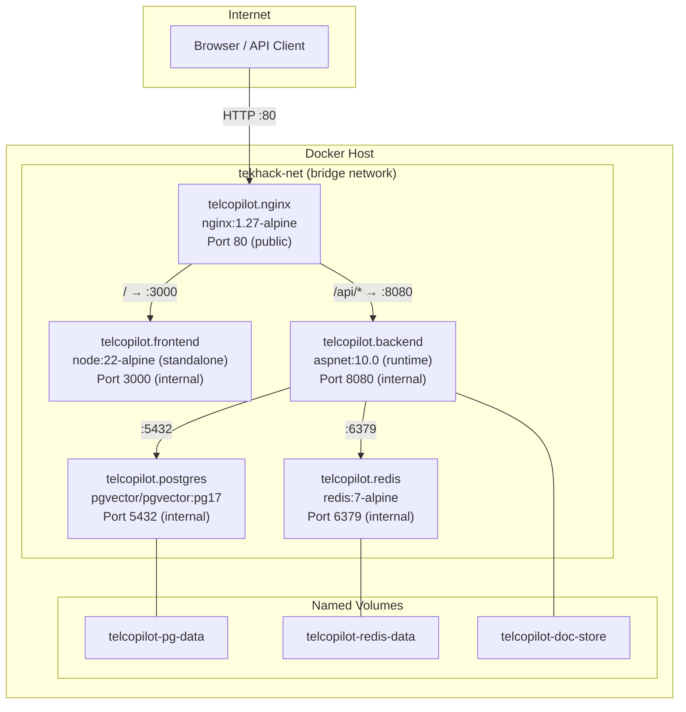

# Infrastructure and Deployment

This document describes TelcoPilot's container infrastructure in detail: the Docker Compose service topology, NGINX reverse proxy configuration, multi-stage Dockerfiles, environment variable reference, .NET Aspire local development setup, and the recommended cloud deployment pathway.

---

## Container Topology

TelcoPilot's full stack runs as five Docker services on a dedicated bridge network. A single `docker compose up --build` command brings up the entire platform.



---

## Docker Compose Service Reference

### telcopilot.nginx

The public-facing entry point. All external traffic enters through NGINX on port 80.

```yaml
nginx:
  image: nginx:1.27-alpine
  ports:
    - "80:80"
  depends_on:
    - frontend
    - backend
  networks:
    - tekhack-net
```

**Role**: Single-entry-point reverse proxy. Routes `/api/*` to the backend and everything else to the frontend. This is the architectural invariant: no other service exposes a port to the host.

### telcopilot.frontend

The Next.js 15 application built in standalone output mode.

```yaml
frontend:
  build:
    context: ./frontend
    dockerfile: Dockerfile
  expose:
    - "3000"
  networks:
    - tekhack-net
  environment:
    - NEXT_PUBLIC_API_URL=/api
```

**Role**: Serves the React application and Next.js API routes. The `NEXT_PUBLIC_API_URL=/api` ensures all frontend API calls go through the NGINX proxy — the frontend never calls the backend directly.

### telcopilot.backend

The ASP.NET Core 10 modular monolith.

```yaml
backend:
  build:
    context: ./backend
    dockerfile: Dockerfile
  expose:
    - "8080"
  depends_on:
    postgres:
      condition: service_healthy
  networks:
    - tekhack-net
  environment:
    - ConnectionStrings__Default=Host=postgres;Database=telcopilot;Username=postgres;Password=${POSTGRES_PASSWORD}
    - Jwt__Secret=${JWT_SECRET}
    - AI_PROVIDER=${AI_PROVIDER:-Mock}
    - ASPNETCORE_ENVIRONMENT=Production
```

**Role**: All business logic, CQRS handlers, AI orchestration, and database access. The `depends_on: service_healthy` condition ensures the backend does not start until PostgreSQL passes its health check — preventing startup connection errors.

### telcopilot.postgres

The PostgreSQL 17 database with the pgvector extension pre-installed.

```yaml
postgres:
  image: pgvector/pgvector:pg17
  expose:
    - "5432"
  volumes:
    - telcopilot-pg-data:/var/lib/postgresql/data
  environment:
    - POSTGRES_DB=telcopilot
    - POSTGRES_USER=postgres
    - POSTGRES_PASSWORD=${POSTGRES_PASSWORD}
  healthcheck:
    test: ["CMD-SHELL", "pg_isready -U postgres -d telcopilot"]
    interval: 10s
    timeout: 5s
    retries: 5
  networks:
    - tekhack-net
```

**Role**: Primary data store. Uses `pgvector/pgvector:pg17` rather than the standard `postgres:17` image because the pgvector extension must be compiled into the image — it cannot be added after the fact via a SQL script in the standard image.

**Health check**: `pg_isready` checks that PostgreSQL is accepting connections on the expected database and user. The 10-second interval with 5 retries means the backend waits up to 50 seconds for the database to be ready — sufficient for first-time volume initialisation.

### telcopilot.redis

The Redis 7 cache with AOF persistence enabled.

```yaml
redis:
  image: redis:7-alpine
  expose:
    - "6379"
  volumes:
    - telcopilot-redis-data:/data
  command: redis-server --appendonly yes
  networks:
    - tekhack-net
```

**Role**: Query result cache (map data, metrics). AOF (Append-Only File) persistence means the cache survives container restarts — reducing cold-start latency after deployments.

---

## NGINX Configuration

```nginx
upstream frontend {
    server frontend:3000;
}

upstream backend {
    server backend:8080;
}

server {
    listen 80;

    location /api/ {
        proxy_pass http://backend;
        proxy_set_header Host $host;
        proxy_set_header X-Real-IP $remote_addr;
        proxy_set_header X-Forwarded-For $proxy_add_x_forwarded_for;
    }

    location /swagger {
        proxy_pass http://backend;
    }

    location /health {
        proxy_pass http://backend;
    }

    location / {
        proxy_pass http://frontend;
        proxy_set_header Host $host;
    }
}
```

### Why Single Public Port is the Architectural Invariant

Exposing only port 80 through NGINX (rather than exposing the frontend on 3000 and backend on 8080 separately) provides several critical guarantees:

1. **CORS is not a problem.** Since the frontend and backend are served from the same origin (`http://localhost`), the browser never issues a cross-origin preflight. CORS headers in the backend are a safety net, not a requirement.
2. **No port management in client code.** The frontend calls `/api/chat` — a relative URL. It never needs to know that the backend is on port 8080. Changing the backend port only requires updating the NGINX config, not every API call site.
3. **Production parity.** In production on Azure Container Apps or Kubernetes, the same single-port contract applies. The proxy layer changes (from NGINX to AGIC/Front Door) but the internal topology and application code do not.

---

## Multi-Stage Dockerfiles

### Backend Dockerfile

```dockerfile
# Stage 1: Build
FROM mcr.microsoft.com/dotnet/sdk:10.0 AS build
WORKDIR /src
COPY . .
RUN dotnet publish src/WebApi/WebApi.csproj -c Release -o /app/publish

# Stage 2: Runtime
FROM mcr.microsoft.com/dotnet/aspnet:10.0 AS runtime
WORKDIR /app
COPY --from=build /app/publish .
ENTRYPOINT ["dotnet", "WebApi.dll"]
```

**Why multi-stage?** The .NET SDK image is ~700MB and contains compilers, build tools, and NuGet cache. The ASP.NET runtime image is ~220MB. Without multi-stage builds, the production container would include all build tooling — increasing image size, attack surface, and pull latency. The published output from the SDK stage is copied into the clean runtime image. Only the compiled application and its dependencies are present in the final image.

### Frontend Dockerfile

```dockerfile
# Stage 1: Dependencies
FROM node:22-alpine AS deps
WORKDIR /app
COPY package*.json ./
RUN npm ci

# Stage 2: Build
FROM node:22-alpine AS builder
WORKDIR /app
COPY --from=deps /app/node_modules ./node_modules
COPY . .
RUN npm run build

# Stage 3: Runtime (Next.js standalone)
FROM node:22-alpine AS runtime
WORKDIR /app
COPY --from=builder /app/.next/standalone ./
COPY --from=builder /app/.next/static ./.next/static
COPY --from=builder /app/public ./public
EXPOSE 3000
CMD ["node", "server.js"]
```

**Why Next.js standalone output?** Next.js's `output: 'standalone'` mode produces a minimal Node.js server bundle that includes only the code and dependencies needed to run the application — not the full `node_modules` tree. This reduces the frontend runtime image from ~1GB (with full node_modules) to ~150MB.

---

## Environment Variable Reference

All environment variables are documented in `.env.example` at the project root. Copy this file to `.env` before running Docker Compose.

| Variable | Default | Required | Description |
|---|---|:---:|---|
| `POSTGRES_PASSWORD` | `postgres` | Yes | PostgreSQL superuser password. Change in production. |
| `JWT_SECRET` | `dev-secret-change-in-production-minimum-32-chars` | Yes | HMAC-SHA256 signing key for JWT tokens. Must be 32+ characters. Rotate per environment. |
| `AI_PROVIDER` | `Mock` | No | `Mock` uses the built-in mock orchestrator. `AzureOpenAi` routes to Azure OpenAI. |
| `AZURE_OPENAI_ENDPOINT` | (empty) | If AzureOpenAi | Azure OpenAI resource endpoint (e.g., `https://your-resource.openai.azure.com/`) |
| `AZURE_OPENAI_API_KEY` | (empty) | If AzureOpenAi | Azure OpenAI API key |
| `AZURE_OPENAI_DEPLOYMENT` | `gpt-4o-mini` | If AzureOpenAi | Deployment name for the chat completion model |
| `ASPNETCORE_ENVIRONMENT` | `Development` | No | Controls Swagger availability, detailed errors, and logging verbosity |

### Secrets in Production

For production deployments, environment variables should be sourced from a secrets manager rather than a `.env` file:

- **Azure Container Apps**: Secret references in environment variable definitions
- **Azure Key Vault**: Managed identity + Key Vault references (no credentials in config)
- **Kubernetes**: Sealed Secrets or External Secrets Operator

The `.env` file is in `.gitignore` and must never be committed. `.env.example` (which contains only placeholder values) is committed as documentation.

---

## .NET Aspire Local Development

For local development with hot reload, TelcoPilot provides a .NET Aspire AppHost at `src/AppHost/`.

### What Aspire Provides

| Feature | Benefit |
|---|---|
| **Service orchestration** | Boots PostgreSQL, Redis, and the backend API in the correct dependency order |
| **Service discovery** | Injects connection strings automatically — no manual env var editing |
| **Aspire Dashboard** | Full observability UI at `https://localhost:17017` with distributed traces, logs, and metrics |
| **OpenTelemetry collection** | Collects OTel signals from all services and displays them in the dashboard |
| **Hot reload** | Frontend and backend can be restarted independently without affecting the database |

### Starting with Aspire

```bash
# Set JWT secret via user-secrets (first time only)
cd src/WebApi
dotnet user-secrets set "Jwt__Secret" "dev-secret-at-least-32-characters-long"
cd ../..

# Start the Aspire AppHost (boots postgres + redis + backend)
dotnet run --project src/AppHost

# In a separate terminal: start the frontend with hot reload
cd frontend
npm install
npm run dev
```

The Aspire dashboard is at `https://localhost:17017`. The API is at `https://localhost:<aspire-assigned-port>`. The frontend dev server is at `http://localhost:3000`.

---

## Production Deployment Pathway: Azure Container Apps

The recommended production deployment target for TelcoPilot is **Azure Container Apps (ACA)**, which provides:

- Container-native scaling without Kubernetes cluster management
- Native DAPR integration (if needed for future event bus)
- Managed ingress with TLS termination and custom domains
- Integration with Azure Container Registry for image storage
- Connection to Azure Database for PostgreSQL (Flexible Server) and Azure Cache for Redis

### Migration Steps from Docker Compose

1. Push images to Azure Container Registry
2. Create an ACA Environment with the same virtual network
3. Deploy each service as a Container App, preserving the internal service names (`backend`, `frontend`, `postgres`, `redis`)
4. Replace the NGINX container with ACA's managed ingress (HTTP ingress rules on the frontend app)
5. Move secrets to Azure Key Vault with managed identity references
6. Replace the `pgvector/pgvector:pg17` container with Azure Database for PostgreSQL Flexible Server (pgvector available as an extension)
7. Replace the Redis container with Azure Cache for Redis

The application code does not change for this migration. Only the infrastructure layer (container registry, networking, secrets source) changes.

---

## Production Readiness Checklist

| Item | Status | Notes |
|---|:---:|---|
| Multi-stage Dockerfiles | ✅ | Minimal runtime images |
| Health check endpoint (`/health`) | ✅ | pg_isready, Redis ping, application liveness |
| Secrets via environment variables | ✅ | No secrets in source code |
| `.env.example` documented | ✅ | All variables described |
| Named volumes for persistence | ✅ | PostgreSQL and Redis data survive restarts |
| Single public port | ✅ | NGINX on :80 only |
| Backend waits for DB health | ✅ | `depends_on: service_healthy` |
| Non-root container users | Recommended | Add `USER` directive to Dockerfiles for prod |
| TLS/HTTPS | Recommended | Add cert-manager or ACA managed TLS |
| Image vulnerability scanning | Recommended | Trivy or Azure Defender for Containers |
| EF Core migrations | Recommended | Replace EnsureCreatedAsync with proper migrations |
| Azure Key Vault integration | Recommended | Replace env var secrets in production |

---

## Cross-References

- Environment variable usage in the application: [04_Backend_Architecture.md](04_Backend_Architecture.md)
- Aspire + OpenTelemetry observability: [15_Error_Handling_Logging_and_Monitoring.md](15_Error_Handling_Logging_and_Monitoring.md)
- Setup instructions for developers: [20_Setup_and_Local_Development.md](20_Setup_and_Local_Development.md)
