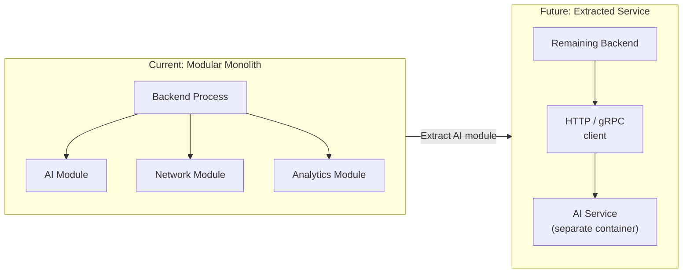

# Scalability and Enterprise Readiness

This document describes how TelcoPilot is designed to scale, the architectural properties that support enterprise adoption, the path from a single-instance deployment to a production-grade MTN Nigeria deployment, and a checklist of enterprise-readiness criteria against the current implementation.

---

## Current Capacity: The Modular Monolith Baseline

TelcoPilot is a modular monolith — all five modules run in the same process, sharing a DI container, database connection pool, and request lifecycle. This is the right starting architecture for the current scale. A monolith is operationally simpler, has zero inter-service latency, and allows the team to evolve module boundaries before committing to the overhead of distributed deployment.

In the Lagos metro NOC context, the operational scale is:
- 15–1,200+ towers being monitored
- Tens to hundreds of concurrent NOC engineers on shift
- Dozens of Copilot queries per shift
- Dashboard polling every 30 seconds per active browser session

At this scale, a well-optimised single ASP.NET Core instance with Redis caching and PostgreSQL connection pooling handles the load comfortably.

---

## Horizontal Scaling: What the Architecture Enables Today

TelcoPilot is designed to scale horizontally from day one, even as a monolith. Three specific architectural decisions enable this.

### Stateless JWT Authentication

Access tokens are JWTs validated entirely from the token's own claims and the signing key. The server holds no session state. Any backend replica can validate any token. Adding a second backend container behind NGINX requires only a single NGINX upstream change — no sticky sessions, no shared session store.

```nginx
upstream backend {
    server backend-1:8080;
    server backend-2:8080;
    server backend-3:8080;
}
```

This is the correct design for load-balanced deployments. Stateful session-based auth would require all requests from a given user to route to the same backend instance — a "sticky session" that breaks horizontal scaling and creates single points of failure.

### Redis-Backed Query Caching

High-frequency read queries (map data, metrics summaries) are cached in Redis. The cache key is identical across all backend replicas because it is derived from the query parameters, not from any per-instance state. When three replicas are serving traffic, a cache miss on one instance populates a result that all other instances will find on their next cache check.

Without Redis, three backend replicas would each independently query PostgreSQL on every cache-miss — tripling the database read load. With Redis as a shared cache, the database read load stays constant regardless of replica count, because the first replica to miss will populate the cache for all others.

### EF Core Connection Pooling

ASP.NET Core's default EF Core configuration uses Npgsql's built-in connection pooling. Each application instance maintains a pool of pre-opened database connections, eliminating the per-request connection overhead. In a multi-replica deployment, each replica has its own pool — this is standard and correct. PostgreSQL itself can handle 100+ concurrent connections without PgBouncer at NOC-level traffic volumes. PgBouncer should be added when aggregate connections across replicas exceed PostgreSQL's `max_connections` setting.

---

## Redis Caching Strategy

| Query | Cache Key | TTL | Reason |
|---|---|---|---|
| Map data (towers + regions) | `map:lagos` | 15 seconds | Refreshed frequently enough for live ops; aggressive caching reduces DB joins on every map poll |
| Metrics summary | `metrics:summary` | Configurable | KPI data changes on alert events; short TTL acceptable |
| Alert feed | Not cached | — | Alert feed must be real-time; staleness is operationally dangerous |
| Copilot responses | Not cached | — | Every query is unique; caching would return stale AI responses |

Cache invalidation is TTL-based. This is intentional for the demo. Production would add explicit cache invalidation on write (e.g., when a tower status changes, evict `map:lagos` immediately) to eliminate the lag between a network event and the dashboard reflecting it.

---

## Health Checks: Load Balancer Readiness

TelcoPilot exposes a `/health` endpoint. In a production deployment behind a load balancer, the load balancer polls this endpoint to determine whether the instance is ready to receive traffic.

The health check verifies:
1. **PostgreSQL connectivity**: can the application open a connection and execute a trivial query?
2. **Redis connectivity**: can the application reach the cache?
3. **Application liveness**: is the process itself responsive?

A failing health check causes the load balancer to route traffic away from the failing instance and optionally trigger a container restart. This ensures that a backend instance with a broken database connection is never served traffic — a property that cannot be provided by a simple "is the process running?" check.

---

## Module Extraction Path: From Monolith to Microservices

Each module is designed for extraction. The extraction procedure is documented here as a capability, not as an immediate plan.



**The extraction contract**:

The AI module communicates with other modules through three interfaces: `INetworkApi`, `IAlertsApi`, and `IAnalyticsApi`. In the current monolith, these interfaces are implemented by the respective modules and injected directly. To extract the AI module into a separate service:

1. Implement `INetworkApi` and `IAlertsApi` as HTTP clients that call the remaining monolith's internal endpoints.
2. Implement `IAnalyticsApi` as an HTTP client (or replace with a message bus publish).
3. Deploy the AI module as a separate container.
4. Update DI registration in the AI module to use the HTTP client implementations.

The application-layer code in the AI module (handler logic, skill implementations) **does not change**. The skills call `INetworkApi.ListByRegionAsync()` — they do not know whether that call resolves in-process or over HTTP.

**When to extract**: Extract a module when it has a clearly different scaling profile from the rest of the application. The AI module is the most likely candidate — Semantic Kernel + Azure OpenAI calls are significantly more latency-sensitive and resource-intensive than the data retrieval modules. In a large NOC with hundreds of concurrent Copilot queries, isolating the AI module allows it to scale independently without scaling the database-facing modules.

---

## Enterprise Adoption Checklist

The following checklist maps TelcoPilot's current capabilities against the criteria a telco enterprise IT team evaluates before adopting a platform.

| Criterion | Status | Evidence |
|---|:---:|---|
| Authentication | ✅ | JWT bearer, BCrypt, refresh rotation |
| Role-based access control | ✅ | 4 roles, ASP.NET Core policies, frontend gating |
| Audit trail | ✅ | All actions logged with actor, role, target, timestamp, IP |
| API security | ✅ | Bearer tokens, no raw secrets in code |
| Secrets management | ✅ | Environment variables, user-secrets for local dev |
| Horizontal scalability | ✅ | Stateless JWT, Redis shared cache, health checks |
| Database persistence | ✅ | Named volumes, PostgreSQL WAL |
| Container-native deployment | ✅ | Docker Compose, multi-stage Dockerfiles |
| Health endpoints | ✅ | `/health` for load balancer integration |
| Structured logging | ✅ | Serilog with context enrichment |
| Distributed tracing | ✅ | OpenTelemetry via Aspire ServiceDefaults |
| Error handling | ✅ | Pipeline behaviors, Result<T>, GlobalExceptionHandler |
| AI provider abstraction | ✅ | ICopilotOrchestrator — Mock or Azure OpenAI |
| Database schema isolation | ✅ | 5 schemas in 1 database; module-owned schemas |
| Cloud deployment path | ✅ | Azure Container Apps recommended |
| EF Core migrations | ⚠️ | EnsureCreatedAsync for demo; Add-Migration for prod |
| TLS termination | ⚠️ | Not in Docker Compose; ACA/cert-manager for prod |
| Multi-tenant isolation | ⚠️ | Single-tenant; tenant ID columns required for multi-tenant |
| SSE / WebSockets for live alerts | ⚠️ | 30s polling; SSE planned for Phase 1 |
| Azure Key Vault integration | ⚠️ | Env vars now; Key Vault for prod |

---

## What Would Change for a Production MTN Deployment

| Area | Demo State | Production Requirement |
|---|---|---|
| Database | EnsureCreatedAsync + seeders | EF Core migrations + flyway baseline |
| Secrets | `.env` file | Azure Key Vault with managed identity |
| TLS | HTTP only | HTTPS via ACA managed certs or Azure Front Door |
| PostgreSQL | Single container | Azure Database for PostgreSQL Flexible Server (HA, PITR) |
| Redis | Single container | Azure Cache for Redis (with replication) |
| Scaling | 1 replica | ACA auto-scaling rules based on HTTP queue depth |
| Monitoring | Aspire dashboard | Azure Application Insights + Azure Monitor |
| Auth | Dev JWT secret | Production secret rotation, short expiry |
| Tower data | 15 seeded towers | Integration with MTN's OSS/NMS via adapter layer |
| Alerts | Seeded incidents | Integration with MTN's EMS/fault management system |

---

## Cross-References

- Docker Compose and infrastructure detail: [13_Infrastructure_and_Deployment.md](13_Infrastructure_and_Deployment.md)
- Error handling and monitoring: [15_Error_Handling_Logging_and_Monitoring.md](15_Error_Handling_Logging_and_Monitoring.md)
- Known limitations and roadmap: [19_Risks_Limitations_and_Future_Improvements.md](19_Risks_Limitations_and_Future_Improvements.md)
