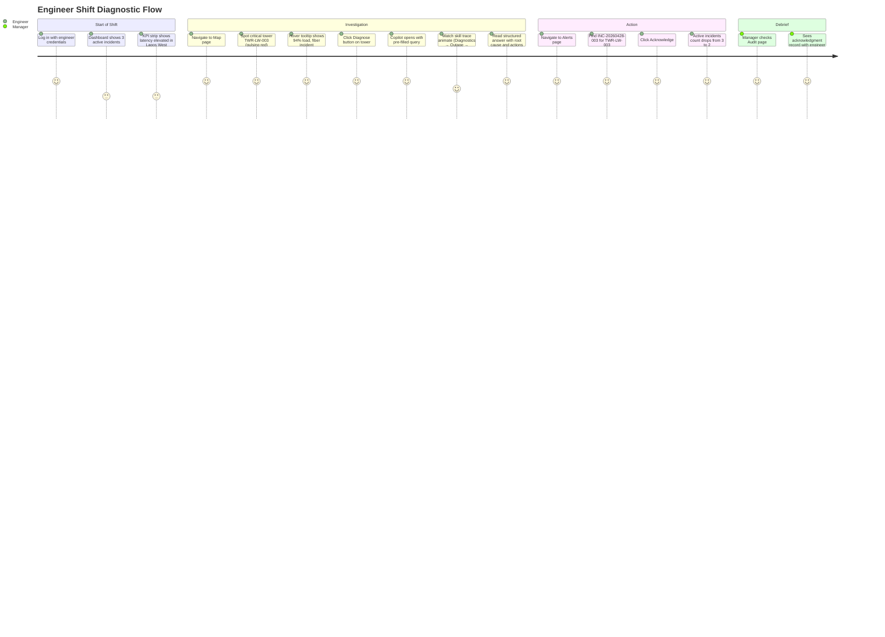

# UI/UX and User Flows

This document describes TelcoPilot's design philosophy, CSS theme system, page-by-page UX walkthrough, and the primary operational user flow that ties the interface together.

---

## Design Philosophy

TelcoPilot's UI is designed around a single operational context: a NOC engineer working a shift in a low-light control room, monitoring multiple screens, under cognitive load. This context drives every design decision.

**Information density over whitespace.** Consumer product design favours generous spacing and minimal information per view. NOC interfaces are the opposite — an engineer needs to assess six KPIs, three alert severities, and regional health without scrolling. The Dashboard packs this into a single viewport.

**Dark-first, always.** NOC environments typically operate in reduced ambient light to minimise eye strain during long shifts. A bright white interface in a dark room is actively harmful to operator focus. TelcoPilot's primary design surface is dark — light mode is provided as an accessibility option, not the design baseline.

**Monospace for codes.** Tower codes (`TWR-LW-003`), incident IDs (`INC-20260428-001`), and IP addresses are rendered in monospace. This is not aesthetic — it is functional. Monospace makes structural patterns in identifiers immediately scannable and diff-able.

**Colour as signal, not decoration.** Every colour in the TelcoPilot palette carries a specific operational meaning. Red means critical action required. Yellow means monitor closely. Green means normal. Blue is interactive (accent). Using these colours for decorative purposes would destroy their signal value.

---

## CSS Variable Theme System

TelcoPilot uses a CSS custom property (variable) system for all theme values. This provides two benefits: consistent token usage across components, and zero-JavaScript theme switching.

### Full Token Reference

| Variable | Dark Mode Value | Light Mode Value | Meaning |
|---|---|---|---|
| `--accent` | `#3b82f6` | `#2563eb` | Primary interactive blue — buttons, links, focus rings |
| `--warn` | `#f59e0b` | `#d97706` | Warning state — yellow alerts, warn status indicators |
| `--crit` | `#ef4444` | `#dc2626` | Critical state — critical alerts, SLA breach indicators |
| `--ok` | `#22c55e` | `#16a34a` | Healthy state — green status, uptime indicators |
| `--ink-1` | `#f1f5f9` | `#0f172a` | Primary text — highest contrast body copy |
| `--ink-2` | `#94a3b8` | `#475569` | Secondary text — labels, metadata, timestamps |
| `--ink-3` | `#64748b` | `#94a3b8` | Tertiary text — disabled states, placeholders |
| `--bg` | `#0f172a` | `#f8fafc` | Page background |
| `--bg-1` | `#1e293b` | `#f1f5f9` | Card/panel background |
| `--bg-2` | `#334155` | `#e2e8f0` | Elevated surface (hover states, selected rows) |
| `--bg-3` | `#475569` | `#cbd5e1` | Borders, dividers rendered as background |
| `--line` | `#334155` | `#e2e8f0` | Primary border/divider colour |
| `--line-2` | `#1e293b` | `#f1f5f9` | Subtle border — separates adjacent items of same hierarchy |

### Theme Toggle Implementation

The theme toggle is implemented without a CSS-in-JS library or React state management. The toggle sets a `data-theme` attribute on the `<html>` element and persists the preference in `localStorage`.

```typescript
// Theme toggle
const toggle = () => {
  const next = document.documentElement.dataset.theme === 'light' ? 'dark' : 'light';
  document.documentElement.dataset.theme = next;
  localStorage.setItem('theme', next);
};

// Hydration (in layout.tsx, before first render)
const saved = localStorage.getItem('theme') ?? 'dark';
document.documentElement.dataset.theme = saved;
```

The CSS selectors:

```css
:root { /* dark mode tokens */ }
[data-theme="light"] { /* light mode token overrides */ }
```

The `data-theme` hydration runs as early as possible in `layout.tsx` to prevent a flash of the wrong theme on page load. This is the canonical Next.js pattern for client-side theme management without a full SSR cookie solution.

---

## Page-by-Page UX Walkthrough

### Login Page (`/login`)

The login page uses a split-screen layout. The left panel carries the TelcoPilot brand: the logo mark, the tagline "Stop digging through logs. Ask the network.", and a brief value proposition statement. The right panel is the authentication form: email, password, and a sign-in button.

This split layout serves two purposes. It fills the screen with product identity rather than an awkward centred card on a blank background. And it gives the product a first impression that communicates "purpose-built enterprise tool" rather than generic SaaS login.

The form performs client-side validation before submission. Invalid email format or blank password shows an inline error without a round-trip to the server. A failed login renders the server's error message below the form.

On successful login, the JWT is stored in `localStorage` (access token) and `httpOnly` cookie handling is managed by the Next.js API route layer. The user is redirected to `/dashboard`.

### Dashboard — Command Center (`/dashboard`)

The Dashboard is the operational home screen. Layout from top to bottom:

1. **KPI Strip** — six cards, each with a headline number, a label, and a 6-point sparkline. Cards are colour-coded: uptime and OK metrics in green tones; latency and incident count respond to threshold values (green/yellow/red based on value vs target).
2. **Network status summary bar** — a one-line status bar showing aggregate network state and last-refresh timestamp.
3. **Quick-access action buttons** — "Ask Copilot", "View Alerts", "Open Map" — for fast navigation from the command center to the operational tools.

The Dashboard auto-refreshes every 30 seconds via a `setInterval` polling loop. A subtle "Last updated: X seconds ago" counter gives the engineer confidence that the data is live.

### Copilot — Natural Language Interface (`/copilot`)

The Copilot page is the most functionally complex page in the application.

**Layout**: Full-screen chat interface. The top half shows the conversation area; the bottom anchors the input bar. Above the input, a row of suggested query chips provides zero-typing entry points for the most common diagnostic questions.

**Suggested query chips** (examples):
- "Why is Lagos West slow?"
- "Which region has the worst signal right now?"
- "Show me all critical towers"
- "What should I check after a power outage?"

Clicking a chip populates the input field (not auto-submits) — giving the engineer the option to edit the query before sending.

**Skill trace animation**: When a query is submitted, the answer area displays a live processing panel. As the backend invokes each Semantic Kernel skill, the panel animates — a spinner beside each skill name, transitioning to a checkmark with timing when complete:

```
[✓] DiagnosticsSkill — 43ms
[✓] OutageSkill — 31ms
[✓] RecommendationSkill — 28ms
```

This animation is not cosmetic. It shows the engineer which analysis paths the AI took — building trust in the answer by making the reasoning process visible rather than delivering a response from a black box.

**Answer formatting**: The response renders in the same card as the skill trace. Tower codes (`TWR-LW-003`) are highlighted with the `--accent` colour and bold weight. Percentage values are bold. Section headers (ROOT CAUSE, AFFECTED, RECOMMENDED ACTIONS, CONFIDENCE) are rendered in small-caps.

### Alerts Page (`/alerts`)

The Alerts page renders the live incident feed as a table, sorted by severity (Critical first) then by timestamp. Each row shows:

| Column | Description |
|---|---|
| Severity badge | Coloured chip: red/Critical, yellow/Warning, blue/Info |
| Tower code | Monospace, highlighted for fast scanning |
| Region | Plain text |
| Incident type | Category (fiber, power, congestion, etc.) |
| Root cause | AI-attributed hypothesis (truncated, expandable) |
| Confidence | Progress bar showing AI confidence (0–100%) |
| Reported at | Relative timestamp ("14 min ago") |
| Action | "Acknowledge" button (engineer+ only; greyed out for Viewer) |

The severity filter bar above the table allows filtering to a single severity level. The filter state is reflected in the URL query parameter (`?severity=critical`), enabling bookmarking of filtered views.

Acknowledging an alert triggers a `POST /api/alerts/{id}/ack` request, then optimistically removes the alert from the "active" section and moves it to an "acknowledged" section below.

### Network Map (`/map`)

The map page renders an SVG/Canvas-based representation of the 15 Lagos metro towers positioned geographically.

**Tower symbols**: Diamond shapes (rotated squares), coloured by status:
- Red with a pulsing outer ring: Critical
- Yellow with a pulsing outer ring: Warning
- Green, no ring: OK

The pulse ring animation draws the eye to non-healthy towers before the engineer consciously looks for them.

**Tower interaction**: Hovering over a tower shows a tooltip with: tower code, region, signal %, load %, status, and the current incident description if one exists. Clicking a tower opens a detail side panel.

**Tower detail panel actions**:
- **Diagnose** — pre-populates the Copilot with `"Diagnose tower [code]"` and navigates to the Copilot page. This is the map → Copilot flow that allows the engineer to go from seeing a red tower to asking the AI about it in two clicks.
- **Dispatch** — opens a field dispatch form (UI placeholder in demo; full workflow in production roadmap).
- **History** — shows the incident history for this tower.

**Best Signal Zones panel**: A persistent side panel showing the top 3 regions by average signal percentage. Each entry shows the region name, average signal %, and a coloured bar. This directly answers the "where should I redirect subscriber traffic?" question.

### Insights Page (`/insights`)

The full analytics page. Contains all charts described in [11_Executive_Dashboard_and_Analytics.md](11_Executive_Dashboard_and_Analytics.md): the network latency chart (p95, per-region, 24h), the regional health bar chart, the incident type distribution, and the SLA compliance donut.

Charts are rendered using lightweight charting primitives (no full charting library dependency). The latency chart uses SVG polylines with gradient fills. The donut chart uses SVG arcs. This keeps the page weight low and gives full control over styling with CSS variables.

### Audit Page (`/audit`) — Manager+ Only

The audit page is a paginated, filterable table of every platform action. Accessible only to Manager and Admin roles. Viewers and Engineers attempting to navigate to `/audit` see an Access Denied panel.

Filter controls: Actor handle, action type, date range. The table displays: timestamp, actor handle + role badge, action, target, source IP.

### Users Page (`/users`) — Manager+ Only

The users page lists all platform users with their name, email, role badge, team, region, and active status. Manager and Admin roles can access this page. Actions available (in the full implementation): create user, edit user, change role, activate/deactivate user.

---

## Primary User Flow: Engineer Diagnosing an Incident



This flow demonstrates the full operational loop: situational awareness (Dashboard) → spatial investigation (Map) → AI-powered diagnosis (Copilot) → action (Alert acknowledgment) → governance (Audit trail). Every step is a natural continuation of the previous one — no context switching to external tools.

---

## Cross-References

- Frontend architecture (App Router, auth context): [05_Frontend_Architecture.md](05_Frontend_Architecture.md)
- Copilot skill architecture: [06_AI_and_Intelligence_Architecture.md](06_AI_and_Intelligence_Architecture.md)
- Role-based page access: [10_User_Roles_and_RBAC.md](10_User_Roles_and_RBAC.md)
- Dashboard KPI definitions: [11_Executive_Dashboard_and_Analytics.md](11_Executive_Dashboard_and_Analytics.md)
