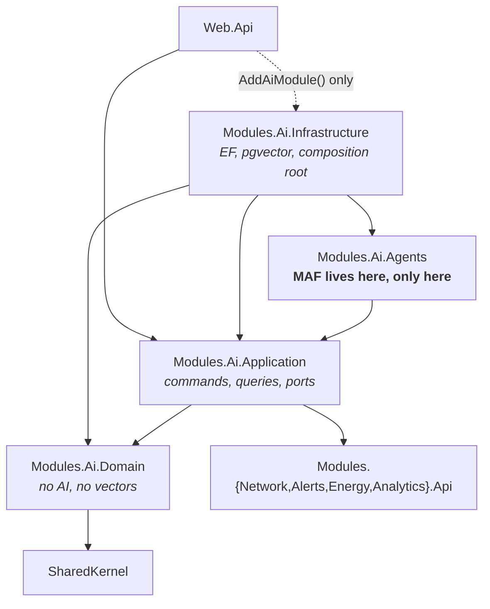
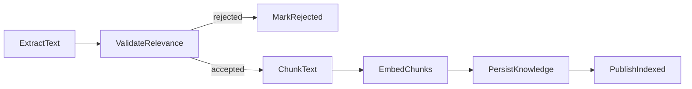
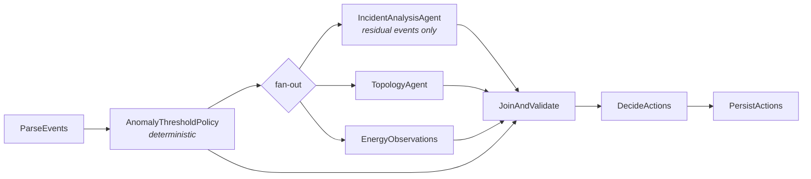
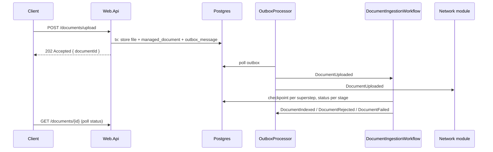

# Phase 2 — Target AI Architecture

**Repository:** TelcoPilot (DDD Modular Monolith, .NET 10)
**Predecessor:** [`PHASE1_AI_ARCHITECTURE_AUDIT.md`](PHASE1_AI_ARCHITECTURE_AUDIT.md)
**Status:** design only. No code changed. No migration performed.
**Date:** 2026-07-10

---

## 1. What this document is

The target architecture for TelcoPilot's AI layer on Microsoft Agent Framework, and the reason for every decision in it.

It is not a migration plan. Sequencing, milestones and risk mitigation are Phase 3. It is also not a rewrite of the business modules: `Network`, `Alerts`, `Energy`, `Analytics` and `Identity` keep their domain models, aggregates and public `.Api` contracts. Phase 1 established that those are clean. The rot is confined to `Modules.Ai.Infrastructure` and the seams around it, and that is what this design replaces.

The organising principle is a single sentence:

> **AI is an application capability that reacts to business events. It is never business logic, never a caller of repositories, and never on the request thread.**

---

## 2. Reference basis

All framework claims below were read from the authoritative sources on 2026-07-10. Microsoft Agent Framework reached 1.0 on 2026-04-03 and is the direct successor to Semantic Kernel and AutoGen, built by the same teams.

| Package | Version seen | Role |
| --- | --- | --- |
| `Microsoft.Agents.AI` | 1.x | `AIAgent`, `AgentSession`, `ChatHistoryProvider`, `AIContextProvider` |
| `Microsoft.Agents.AI.Workflows` | 1.13.0 | `WorkflowBuilder`, `Executor`, `CheckpointManager` |
| `Microsoft.Agents.AI.OpenAI` | prerelease | Azure OpenAI / OpenAI agent factories |
| `Microsoft.Agents.AI.Hosting` | 1.x | `builder.AddAIAgent(...)` → `IHostedAgentBuilder` |
| `Microsoft.Agents.AI.DurableTask` | 1.4.0-preview | Durable execution, Azure-backed |
| `Azure.AI.OpenAI`, `Azure.Identity` | prerelease / stable | `AzureOpenAIClient` |

Sources: [Agent Framework overview](https://learn.microsoft.com/en-us/agent-framework/overview/) · [SK migration guide](https://learn.microsoft.com/en-us/agent-framework/migration-guide/from-semantic-kernel/) · [Tools](https://learn.microsoft.com/en-us/agent-framework/agents/tools/) · [Workflows](https://learn.microsoft.com/en-us/agent-framework/workflows/) · [Checkpoints](https://learn.microsoft.com/en-us/agent-framework/workflows/checkpoints) · [Context providers](https://learn.microsoft.com/en-us/agent-framework/agents/conversations/context-providers) · [Storage](https://learn.microsoft.com/en-us/agent-framework/agents/conversations/storage) · [Session](https://learn.microsoft.com/en-us/agent-framework/agents/conversations/session) · [RAG](https://learn.microsoft.com/en-us/agent-framework/agents/rag) · [Azure OpenAI provider](https://learn.microsoft.com/en-us/agent-framework/agents/providers/azure-openai)

### Not verified

Stated plainly so nothing here is mistaken for fact:

- **The `binarytrails-ai/aigenius-maf-travel-assistant` reference repo was read only partially.** Its tree, `README`, `Program.cs` summary and docs site were retrieved; individual agent and tool source files were not. Findings are in **Appendix A**. It is treated as an example, not a template — see the appendix for why that distinction is load-bearing.
- **The `microsoft/agent-framework` `dotnet/samples` tree was not read.** `github.com` resolved intermittently from the authoring environment and the unauthenticated API rate limit was exhausted.
- **`ICheckpointStore<JsonElement>`'s exact member list** was not read. Only its use in `CheckpointManager.CreateJson(ICheckpointStore<JsonElement>, JsonSerializerOptions)` was confirmed.
- **`RequestInfoExecutor`** (human-in-the-loop) is documented in the workflows comparison table; its exact C# signature was not read. It is not on the critical path for this design.
- The version skew between `Microsoft.Agents.AI.Workflows` (1.13.0) and `Microsoft.Agents.AI.DurableTask` (1.4.0-preview) is real and unexplained. Pin versions explicitly.

Semantic Kernel and MAF coexistence is **not** relied upon anywhere in this design — see **D12**.

---

## 3. Decision register

Every decision, with its reason. Decisions D1–D4 were taken by the repository owner; D5–D11 follow from the framework and the Phase 1 evidence.

| # | Decision | Reason |
| --- | --- | --- |
| **D1** | **Five agents, not ten.** | MAF's own guidance: *"If you can write a function to handle the task, do that instead of using an AI agent."* Four of the directive's ten have no LLM-shaped work. See §5. |
| **D2** | **Postgres outbox + custom `ICheckpointStore<JsonElement>`.** | Satisfies retry/resumability/cancellation/progress without new infrastructure. Reuses the database already present. See §8, §9. |
| **D3** | **Azure OpenAI Responses client.** | Microsoft's recommended primary client. Richest tool surface: hosted MCP, file search, code interpreter, tool approval. Tool approval maps directly onto the MTN permit-to-work roadmap item. |
| **D4** | **Delete the in-process MCP registry.** | It is a hand-rolled reimplementation of tool dispatch that MAF provides natively, and Phase 1 proved the LLM cannot see it. MCP is retained only for genuine out-of-process servers. |
| **D5** | **Conversation history stays application-owned.** | Consequence of D3. Responses can let OpenAI own the conversation; the docs name our exact configuration — many users behind one API key — as *"the risky hosted pattern."* We use a custom `ChatHistoryProvider` over the existing `Conversation` aggregate and never accept a service-side ID from a client. This also fixes the write-only-memory defect (Phase 1 §4.7). |
| **D6** | **Workflow graphs must never reference the checkpoint store.** | `Microsoft.Agents.AI.DurableTask` adds durable execution *"to any MAF workflow without changing the workflow definition."* Keeping durability a hosting concern means adopting it later costs zero workflow changes. |
| **D7** | **Offline mode is a swapped `IChatClient`, not a second orchestrator.** | `ChatClientAgent` wraps any `IChatClient`. This makes the Phase 1 provider divergence — Mock does RAG, SK does not — structurally impossible. One code path. |
| **D8** | **Executors and Tools reach the outside world only through `ISender`.** | A single, mechanically checkable rule that enforces "AI never calls repositories" and "Tools wrap application services." |
| **D9** | **AI never dispatches another module's command.** | Breaks the runtime cycle (Phase 1 §4.3). Modules subscribe to events instead. |
| **D10** | **NOC runbooks move to the domain.** | `RecommendationSkill` is a `switch` today. Runbooks are MTN business policy. Turning deterministic policy into model output would be a regression. |
| **D11** | **`Modules.Ai.Infrastructure` remains the AI module's composition root.** | It already is. A fifth project whose only file is `DependencyInjection.cs` is speculative structure — the exact smell the directive forbids. |
| **D12** | **MAF fully replaces Semantic Kernel. No coexistence, no bridge, no dual runtime.** | Owner decision. No `KernelFunction`-to-`AIFunction` adapter, no feature flag selecting between orchestrators, no request path that can reach both. When SK leaves, it leaves entirely. |
| **D13** | **All migration work lands on the single branch `feat-MAF-refinement(weyinmi)`. No PR sequence.** | Owner decision, and it resolves D12's scope. Coexistence is permitted *within* the branch's intermediate commits — it never reaches `main`. The branch merges as one complete replacement. See §14.1. |

---

## 4. Module boundaries and dependency graph

### 4.1 Projects

Four projects. `Modules.Ai.Agents` is new, and is **the only place in the repository where a MAF type may appear**.



`Infrastructure → Agents` looks inverted until you read it as *composition root → component*. Infrastructure constructs the agents, injects the ports they declare, and owns every adapter. `Agents` itself knows nothing about EF Core, pgvector, HTTP or Postgres.

### 4.2 Enforced dependency rules

Each rule exists to kill a specific Phase 1 finding.

Citations below point at the Phase 1 audit, not at sections of this document.

| Rule | Kills |
| --- | --- |
| `Ai.Domain` references no vector or AI package | `using Pgvector;` in `KnowledgeChunk` — Phase 1 §4.2 #1 |
| `Ai.Agents` may not reference `Ai.Infrastructure`, `Ai.Domain`, or any repository | AI → repositories (dependency-rule directive) |
| `Ai.*` may not reference another module's `.Application` | `Ai.Infrastructure → Network.Application` — Phase 1 §4.2 #2 |
| `Web.Api` may not reference `Ai.Domain` or `Ai.Agents` | `GeoEnricher` → `Ai.Infrastructure.Mcp.Osm` — Phase 1 §4.2 #3; `IManagedDocumentRepository` injected into an endpoint — Phase 1 §4.2 #4 |
| No AI type appears outside `src/Modules/Ai/` | `AiAnalysisResult`, `INetworkBatchAnalyzer` in `Network.Application` — Phase 1 §4.2 #5 |
| No namespace is named after a vendor framework | `Modules.Ai.Application.SemanticKernel` — Phase 1 §4.2 #6 |
| AI never sends another module's command | the runtime cycle — Phase 1 §4.3 |

**How they are enforced.** Project references catch most of these at compile time. The remainder — "no AI type outside the AI module", "AI never sends another module's command" — get an architecture test using NetArchTest or a plain reflection test in the (currently broken) test project. Enforcement that depends only on review will decay; Phase 1 is the evidence.

### 4.3 Folder structure

```
src/Modules/Ai/
├── Modules.Ai.Domain/
│   ├── Conversations/          Conversation, Message, MessageRole
│   ├── Documents/              ManagedDocument, IndexingStatus, DocumentSource
│   └── Knowledge/              KnowledgeDocument, KnowledgeChunk   ← float[], not Pgvector.Vector
│
├── Modules.Ai.Application/
│   ├── Contracts/              DTOs crossing the module boundary
│   ├── Copilot/                AskCopilotCommand + handler, conversation queries
│   ├── Documents/              Upload/Reindex/Delete/List commands + handlers
│   ├── Knowledge/              IndexKnowledgeCommand, SearchKnowledgeQuery
│   ├── Tools/                  MediatR queries the Tools dispatch (one per capability)
│   └── Ports/                  IEmbeddingGenerator, IKnowledgeSearch, IDocumentStorage,
│                               ITextExtractor, IChunker, IAgentSessionStore
│
├── Modules.Ai.Agents/          ← the /AI bounded context. MAF types confined here.
│   ├── Agents/                 5 agent definitions (§5)
│   ├── Tools/                  AIFunction definitions, grouped by module (§6)
│   ├── Workflows/              graph definitions
│   │   └── Executors/          one file per executor
│   ├── Memory/                 PostgresChatHistoryProvider, KnowledgeContextProvider
│   ├── Sessions/              AgentSession serialization helpers
│   ├── Prompts/                agent instructions, one file each
│   └── Configuration/          AiOptions, AgentNames, agent registration
│
└── Modules.Ai.Infrastructure/
    ├── Database/               AiDbContext, EF configurations, migrations
    ├── Embeddings/             AzureOpenAiEmbeddingGenerator, Deterministic, CachingDecorator
    ├── Knowledge/              PgVectorKnowledgeSearch
    ├── Storage/                Local + cloud document storage providers
    ├── Checkpointing/          PostgresCheckpointStore : ICheckpointStore<JsonElement>
    ├── Outbox/                 OutboxMessage, OutboxProcessor
    ├── Hosting/                workflow host BackgroundServices
    └── DependencyInjection.cs  AddAiModule() — the composition root
```

The directive asked for `/AI/{Agents,Workflows,Tools,Memory,Prompts,Models,Contracts,Sessions,Configuration}`. That is realised as `Modules.Ai.Agents/` plus `Modules.Ai.Application/{Contracts,Ports}`. `Models` and `Contracts` belong in the Application layer because they cross the module boundary and must not drag MAF types with them.

---

## 5. Agent architecture

### 5.1 The five agents

| Agent | Input → Output | Why it must be an LLM |
| --- | --- | --- |
| **`OperationsCopilotAgent`** | natural-language question → grounded answer | Open-ended, conversational, autonomous tool selection. The only agent with a chat session. |
| **`IncidentAnalysisAgent`** | network events → `DetectedAnomaly[]` | Pattern recognition over heterogeneous, semi-structured logs. |
| **`RootCauseAgent`** | anomaly + topology + prior incidents → cause + confidence | Synthesis across sources; no closed-form rule exists. |
| **`DocumentIntakeAgent`** | filename + text preview → relevance + extracted metadata | Semantic relevance judgement. |
| **`TopologyAgent`** | network log → `TopologyDelta` | Entity/relationship extraction from unstructured text. |

Each has a single purpose, its own instructions file, and its own tool set. None shares a prompt with another.

### 5.2 What is deliberately *not* an agent

| Directive's name | Becomes | Reason |
| --- | --- | --- |
| `RecommendationAgent` | `RunbookPolicy` — a domain service | It is a `switch` today. NOC runbooks are MTN policy, not model output (**D10**). |
| `KnowledgeAgent` | `KnowledgeContextProvider` + one `query_knowledge` tool | Retrieval is not reasoning. MAF models RAG as an `AIContextProvider`. |
| `CorrelationAgent` | `CorrelationExecutor` | Alarm correlation is a rules problem with a deterministic answer. |
| `NotificationAgent` | `NotificationExecutor` | A workflow step. There is nothing to reason about. |
| `HealthMonitoringAgent` | `HealthMonitor : BackgroundService` | Polling and thresholds. |
| `TowerDiscoveryAgent` | *deferred* | No use case exists in the repository. Building it now is speculative generalisation. |
| `DocumentAgent` | `DocumentIntakeAgent` | Renamed to say what it does. |

This is a substantive departure from the directive's list, taken deliberately. Six fewer LLM call sites, six fewer prompts to maintain, and the two pieces of genuine business policy — runbooks and correlation rules — return to the domain where they can be unit-tested without a model.

### 5.3 Agent construction

Agents are constructed in `Modules.Ai.Infrastructure`, defined in `Modules.Ai.Agents`.

```csharp
// Modules.Ai.Infrastructure — composition root
AzureOpenAIClient client = new(new Uri(options.Endpoint), credential);

IChatClient chat = options.Enabled
    ? client.GetResponsesClient().AsIChatClient()   // D3
    : new DeterministicChatClient();                // D7 — offline mode

AIAgent copilot = chat.AsAIAgent(new ChatClientAgentOptions
{
    Name = AgentNames.OperationsCopilot,
    ChatOptions = new() { Instructions = Prompts.OperationsCopilot },
    ChatHistoryProvider = new PostgresChatHistoryProvider(sender),   // D5
    AIContextProviders = [new KnowledgeContextProvider(sender)],
});
```

The structured agents (`IncidentAnalysis`, `RootCause`, `Topology`, `DocumentIntake`) are constructed the same way with no history provider — they are stateless, single-shot, and return typed results.

**Registration.** One builder class per agent, each registered as a keyed singleton:

```csharp
services.AddSingleton<OperationsCopilotAgentBuilder>();
services.AddKeyedSingleton<AIAgent>(AgentNames.OperationsCopilot,
    (sp, _) => sp.GetRequiredService<OperationsCopilotAgentBuilder>().Build());
```

Keyed singletons are the pattern the MAF migration guide shows, and the reference travel-assistant repo uses it too (Appendix A). `Microsoft.Agents.AI.Hosting`'s `builder.AddAIAgent(name, instructions).WithAITool(...)` is the more declarative alternative, but it registers against `IHostApplicationBuilder` in `Web.Api`, which would put agent construction outside the AI module and violate §4.2. We keep construction in the composition root.

`Build()` is **synchronous**. The reference repo calls `factory.CreateAsync().Result` inside its DI callback; blocking on a `Task` in a service-resolution path is a deadlock risk and we do not copy it. Any async warm-up (for example, connecting an MCP client) belongs in an `IHostedService`, not in a DI factory.

**Offline mode.** `DeterministicChatClient : IChatClient` returns canned, schema-valid responses. Because it sits below the agent rather than beside it, the offline path exercises the *same* agent, the *same* tools, the *same* context providers and the *same* workflow graph as production. Phase 1 §4.6 showed the current Mock and Azure paths are different algorithms behind one interface; this makes that class of bug impossible.

### 5.4 Composition over a supervisor

MAF supports `agent.AsAIFunction()` — an agent used as another agent's tool. `OperationsCopilotAgent` may call `RootCauseAgent` this way. It is composition, not a supervisor hierarchy, and it stays optional: the copilot answers most questions from tools alone.

MAF also supports **workflows as agents**, so `IncidentInvestigationWorkflow` could be surfaced to the copilot as a single callable capability. The reference repo registers a `ContosoTravelWorkflowAgent` exactly this way. We note the option and do not take it yet: an operator asking "why is Lekki down?" should not silently trigger a workflow that writes alerts and sends notifications. Workflows with side effects stay event-triggered.

---

## 6. Tool architecture

### 6.1 Shape

A tool is a method. No attribute, no plugin class, no registry — MAF reads the signature and `[Description]`.

```csharp
// Modules.Ai.Agents/Tools/NetworkTools.cs
internal sealed class NetworkTools(ISender sender)
{
    [Description("Return the current signal, load and status snapshot for every tower in a region.")]
    public Task<string> GetRegionMetrics(
        [Description("Region name, e.g. 'Lekki'. Empty string for all regions.")] string region,
        CancellationToken ct = default)
        => Dispatch(sender, new GetRegionMetricsQuery(region), ct);
}

// registration
AIAgent agent = chat.AsAIAgent(tools: [AIFunctionFactory.Create(networkTools.GetRegionMetrics)]);
```

Every tool body is one line: dispatch a MediatR query. Tool calls therefore ride the same logging, validation and exception pipeline as every other use case (**D8**). This generalises `InternalToolsSkill`, which Phase 1 identified as the one thing the current codebase already gets right.

### 6.2 The tool catalogue

Twelve tools replace twenty-three kernel functions plus a parallel MCP capability set.

| Group | Tools |
| --- | --- |
| `NetworkTools` | `get_region_metrics`, `get_tower_metrics`, `search_towers` |
| `AlertTools` | `get_active_outages`, `search_alarm_history` |
| `EnergyTools` | `get_energy_kpis`, `detect_energy_anomalies`, `get_diesel_trace` |
| `KnowledgeTools` | `query_knowledge` |
| `GeoTools` | `get_site_geocontext`, `classify_region` |
| `DocumentTools` | `search_documents` |

The deletions are the point. Phase 1 found `get_network_metrics` (MediatR) and `get_region_metrics` (`INetworkApi`) returned the same data by different routes, and `get_outages` / `get_active_outages` / `get_outages_in_region` were three tools for one question. Every duplicate the model can see is a coin-flip it has to make, and a round trip it may waste. **One capability, one tool.**

The five OSM primitives collapse to two composed tools, matching the current system prompt's own advice to *"prefer `osm_get_site_geocontext` (one call, cached) over invoking the four primitives separately."* The prompt was compensating for a tool-design problem. Fix the tools, delete the prose.

### 6.3 MCP

`IMcpPlugin`, `IMcpInvoker`, `IMcpPluginRegistry`, the four plugins, both dead adapters and `/api/mcp/*` are deleted (**D4**). They are ~400 LOC reimplementing what MAF does natively, invisible to the LLM, reachable only from a hand-written endpoint that itself violated the thin-API rule.

MCP survives only where it is genuinely MCP: MAF's Local MCP and Hosted MCP tool support, pointed at real out-of-process servers. `FileMcpClient` — which spawns an `npx` Node subprocess on every boot, including in offline mode where its tools are never attached to any kernel — is removed unless a concrete use case survives Phase 3 review.

---

## 7. Workflow architecture

Three workflows. Each is a `WorkflowBuilder` graph of `Executor`s. No workflow logic lives in a controller or a command handler.

### 7.1 `DocumentIngestionWorkflow`



`ValidateRelevance` invokes `DocumentIntakeAgent`. `EmbedChunks` partitions into requests of at most `MaxInputsPerRequest` (default 2048). Everything else is deterministic.

A checkpoint is written at every superstep boundary. Executors persist their state:

```csharp
internal sealed class ChunkTextExecutor() : Executor("ChunkText")
{
    [MessageHandler]
    private async ValueTask HandleAsync(ExtractedText msg, IWorkflowContext ctx) { /* ... */ }

    protected override ValueTask OnCheckpointingAsync(IWorkflowContext ctx, CancellationToken ct)
        => ctx.QueueStateUpdateAsync(StateKey, _chunks);

    protected override async ValueTask OnCheckpointRestoredAsync(IWorkflowContext ctx, CancellationToken ct)
        => _chunks = await ctx.ReadStateAsync<List<TextChunk>>(StateKey);
}
```

The four directive requirements are properties of the framework, not hand-rolled code:

| Requirement | Mechanism |
| --- | --- |
| **Retry** | Resume from the last `CheckpointInfo` |
| **Resumability** | `InProcessExecution.ResumeStreamingAsync(workflow, checkpoint, manager)` |
| **Cancellation** | `CancellationToken` + `ManagedDocument.MarkCancelled()` |
| **Progress reporting** | `SuperStepCompletedEvent` → `ManagedDocument.Status` / `ProcessingStage` |

### 7.2 `NetworkLogAnalysisWorkflow`

Replaces `SemanticKernelNetworkBatchAnalyzer`. Phase 1 found four **independent** LLM calls executed **sequentially**, each re-sending the same `eventsJson` and `rawContext`, worst case eight calls with retries.



The fan-out is a parallel edge group; the three branches run in one superstep, replacing four sequential calls.

`AnomalyThresholdPolicy` runs first and deterministically. A signal drop of 40 dB is not a judgement call, and paying an LLM to notice it is waste. Only the events it cannot classify reach `IncidentAnalysisAgent`. This inverts the current design, which sends every event to the model and keeps the thresholds in a class that is only registered when Azure is *absent*.

`DecideActions` and `PersistActions` are deterministic and behaviourally unchanged — they are the existing Stage 3 and Stage 4.

`EnergyObservations` is an open question for Phase 3. Phase 1 showed the energy "skill" mostly re-fetches live energy state (`ListSitesAsync` + `ListAnomaliesAsync`) and re-serialises it. If it performs no reasoning, it should not be an LLM call at all — it should be a tool.

### 7.3 `IncidentInvestigationWorkflow`

The event-driven flow the directive asks for:

```
AlarmReceived → CorrelationExecutor → RootCauseAgent → RunbookPolicy → NotificationExecutor
```

`CorrelationExecutor` and `RunbookPolicy` are deterministic. Exactly one LLM call sits in the middle, where the reasoning is.

### 7.4 Durability is a hosting concern

**D6.** Workflow definitions never mention checkpoints. Execution is configured at the host:

```csharp
// Infrastructure/Hosting — today
CheckpointManager manager = CheckpointManager.CreateJson(postgresCheckpointStore, jsonOptions);
StreamingRun run = await InProcessExecution.RunStreamingAsync(workflow, input, manager);

// later, if Azure Durable Task Scheduler is adopted:
//   swap the host. The graph above does not change.
```

---

## 8. Memory architecture

Four stores. No responsibility is shared between two of them.

| Concern | Mechanism | Backing | Lifetime |
| --- | --- | --- | --- |
| **Conversation** | `PostgresChatHistoryProvider : ChatHistoryProvider` | existing `Conversation` / `Message` | per user conversation |
| **Knowledge** | `KnowledgeContextProvider : AIContextProvider` + `query_knowledge` tool | pgvector | corpus lifetime |
| **Operational** | stateless tools over module `.Api` | none — live reads | per call |
| **Workflow state** | `PostgresCheckpointStore : ICheckpointStore<JsonElement>` | `ai.workflow_checkpoints` | per workflow run |

### 8.1 Conversation memory

Phase 1's most user-visible defect: `AskCopilotCommandHandler` loads the full `Conversation` with its `Message` list, then calls `orchestrator.AskAsync(query, role, ct)` and discards it. Multi-turn conversation has never worked.

MAF has a first-class seam. `ChatHistoryProvider` is attached to the agent, is shared across sessions, and must therefore hold no per-session state — session-scoped values go in the `AgentSession` via `ProviderSessionState<T>`.

```csharp
internal sealed class PostgresChatHistoryProvider(ISender sender) : ChatHistoryProvider
{
    protected override async ValueTask<IEnumerable<ChatMessage>> ProvideChatHistoryAsync(
        InvokingContext context, CancellationToken ct)
    {
        var state = _sessionState.GetOrInitializeState(context.Session);
        return await sender.Send(new GetConversationMessagesQuery(state.ConversationId), ct);
    }

    protected override async ValueTask StoreChatHistoryAsync(InvokedContext context, CancellationToken ct)
    {
        var state = _sessionState.GetOrInitializeState(context.Session);
        await sender.Send(new AppendMessagesCommand(
            state.ConversationId, context.RequestMessages, context.ResponseMessages), ct);
    }
}
```

Note it dispatches through `ISender` (**D8**) — the provider never touches `IConversationRepository`.

`ChatLog` is retired. It is a write-only second source of truth for the same event; its only read method has zero callers.

**Session persistence.** `agent.SerializeSession(session)` returns a `JsonElement`, stored on the conversation row and restored with `agent.DeserializeSessionAsync(...)`. Per the docs' explicit warning, a serialized session is bound to the authenticated user and ownership is verified before it is resumed. Service-side identifiers are never returned to a browser.

### 8.2 Knowledge memory

MAF ships `TextSearchProvider`, an `AIContextProvider` with two modes: search before every run, or expose itself as a function tool for on-demand retrieval.

We use **both, deliberately**: `OperationsCopilotAgent` gets a `query_knowledge` tool for explicit lookups, and a `BeforeAIInvoke` provider for baseline grounding. This is the fix for Phase 1 §4.6 — it removes any possibility that retrieval happens on one provider and not the other, because retrieval now lives in the agent's own pipeline rather than in an orchestrator's imperative code.

Retrieval reaches pgvector through the `IKnowledgeSearch` port, implemented in Infrastructure.

### 8.3 Operational memory

There isn't any, and that is the design. Live network, alert and energy state is read on demand through tools. Caching it would create a staleness problem in a system whose entire purpose is telling engineers what is happening *now*.

---

## 9. Document processing architecture

The single most important change in this document.

### 9.1 Today

`POST /documents/upload` does not return until text extraction, an LLM relevance call, an unbounded embeddings call, and a five-stage network pipeline with four more LLM calls have all completed. **5–9 LLM round trips and ≥11 `SaveChangesAsync` across two DbContexts inside the HTTP request.** The code says so out loud: *"Synchronously ingest so the demo flow is 'upload → searchable' without needing a background worker."*

### 9.2 Target



The endpoint returns after one transaction. Everything downstream is asynchronous, checkpointed, retryable and cancellable.

### 9.3 Breaking the cycle

Phase 1 §4.3 found `Ai.Infrastructure → Network.Application → Ai.Infrastructure`, closed through `ISender` and DI, firing on every log-file upload. It exists *because* upload is synchronous: AI code had to call Network code to make the triggers fire, and Network code had to call back into AI code to do the analysis.

Under **D9**, `DocumentIngestionService` no longer sends `ProcessNetworkLogCommand`. The Network module subscribes to `DocumentUploaded` and decides for itself whether the file is a network log. The dependency is inverted structurally, not by convention. `INetworkBatchAnalyzer`, `AiAnalysisResult`, `DetectedAnomaly`, `AnomalyType` and `TopologyDelta` — 188 LOC of AI vocabulary — move out of `Network.Application` into the AI module's contracts.

### 9.4 The outbox

A transactional outbox is required because the document row and the "please process this" signal must commit atomically. The existing `IEventBus` is an in-memory `Channel`: a crash between the two loses the work silently.

The outbox table lives in the `ai` schema, written by `AiDbContext` in the same transaction as `ManagedDocument`. A single `OutboxProcessor : BackgroundService` polls it and publishes through the existing `IEventBus` → `IntegrationEventProcessorJob` → MediatR path, which is kept. This is the smallest change that makes the event durable; a repository-wide outbox is deferred until a second module needs one.

### 9.5 Required domain changes

Additive, and forced by the new capability. The existing aggregate is otherwise preserved.

```csharp
public enum IndexingStatus
{
    Pending, InProgress, Indexed, Failed, Rejected,
    Cancelled,                    // NEW — cancellation is a directive requirement
}

public sealed class ManagedDocument
{
    public string? ProcessingStage { get; private set; }   // NEW — progress reporting
    public string? CheckpointId { get; private set; }      // NEW — resumability

    public void MarkCancelled();                           // NEW
    public void RecordProgress(string stage, string? checkpointId);  // NEW
}
```

`ManagedDocument` already models `MarkInProgress` / `MarkIndexed` / `MarkFailed` / `MarkRejected` and carries a `Version` for idempotent reindexing. Its own comment claims the status *"lets the ingestion job pick up where it left off after a restart"* — there has never been such a job, and no field to resume from. These three additions make the comment true.

### 9.6 API contract change — flagged

`POST /documents/upload` changes from **`201 Created`** with a fully-indexed document to **`202 Accepted`** with a document id and `Pending` status. The frontend must poll `GET /documents/{id}` or subscribe for completion.

This is a breaking change to a public contract. The directive says to avoid breaking changes; this one is unavoidable, because "the upload endpoint should never wait for AI processing" is also a directive requirement, and the two cannot both hold. It is called out here rather than discovered during Phase 4. The frontend already renders an indexing-status badge from `IndexingStatus`, so the UI affordance exists.

---

## 10. Event catalogue

| Event | Published by | Consumed by |
| --- | --- | --- |
| `DocumentUploaded` | `UploadDocumentCommandHandler` (via outbox) | `DocumentIngestionWorkflow`; **Network module** |
| `DocumentIndexed` | `PublishIndexedExecutor` | notification, dashboard projection |
| `DocumentRejected` | `MarkRejectedExecutor` | notification |
| `DocumentFailed` | workflow host | notification, retry policy |
| `AlarmReceived` | Alerts module | `IncidentInvestigationWorkflow` |
| `PipelineCompleted` | `NetworkLogAnalysisWorkflow` | dashboard projection (exists today) |

Direction of travel: **AI reacts to business events; business modules never call AI.**

---

## 11. Performance

Phase 1's bottlenecks, and where each is addressed.

| Bottleneck (Phase 1 §4.10) | Remedy |
| --- | --- |
| Unbounded embeddings request — latent HTTP 400 above ~1 MB of text | `EmbedChunksExecutor` partitions to ≤ `MaxInputsPerRequest` (default 2048) |
| No embedding cache; every RAG query re-embeds | `CachingEmbeddingGenerator` decorator keyed by content hash, over the Redis already registered |
| `EnergyKnowledgeIndexer` re-embeds every site + 200 anomalies every 5 minutes, forever | Content-hash dirty check; skip unchanged documents |
| Stage 2 runs four independent LLM calls sequentially, re-sending the same payload | Parallel edge group (§7.2) |
| Every event is sent to the model, including unambiguous threshold breaches | `AnomalyThresholdPolicy` pre-filter; only residual events reach the agent (§7.2, §12) |
| Copilot re-sends an 86-line system prompt on every auto-invoke round trip | Decomposed instructions; `MessageCountingChatReducer` on history |
| 23 tools with overlaps → wasted tool-selection round trips | 12 tools, no duplicates (§6.2) |
| Boot does RAG indexing + embeddings on the startup thread; seed runs twice | Seeding moves to one idempotent hosted service, off the startup path |
| `npx` Node subprocess spawned at every boot | `FileMcpClient` removed (**D4**) |
| `DocumentSyncService` fire-and-forget `Task.Run` | Deleted; replaced by the workflow |

---

## 12. What gets deleted

Phase 5 detail, listed here so the design's scope is honest.

**Confirmed dead already** (Phase 1 §4.8): `SemanticKernelOrchestrator.MockAnswer`, `OneDriveDocumentStorageProvider`, `ExternalApiPlugin`, `ExternalMcpServerPlugin`, `McpPluginKind.ExternalApi`/`.ExternalMcpServer`, `ChatLogRepository.CountAsync`, the DI-registered `PromptExecutionSettings` singleton.

**Superseded by this design:** all 16 files importing `Microsoft.SemanticKernel`; `Kernel`, `IChatCompletionService`, `KernelJsonInvoker`; the 7 SK skills and 4 Stage-2 skills; `ICopilotOrchestrator` and both implementations; `IMcpPlugin`/`IMcpInvoker`/`IMcpPluginRegistry` and the 4 plugins; `/api/mcp/*`; `FileMcpClient`, `FileMcpClientInitializer`; `DocumentSyncService`; `ChatLog`, `IChatLogRepository`, `ChatLogRepository`; `INetworkBatchAnalyzer` and its AI contracts in `Network.Application`.

**Preserved, not deleted — logic extracted first.** Two classes look like AI artifacts and are actually business policy. Deleting them would discard domain rules:

| Class | What it really is | Destination |
| --- | --- | --- |
| `RecommendationSkill` | NOC runbooks: root-cause class → three operator actions | `RunbookPolicy` in the domain (**D10**) |
| `HeuristicNetworkBatchAnalyzer` | Anomaly thresholds: signal drop ≥ 30, load ≥ 85, latency ≥ 100 | `AnomalyThresholdPolicy` in `Network.Domain` |

`AnomalyThresholdPolicy` is not an offline fallback. It is a deterministic rule that should run **before** `IncidentAnalysisAgent` in `NetworkLogAnalysisWorkflow`, so obvious threshold breaches never cost an LLM call and the agent is left to reason about the cases that actually need judgement. Offline mode is `DeterministicChatClient` (**D7**), which is a separate concern.

This is the same argument as **D10**, and it is worth stating as a rule: *before deleting an AI class, ask whether the business rule inside it has anywhere else to live.*

---

## 13. Traceability — Phase 1 finding → Phase 2 remedy

| Phase 1 finding | Remedy |
| --- | --- |
| §4.1 Test project does not compile | *Deferred by owner decision.* Blocks the architecture tests in §4.2. Must land before Phase 4 completes. |
| §4.2 Six dependency-rule violations | §4.1, §4.2 — project graph + architecture tests |
| §4.3 Runtime circular dependency | §9.3 — Network subscribes to `DocumentUploaded` (**D9**) |
| §4.4 Upload blocks on the full AI chain | §9.2 — outbox + async workflow |
| §4.4.1 Unbounded embeddings request | §11 — batch partitioning |
| §4.5 Three parallel tool surfaces | §6 — one surface, 12 tools (**D4**) |
| §4.6 Default config disables all SK paths; providers diverge | §5.3 — `DeterministicChatClient` below the agent (**D7**) |
| §4.7 Conversation memory is write-only | §8.1 — `PostgresChatHistoryProvider` (**D5**) |
| §4.8 Dead code | §12 |
| §4.9 Three temperatures; `KernelJsonInvoker`; business logic in AI infra | §5.3 single construction path; `KernelJsonInvoker` deleted; §5.2 runbooks → domain (**D10**) |
| §4.10 Performance | §11 |
| §4.11 God-prompt, god-kernel, prose-parsed confidence | §5.1 five agents; structured outputs replace `ExtractConfidence` regex |

---

## 14. Open risks

| Risk | Severity | Mitigation |
| --- | --- | --- |
| **D12** forbids coexistence, so risk concentrates into one cutover commit — which lands with no compiling test suite | **High** | §14.1. Phase 3 must define how the cutover is validated. This is the riskiest moment in the migration. |
| No compilable test suite; architecture rules unenforceable | **High** | Owner deferred the fix. Rules decay without enforcement (Phase 1 is the evidence). |
| SK paths never exercised in default config — no behavioural baseline | **High** | Decide the parity baseline. `DeterministicChatClient` makes offline the *same* code path, which converts this from a correctness risk to a prompt-quality risk. |
| `202 Accepted` breaks the upload contract | Medium | §9.6. Coordinate with frontend. |
| Several MAF packages are prerelease; version skew observed | Medium | Pin versions. Avoid preview-only APIs on the critical path. |
| `Pgvector` removal from `Ai.Domain` requires an EF mapping change | Low | `float[]` in the domain, `Vector` at the EF configuration boundary. |
| `EnergyObservations` may not need an LLM at all | Low | Decide in Phase 3 (§7.2). |

### 14.1 How D12 and D13 shape the migration

**D12** — MAF fully replaces SK, no coexistence — appears to collide with the directive's own rule that each unit of work be *"small, compilable, testable, reversible"* and that we *"never attempt a massive rewrite."* Taken naively both cannot hold: the moment `Microsoft.SemanticKernel` is removed, all 16 files importing it must already be gone.

**D13 resolves it.** All work happens on one branch, `feat-MAF-refinement(weyinmi)`. Coexistence is permitted *inside* that branch and never reaches `main`. The branch merges as a single complete replacement, which is what "no coexistence" means in practice.

The collision dissolves further because **Semantic Kernel is confined entirely to `Modules.Ai.Infrastructure`.** No other project imports it. So the branch can be sequenced into commits that each compile and are each individually revertible:

```
commit 1..n   Build Modules.Ai.Agents (MAF only). Referenced by nothing.
              Ports, tools, workflows, providers, outbox, domain additions.
              Each commit compiles. Nothing is wired. SK still serves traffic.

commit n+1    THE CUTOVER, in one commit:
                - AddAiModule() constructs MAF agents instead of the Kernel
                - delete the 16 SK files
                - drop the Microsoft.SemanticKernel package references
              Reviewable as a diff; revertible as a commit.

commit n+2..  Delete the now-unreachable code (Phase 5).
              Fix the test project (deferred by owner decision).
```

No commit ever puts SK and MAF on the same execution path. Both packages are referenced in the solution during commits 1..n, in different projects — that is the coexistence D13 explicitly permits.

Two consequences worth naming. Because no bridge is built, there is no `KernelFunction`→`AIFunction` adapter to write, no dual DI registration, and no half-migrated state to reason about. The end state is cleaner. The cost is that risk concentrates into commit `n+1`, and because the test project does not compile (Phase 1 §4.1), that commit lands without automated verification. **The cutover commit is the single riskiest moment in this migration.** Phase 3 must say how it is validated.

---

## 15. Non-goals

Named so scope does not creep.

- **No microservices.** The modular monolith stands. Workflows run in-process.
- **No business-module rewrite.** `Network`, `Alerts`, `Energy`, `Analytics`, `Identity` keep their domain models and `.Api` contracts.
- **No new infrastructure.** Postgres and Redis only. No broker, no Cosmos, no Durable Task Scheduler — though **D6** keeps that door open.
- **No Foundry / Agent Service migration.** Azure OpenAI direct.
- **No `TowerDiscoveryAgent`, no `CreateTicketTool`, no SAP integration.** Roadmap items with no current use case. The architecture accommodates them; this phase does not build them.

---

## 16. Approval gate

Phase 2 is complete. No code has been changed.

Awaiting approval to proceed to **Phase 3 — Migration plan**: milestones, commit sequencing on `feat-MAF-refinement(weyinmi)`, risk mitigation, and a replacement path from Semantic Kernel to Microsoft Agent Framework that preserves business functionality and keeps every commit compilable and revertible.

D12's scope is resolved by **D13**. One item remains open, and Phase 3 must answer a second:

1. **The parity baseline.** `DeterministicChatClient` largely dissolves this, but someone must still decide whether the Azure prompts' current behaviour is worth capturing before it is replaced.
2. **How the cutover commit is validated**, given that the test project does not compile and the owner has deferred fixing it. This is the highest-severity open risk in §14.

---

## Appendix A — What the reference repository actually shows

`binarytrails-ai/aigenius-maf-travel-assistant`, read on 2026-07-10. The directive named it *"an architectural example rather than a template to copy."* Having read it, that framing is correct, and the reason is structural.

### What it is

A workshop sample. `src/` contains `ContosoTravel.AppHost`, `ContosoTravel.ServiceDefaults`, `backend`, `frontend`, `mcp`. The backend is **one flat ASP.NET Core host project** — `ContosoTravelAgent.Host.csproj` — with folders `Agents/`, `Tools/`, `Services/`, `Models/`, `Extensions/`, `skills/` and a 173-line `Program.cs`.

There is no domain layer, no bounded context, no CQRS, no module boundary. Six agents coordinate to plan a trip. Copying its structure into TelcoPilot would delete the very thing Phase 1 found to be healthy — the DDD modular monolith.

### What transfers

| Observation | How this design uses it |
| --- | --- |
| Agents registered as **keyed singletons** built by per-agent builder/factory classes (`ContosoTravelAgentBuilder`, `TriageAgentFactory`, `FlightBookingAgentFactory`) | Adopted — §5.3 |
| Workflows registered as **workflow-agents** (`ContosoTravelWorkflowAgent`) | Noted, deliberately not adopted — §5.4 |
| Tools supplied by an **out-of-process MCP server**, deployed as its own container app | Independently validates **D4**: MCP is for genuine out-of-process servers, not for in-process tool dispatch |
| `ServerFunctionApprovalAgent` — human-in-the-loop tool approval | Confirms the MTN permit-to-work roadmap item maps onto MAF tool approval |
| Aspire `AppHost` + `ServiceDefaults` + OpenTelemetry | Already present in TelcoPilot; keep |
| A `skills/` folder (MAF Agent Skills, file-provided) | Not adopted this phase. Our agent instructions live in `Prompts/`. |

### What we deliberately reject

- **`builder.Services.AddKeyedSingleton("ContosoTravelAgent", (sp, key) => factory.CreateAsync().Result)`.** Blocking on a `Task` inside a DI resolution callback. Agent construction is synchronous here; async warm-up goes in an `IHostedService`.
- **Azure OpenAI Chat Completions** (`azureOpenAIClient.GetChatClient(...)`). We use the Responses client per **D3**, which Microsoft names the recommended primary client.
- **Flat project structure.** See above.

### Not read

Individual files under `Agents/`, `Tools/` and `Services/`; the `mcp/` project; the frontend. `github.com` resolved intermittently and the unauthenticated API rate limit was exhausted. The conclusions above rest on the repository tree, the docs site, and a summary of `Program.cs` — not on a line-by-line reading of the agent implementations.
