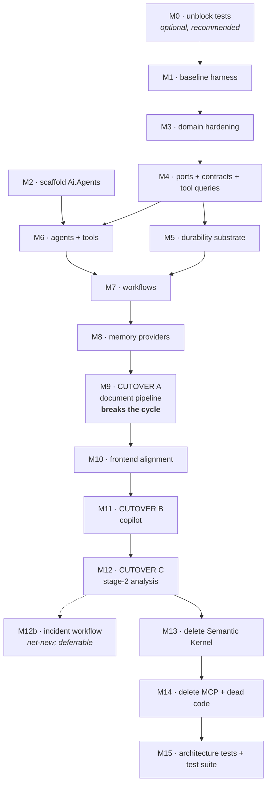

# Phase 3 — Migration Plan: Semantic Kernel → Microsoft Agent Framework

**Repository:** TelcoPilot (DDD Modular Monolith, .NET 10)
**Branch:** `feat-MAF-refinement(weyinmi)` — all work lands here (**D13**)
**Predecessors:** [Phase 1 audit](PHASE1_AI_ARCHITECTURE_AUDIT.md) · [Phase 2 design](PHASE2_AI_ARCHITECTURE_DESIGN.md)
**Status:** plan only. No code changed.
**Date:** 2026-07-10

---

## 1. What this document is

The sequence of commits that moves TelcoPilot from Semantic Kernel to Microsoft Agent Framework, and the evidence that each one is safe.

It is a **milestone plan**, not a task-by-task implementation plan. The directive separates Phase 3 (*"produce migration milestones"*) from Phase 4 (*"implement the migration module-by-module"*). Each milestone below gets its own task-level breakdown — with real code in every step — when we reach it in Phase 4. Writing 15 milestones' worth of line-level code now would be speculative: milestone M6 depends on interfaces defined in M4, which will look different once M3 lands.

Every milestone states: **goal, files, what it depends on, how you know it worked, and how to undo it.**

---

## 2. The finding that de-risks this migration

Phase 2 §14 flagged the cutover as *"the single riskiest moment"* — one commit swapping the AI runtime with no compiling test suite behind it.

Reading the code more closely, that framing was too pessimistic, and the reason is worth stating up front:

> **`HeuristicNetworkBatchAnalyzer` is deterministic, and it is the default code path.**

`appsettings.json` ships `Ai:Provider = "Mock"`. So the pipeline that actually runs on every developer machine and in every demo computes anomalies from fixed thresholds — signal drop ≥ 30, load ≥ 85, latency ≥ 100 — with no model involved. Same CSV in, same `IngestionRunSummary` out, every time.

Phase 2 §12 extracts exactly those thresholds into `AnomalyThresholdPolicy`. That gives us a **precise, checkable parity contract**:

> Feed the same network log through the pipeline before and after the migration, in offline mode. `EventsParsed`, `AnomaliesDetected`, `AlertsCreated`, `AlertsUpdated`, `OptimizationsCreated` and `TopologyChanged` must be identical.

This answers the open "parity baseline" question carried since Phase 1. **The baseline is offline mode, and it is exactly preservable** — because the thresholds move, they do not get reinterpreted by a model. The prose the copilot writes will change. The numbers the pipeline produces must not.

Three further facts, each verified in the code, shrink the risk further.

| Fact | Consequence |
| --- | --- |
| Semantic Kernel appears in exactly **16 files, all under `Modules.Ai.Infrastructure`** | Nothing outside the AI module needs to change to delete it |
| There are **no EF migrations**. `MigrationExtensions.EnsureSchemaAsync` creates tables from the model idempotently and adds **only nullable columns** to existing tables | New tables (`outbox_messages`, `workflow_checkpoints`) appear automatically. `ProcessingStage` and `CheckpointId` are nullable, so they auto-add. **No migration files to write.** |
| `UploadedDocumentDto` already carries a `Status` field, and the frontend's `request()` helper gates on `if (!res.ok)` | Changing `201 Created` → `202 Accepted` needs **no DTO change** and no client-side status handling. `202` is `res.ok`. |

And the risk that grew rather than shrank:

| Fact | Consequence |
| --- | --- |
| **`frontend/src/app/(authed)/mcp/page.tsx` exists** and calls `/api/mcp/plugins` and `/api/mcp/invoke` | Deleting the MCP registry (**D4**) breaks a live UI page. It must be deleted in the same milestone. This was not visible from the backend audit. |

---

## 3. Constraints this plan obeys

| Source | Constraint |
| --- | --- |
| **D12** | End state contains no Semantic Kernel. No bridge, no adapter, no dual runtime. |
| **D13** | One branch. Coexistence permitted *inside* it; never on `main`. The branch merges as one complete replacement. |
| Directive | Every commit small, compilable, reversible. No massive rewrite. |
| Directive | Preserve business functionality. Avoid breaking changes where possible; declare them where not. |
| Owner decision | The test-project fix is deferred. §5 explains what that costs and how we compensate. |

### 3.1 The coexistence question, resolved

**D13** permits Semantic Kernel and MAF to coexist within the branch. That lets the cutover be **three small cutovers instead of one large one**, each independently revertible and independently verifiable:

```
M9   Document pipeline  → MAF.   SK still serves chat and Stage 2.
M11  Copilot            → MAF.   SK still serves Stage 2.
M12  Stage-2 analysis   → MAF.   SK now serves nothing.
M13  Delete SK.                  Mechanical — nothing references it.
```

At no point do SK and MAF serve the *same* request path. This directly retires the "single riskiest moment" risk from Phase 2 §14, replacing one large irreversible step with three small reversible ones. It is the main reason to prefer D13's reading over a single atomic cutover.

---

## 4. Milestone graph



M1–M8 are **additive and unwired**. Production behaviour is unchanged throughout. If the migration is abandoned at any point before M9, the branch can simply be deleted with no loss to `main`.

---

## 5. How the cutover is verified without a test suite

This is the open item Phase 2 §16 demanded an answer to.

### 5.1 What is actually broken

`tests/Modules.Network.UnitTests` has **154 test methods across 23 files** and does not compile. Ten `CS0535` errors originate in **three files**:

- `Ingestion/Stage2_Analyze/AnalyzeNetworkBatchCommandHandlerTests.cs`
- `Ingestion/Stage2_Analyze/SemanticKernelNetworkBatchAnalyzerTests.cs`
- `Pipeline.E2E/PipelineTestHost.cs`

All three reference `INetworkBatchAnalyzer` or the four `INetwork*Skill` interfaces, which gained a `string? rawContext` parameter in commit `0c7410c` and whose test doubles were never updated.

**Those three files reference types this migration deletes.** The owner's instinct to defer was sound: rewriting them now is work thrown away at M12.

### 5.2 What the deferral costs

The other **20 test files — covering the Network domain, alert deduplication, log parsers, the decision engine, ingestion-run state and the end-to-end pipeline — are collateral.** They compile fine. They cannot run, because one project fails to build.

So the deferral does not just delay three obsolete tests. It keeps **~151 healthy tests dark for the entire migration**, exactly across the code M3 and M12 touch most.

**M0 fixes this in three files by adding one parameter to each stub.** It is roughly ten lines and it is not "the test fix" — it is unblocking the suite that already exists. The three obsolete files still get deleted at M12.

I am flagging this once, concretely, and then proceeding either way. **M0 is marked optional. I recommend it strongly.** If M0 is skipped, §5.3 is the entire safety net.

### 5.3 The characterization harness — required regardless

Built at **M1**, before any source changes. It works because offline mode is deterministic.

```
1. docker compose up   (Postgres, Redis, Web.Api — Ai:Provider=Mock)
2. POST /api/network/ingest   with tests/fixtures/*.csv
   capture IngestionRunSummary → docs/baselines/ingest-<fixture>.json
3. POST /api/documents/upload with a fixture PDF + a fixture CSV
   capture final document Status after settling
4. POST /api/chat             with 5 fixed questions
   capture provider, attachments, and the shape of skillTrace
5. GET  /api/alerts, /api/energy/sites, /api/metrics
   capture row counts
```

The golden files are committed. After each cutover milestone the harness replays and diffs.

**What must match exactly** (the parity contract of §2):
`EventsParsed`, `AnomaliesDetected`, `AlertsCreated`, `AlertsUpdated`, `OptimizationsCreated`, `TopologyChanged`, and the terminal `IndexingStatus` of each uploaded document.

**What is expected to differ, and is reviewed by eye rather than diffed:**
the copilot's prose answer, its confidence number, and the contents of `skillTrace`. Phase 1 §4.11 recorded a suspicion that the current trace is fabricated — it is reconstructed from `msg.AuthorName` on tool messages, and falls through to a synthetic `("IntentParser","parseQuery")` entry when that is null. Under MAF the trace is built from real `AgentResponse.Messages` function-call content. **If the new trace differs from the old, that is the bug being fixed, not a regression.** M11 is where we find out.

### 5.4 The gate applied to every commit

```bash
dotnet build src/Web.Api/Web.Api.csproj -v q --nologo   # must be 0 errors
```

`src/` builds clean today (0 errors, 64 warnings). It must never regress. If M0 lands, add `dotnet test tests/Modules.Network.UnitTests`.

---

## 6. Milestones

Notation: **Depends on** · **Exit** (how you know it worked) · **Undo** (how to reverse it).

---

### M0 — Unblock the test project *(DEFERRED to M15 by owner decision, 2026-07-10)*

**Owner decision.** The test fixes are deferred to the end (M15) rather than done first. Rationale: all three broken files reference types this migration **deletes or retargets** (`SemanticKernelNetworkBatchAnalyzer` and its skills at M12; `HeuristicNetworkBatchAnalyzer` → `AnomalyThresholdPolicy` at M12). Fixing them at M0 and rewriting them at M12 is throwaway work. Doing it once, at M15, is cleaner.

**Consequence, accepted.** The ~151 healthy tests that are only collateral-blocked (§5.2) stay dark for the whole migration. The **characterization harness (M1) is therefore the sole automated safety net** through every cutover. This was the documented fallback in §5.3.

**Attempted and reverted.** An M0 pass on 2026-07-10 revealed the breakage is larger than the audit's "5 CS0535 in 3 files": fixing the interface stubs surfaced **17 errors across 3 files** (CS0535 masking downstream CS1503 call-site and CS7036 constructor drift — `ProcessNetworkLogCommandHandler` and `SemanticKernelNetworkBatchAnalyzer` both gained constructor dependencies). All edits were reverted to keep the working tree at the clean documented baseline (`src` builds; `tests` does not compile). **M15 must budget for 17+ fixes, not 5** — see the note there.

**Depends on:** nothing.
**When done (at M15):** `dotnet build TelcoPilot.slnx` → 0 errors; `dotnet test` runs and is recorded.

---

### M1 — Baseline characterization harness

**Goal.** Capture the current behaviour of offline mode as committed golden files, before anything changes.

**Files (create):**
- `scripts/baseline/capture.ps1` and `scripts/baseline/replay.ps1`
- `tests/fixtures/network-log-small.csv`, `network-log-topology.csv`, `document-sample.pdf`
- `docs/baselines/*.json`

**Depends on:** nothing. Touches no `src/` file.
**Exit:** `replay.ps1` run twice against an unchanged build produces a zero diff. *If it does not, the harness is not deterministic and must be fixed before proceeding — this is the load-bearing assumption of the whole plan.*
**Undo:** delete the directory. No production impact.

---

### M2 — Scaffold `Modules.Ai.Agents`

**Goal.** A new project that compiles, references MAF, and is referenced by nothing.

**Files (create):**
- `src/Modules/Ai/Modules.Ai.Agents/Modules.Ai.Agents.csproj`
  - `ProjectReference` → `Modules.Ai.Application` only
  - `PackageReference` → `Microsoft.Agents.AI`, `Microsoft.Agents.AI.Workflows`, `Microsoft.Agents.AI.OpenAI`, `Azure.AI.OpenAI`, `Azure.Identity` — **pinned to explicit versions**
- Empty folders: `Agents/`, `Tools/`, `Workflows/Executors/`, `Memory/`, `Sessions/`, `Prompts/`, `Configuration/`
- `TelcoPilot.slnx` — add the project

**Depends on:** nothing.
**Exit:** `dotnet build src/Web.Api/Web.Api.csproj` → 0 errors. The new project builds standalone. Semantic Kernel still serves every request.
**Undo:** `git revert`. Nothing references it.

**Note.** Several MAF packages are prerelease (`Microsoft.Agents.AI.OpenAI`) and the observed versions skew (`Workflows` 1.13.0 vs `DurableTask` 1.4.0-preview). Pin them. Do not take `--prerelease` floating.

---

### M3 — Domain hardening (no AI involved)

**Goal.** Extract business rules out of AI code and remove infrastructure from the domain. **Behaviour must not change.**

**Files (modify):**
- `src/Modules/Ai/Modules.Ai.Domain/Modules.Ai.Domain.csproj` — drop `Pgvector`
- `src/Modules/Ai/Modules.Ai.Domain/Knowledge/KnowledgeChunk.cs` — `Vector` → `float[]`
- `src/Modules/Ai/Modules.Ai.Infrastructure/Database/Configurations/KnowledgeChunkConfiguration.cs` — add an EF value converter `float[] ↔ Pgvector.Vector`, `HasColumnType("vector(1536)")`
- `src/Modules/Ai/Modules.Ai.Domain/Documents/IndexingStatus.cs` — add `Cancelled = 5`
- `src/Modules/Ai/Modules.Ai.Domain/Documents/ManagedDocument.cs` — add nullable `ProcessingStage`, `CheckpointId`; add `MarkCancelled()`, `RecordProgress(stage, checkpointId)`

**Files (create):**
- `src/Modules/Network/Modules.Network.Domain/Analysis/AnomalyThresholdPolicy.cs` — thresholds lifted verbatim from `HeuristicNetworkBatchAnalyzer.cs:68,90,110`
- `src/Modules/Network/Modules.Network.Domain/Runbooks/RunbookPolicy.cs` — the `switch` lifted from `RecommendationSkill.cs:24-48`

**Files (modify, to delegate):**
- `HeuristicNetworkBatchAnalyzer.cs` — now calls `AnomalyThresholdPolicy`. Same numbers out.
- `RecommendationSkill.cs`, `MockCopilotOrchestrator.SuggestActionsFor` — both call `RunbookPolicy`, ending the duplicated playbook text (Phase 1 §4.9)

**Depends on:** M1 (need the baseline to prove behaviour is unchanged).
**Exit:**
- `dotnet build` → 0 errors
- `replay.ps1` → **zero diff**. This is the whole point of the milestone.
- Fresh-database check: `docker compose down -v && docker compose up` → `knowledge_chunks.embedding` is still `vector(1536)`; RAG search returns rows.

**Undo:** `git revert`. Note the DB column is unchanged either way — the converter is a mapping concern.

**Risk — the sharpest in this plan.** `AddMissingColumnsAsync` adds columns; it never *alters* a column's type. If the value converter causes EF to expect a different column type, an **existing** database silently mismatches while a **fresh** one works. Verify against both. This is the one milestone where a fresh-DB-only test is insufficient.

---

### M4 — Application ports, contracts, and consolidated tool queries

**Goal.** Give `Modules.Ai.Agents` something to depend on that is not infrastructure.

**Files (create):** under `src/Modules/Ai/Modules.Ai.Application/`
- `Ports/IEmbeddingGenerator.cs`, `IKnowledgeSearch.cs`, `IDocumentStorage.cs`, `ITextExtractor.cs`, `IChunker.cs`, `IAgentSessionStore.cs`
- `Knowledge/IndexKnowledgeCommand.cs`, `SearchKnowledgeQuery.cs`
- `Copilot/Conversations/GetConversationMessagesQuery.cs`, `AppendMessagesCommand.cs`
- `Tools/` — the **twelve** capability queries of Phase 2 §6.2, each with its handler, each dispatching to a module `.Api`

**Depends on:** M3.
**Exit:** `dotnet build` → 0 errors. Every new query has a handler and is resolvable from `ISender`. Nothing calls them yet. `replay.ps1` → zero diff.
**Undo:** `git revert`.

**Note.** The existing four `Tools/*ToolQuery` types stay untouched here; `InternalToolsSkill` still dispatches them. They are deleted at M11 with the copilot cutover.

---

### M5 — Durability substrate (unwired)

**Goal.** Outbox and checkpoint storage exist and are tested in isolation. Nothing publishes to them.

**Files (create):**
- `src/Modules/Ai/Modules.Ai.Infrastructure/Outbox/OutboxMessage.cs` + EF configuration → table `ai.outbox_messages`
- `src/Modules/Ai/Modules.Ai.Infrastructure/Outbox/OutboxProcessor.cs` (`BackgroundService`) — registered but idle; the table is empty
- `src/Modules/Ai/Modules.Ai.Infrastructure/Checkpointing/PostgresCheckpointStore.cs` : `ICheckpointStore<JsonElement>` → table `ai.workflow_checkpoints`

**Depends on:** M4.
**Exit:**
- `dotnet build` → 0 errors
- `docker compose up` on an **existing** volume → both tables appear. This exercises `EnsureSchemaAsync`'s new-table path. *Verify. Phase 1 read the code; nobody has run it for a new table.*
- `replay.ps1` → zero diff (the processor has nothing to process)

**Undo:** `git revert`. The two tables remain, empty and unreferenced. Harmless.

**Open.** `ICheckpointStore<JsonElement>`'s member list was never read (Phase 2 §2). **The first task of M5 is to read the interface and confirm the shape**, before writing the Postgres implementation. If it does not fit a relational store cleanly, fall back to `CheckpointManager.CreateInMemory()` for M7–M12 and revisit; durability is a hosting concern by **D6**, so this does not block the migration.

---

### M6 — Agents and tools

**Goal.** The five agents of Phase 2 §5.1 and the twelve tools of §6.2, in `Modules.Ai.Agents`. Wired to nothing.

**Files (create):** `Modules.Ai.Agents/`
- `Configuration/AgentNames.cs`, `AiOptions.cs`
- `Prompts/OperationsCopilot.cs`, `IncidentAnalysis.cs`, `RootCause.cs`, `DocumentIntake.cs`, `Topology.cs`
- `Tools/NetworkTools.cs`, `AlertTools.cs`, `EnergyTools.cs`, `KnowledgeTools.cs`, `GeoTools.cs`, `DocumentTools.cs` — each takes `ISender`, each method one dispatch (**D8**)
- `Agents/OperationsCopilotAgentBuilder.cs` and four more builders
- `Infrastructure/DeterministicChatClient.cs` : `IChatClient` — offline mode (**D7**)

**Files (modify):**
- `Modules.Ai.Infrastructure.csproj` — add `ProjectReference` → `Modules.Ai.Agents`. The composition root must be able to construct the agents (Phase 2 §4.1). This is the *only* project permitted to reference `Modules.Ai.Agents`.

**Depends on:** M2, M4.
**Exit:** `dotnet build` → 0 errors. Each builder's `Build()` is **synchronous** (Phase 2 Appendix A: do not copy the reference repo's `.Result`). Unit-test each agent against `DeterministicChatClient` — no network, no database. `replay.ps1` → zero diff; nothing is registered in `AddAiModule`.
**Undo:** `git revert`.

---

### M7 — Workflows

**Goal.** Three MAF workflow graphs. Wired to nothing.

**Files (create):** `Modules.Ai.Agents/Workflows/`
- `DocumentIngestionWorkflow.cs` + `Executors/{ExtractText,ValidateRelevance,ChunkText,EmbedChunks,PersistKnowledge,PublishIndexed,MarkRejected}Executor.cs`
- `NetworkLogAnalysisWorkflow.cs` + executors (threshold pre-filter, parallel fan-out per Phase 2 §7.2)
- `IncidentInvestigationWorkflow.cs` + `Executors/{Correlation,Notification}Executor.cs`

**Depends on:** M5, M6.
**Exit:**
- `dotnet build` → 0 errors
- Each executor implements `OnCheckpointingAsync` / `OnCheckpointRestoredAsync`
- **Kill-and-resume test:** run `DocumentIngestionWorkflow` over a fixture with `CheckpointManager`, abort after `EmbedChunks`, resume via `InProcessExecution.ResumeStreamingAsync`, assert it does not re-embed. *This is the proof that resumability works. Do it here, in isolation, before it matters.*
- `EmbedChunks` partitions to ≤ 2048 inputs — assert with a 5,000-chunk input
- `replay.ps1` → zero diff

**Undo:** `git revert`.

**Open.** `RequestInfoExecutor`'s C# signature was never read. It is not used by these three workflows. Ignore until a human-in-the-loop workflow is actually needed.

---

### M8 — Memory providers

**Goal.** Conversation history and knowledge retrieval as MAF providers. Wired to nothing.

**Files (create):** `Modules.Ai.Agents/Memory/`
- `PostgresChatHistoryProvider.cs` : `ChatHistoryProvider` — `ProvideChatHistoryAsync` / `StoreChatHistoryAsync`, dispatching through `ISender` (**D8**), session state via `ProviderSessionState<T>`
- `KnowledgeContextProvider.cs` : `AIContextProvider` (or `TextSearchProvider` with a `SearchAdapter` over `SearchKnowledgeQuery`)
- `Sessions/AgentSessionSerializer.cs` — `agent.SerializeSession` / `DeserializeSessionAsync`, bound to the authenticated user (**D5**)

**Depends on:** M6.
**Exit:** `dotnet build` → 0 errors. Provider instances hold **no per-session state** — this is a documented MAF requirement and a silent multi-user data-leak bug if violated. Unit-test two concurrent sessions against one provider instance and assert their histories do not cross. `replay.ps1` → zero diff.
**Undo:** `git revert`.

---

### M9 — CUTOVER A · document pipeline *(behaviour changes here)*

**Goal.** Upload returns immediately. Ingestion runs asynchronously. **The runtime cycle is broken.**

**Files (modify):**
- `Modules.Ai.Application/Documents/UploadDocument/UploadDocumentCommandHandler.cs` — store file, insert `ManagedDocument`, insert `OutboxMessage(DocumentUploaded)`, **one transaction**, return. Delete the inline `ingestion.IngestAsync` call.
- `src/Web.Api/Endpoints/Documents/Documents.cs` — `Results.Created` → `Results.Accepted`
- `Modules.Ai.Infrastructure/DependencyInjection.cs` — register `DocumentIngestionWorkflowHost`
- `Modules.Ai.Infrastructure/Rag/Ingestion/DocumentIngestionService.cs` — **delete `TryDispatchNetworkPipelineAsync`**. This is the cycle break (**D9**).

**Files (create):**
- `Modules.Network.Application/Ingestion/DocumentUploadedHandler.cs` — Network subscribes and decides *for itself* whether the file is a network log
- `Modules.Ai.Infrastructure/Hosting/DocumentIngestionWorkflowHost.cs`
- `Application.Abstractions/Events/DocumentUploaded.cs`

**Files (modify, csproj):**
- `Modules.Ai.Infrastructure.csproj` — **remove `ProjectReference` to `Modules.Network.Application`**

**Depends on:** M8.
**Exit:**
- `dotnet build` → 0 errors. *The removed project reference is the proof the cycle is gone — it will not compile otherwise.*
- `replay.ps1` — upload a CSV; poll until terminal. **`IngestionRunSummary` counts must match the M1 baseline exactly.** Timing differs; numbers do not.
- Upload returns `202` in well under a second.
- **Crash test:** upload, `docker kill` the API mid-workflow, restart. The document resumes from its last checkpoint and reaches `Indexed`. *This is the directive's resumability requirement, demonstrated rather than asserted.*

**Undo:** `git revert`. Restores synchronous ingestion. Unprocessed outbox rows are ignored by the old code. The new tables and nullable columns are inert.

**Breaking change.** `POST /api/documents/upload`: `201` → `202`, and `status` is now `"Pending"` rather than `"Indexed"`. The response body shape is unchanged. Frontend follows in M10 — **these two milestones ship together or the documents page shows a permanently "Pending" row.**

---

### M10 — Frontend alignment

**Goal.** The UI reflects asynchronous ingestion.

**Files (modify):**
- `frontend/src/lib/types.ts:203` — `IndexingStatus` union gains `"Cancelled"`
- `frontend/src/app/(authed)/documents/page.tsx:31` — `STATUS_TONE` gains a `Cancelled` entry. *This is a `Record<IndexingStatus, …>`; omitting it is a TypeScript compile error, not a runtime bug.*
- `frontend/src/app/(authed)/documents/page.tsx` — poll `refresh()` on an interval while any row is `Pending` or `InProgress`; stop when none are. Today `onUploaded` calls `refresh()` exactly once.

**Depends on:** M9.
**Exit:** `npm run build` passes. Upload a document; the row transitions `Pending → InProgress → Indexed` without a manual refresh.
**Undo:** `git revert`.

**No change needed** to `frontend/src/lib/api.ts` — `request()` gates on `if (!res.ok)`, and `202` is ok. Verified, not assumed.

---

### M11 — CUTOVER B · copilot

**Goal.** `OperationsCopilotAgent` replaces both orchestrators.

**Files (modify):**
- `Modules.Ai.Application/Copilot/AskCopilot/AskCopilotCommandHandler.cs` — resolve the keyed `AIAgent`, pass an `AgentSession`. **Conversation history now reaches the model** (fixes Phase 1 §4.7).
- `Modules.Ai.Infrastructure/DependencyInjection.cs` — register the agent; unregister `ICopilotOrchestrator`
- Map `AgentResponse.Messages` → `SkillTraceEntry[]` so `CopilotAnswer` keeps its shape

**Files (delete):**
- `Modules.Ai.Application/SemanticKernel/ICopilotOrchestrator.cs`
- `SemanticKernel/SemanticKernelOrchestrator.cs`, `MockCopilotOrchestrator.cs`
- `SemanticKernel/Skills/*.cs` (7 files)
- `Modules.Ai.Application/Tools/*ToolQuery.cs` (4 files, superseded by M4)
- `Modules.Ai.Domain/Conversations/ChatLog.cs`, `Repositories/ChatLogRepository.cs`

**Depends on:** M10.
**Exit:**
- `dotnet build` → 0 errors
- **Multi-turn works.** Ask "what is the status of TWR-LEK-003?", then "and its neighbours?". The second answer must resolve the pronoun. *This has never worked. It is the acceptance test.*
- `replay.ps1` — prose and `skillTrace` **differ; review by eye.** `provider` and `attachments` should still populate. Structured endpoints unchanged.

**Undo:** `git revert`.

**Expected divergence, not a regression.** If `skillTrace` was previously always the synthetic `("IntentParser","parseQuery")` entry (Phase 1 §4.11), M11 is where that is confirmed and fixed. Record what the old trace actually contained *before* reverting anything.

---

### M12 — CUTOVER C · stage-2 analysis

**Goal.** `NetworkLogAnalysisWorkflow` replaces the batch analyzer. Semantic Kernel now serves nothing.

**Files (modify):**
- `Modules.Network.Application/Ingestion/Stage2_Analyze/AnalyzeNetworkBatchCommandHandler.cs` — invoke the workflow
- Move `AiAnalysisResult`, `DetectedAnomaly`, `AnomalyType`, `TopologyDelta` → `Modules.Ai.Application/Contracts/` (Phase 1 §4.2 #5)

**Files (delete):**
- `Modules.Network.Application/Ingestion/Stage2_Analyze/INetworkBatchAnalyzer.cs`
- `Modules.Ai.Infrastructure/Pipeline/**` — `SemanticKernelNetworkBatchAnalyzer`, `HeuristicNetworkBatchAnalyzer`, the 4 Stage-2 skills, `KernelJsonInvoker`, `AiPipelineJson`, the 4 validators
- `Modules.Ai.Infrastructure/Rag/Ingestion/AiDocumentValidator.cs`, `MockDocumentValidator.cs`

**Files (delete or retarget — tests):**
- `tests/.../Stage2_Analyze/AnalyzeNetworkBatchCommandHandlerTests.cs` — delete; the analyzer interface is gone
- `tests/.../Stage2_Analyze/SemanticKernelNetworkBatchAnalyzerTests.cs` — delete
- `tests/.../Stage2_Analyze/HeuristicNetworkBatchAnalyzerTests.cs` — **retarget onto `AnomalyThresholdPolicy`.** These tests encode the threshold behaviour the parity contract depends on. Do not delete them; point them at the domain policy that now owns those thresholds.
- `tests/.../Stage2_Analyze/AiAnalysisResultValidatorTests.cs` — retarget onto the workflow's `JoinAndValidate` executor, or delete if validation moved into typed agent output
- `tests/.../Pipeline.E2E/PipelineTestHost.cs` — update to build the new workflow host

**Depends on:** M11.
**Exit:**
- `dotnet build` → 0 errors
- `replay.ps1` — **`AnomaliesDetected`, `AlertsCreated`, `OptimizationsCreated`, `TopologyChanged` identical to the M1 baseline.** This is the parity contract of §2. A diff here means `AnomalyThresholdPolicy` was not a faithful extraction.
- `grep -rl Microsoft.SemanticKernel src` → only `DependencyInjection.cs` and `FileMcpClient.cs` remain

**Undo:** `git revert`.

---

### M12b — Wire `IncidentInvestigationWorkflow` *(net-new capability)*

**Goal.** Deliver the directive's headline event flow: `AlarmReceived → Investigation → Recommendation → Notification`.

**Files (create):**
- `Modules.Alerts.Application/.../AlarmReceived.cs` integration event, published when an alert is created
- `Modules.Ai.Infrastructure/Hosting/IncidentInvestigationWorkflowHost.cs`

**Files (modify):**
- `Modules.Ai.Infrastructure/DependencyInjection.cs` — subscribe the host

**Depends on:** M12.
**Exit:** Ingest a fixture that creates a critical alert. The workflow runs, `RootCauseAgent` is invoked once, `RunbookPolicy` returns three actions, a notification is recorded. `replay.ps1` structured counts unchanged — *investigation is additive; it must not alter alert or optimization counts.*
**Undo:** `git revert`.

**Scope note.** This milestone builds something that does not exist today. It is **not** part of the SK→MAF replacement and can be deferred past M15 without affecting D12. It is listed here because Phase 2 §7.3 designed it and the directive names it explicitly. If the schedule tightens, cut this first.

---

### M13 — Delete Semantic Kernel

**Goal.** Remove the framework. Mechanical; nothing references it.

**Files (modify):**
- `Modules.Ai.Infrastructure/DependencyInjection.cs` — delete the `Kernel` factory, the `useAzure` skill registrations, the dead `PromptExecutionSettings` singleton (Phase 1 §4.8)
- `Modules.Ai.Infrastructure.csproj` — drop `Microsoft.SemanticKernel` and `Microsoft.SemanticKernel.Connectors.AzureOpenAI` (both `1.75.0`)

**Files (delete):** `Mcp/Clients/FileMcpClient.cs` (and `FileMcpClientInitializer`) — the last SK importer, and the `npx` Node subprocess (**D4**)

**Depends on:** M12.
**Exit:**
- `grep -rl "Microsoft.SemanticKernel" src` → **empty**
- `grep -rn "SemanticKernel" src --include=*.csproj` → **empty**
- `dotnet build` → 0 errors
- `replay.ps1` → structured outputs match baseline
- App starts without spawning `npx`

**Undo:** `git revert`. **D12 is satisfied at this commit.**

---

### M14 — Delete the MCP registry and the remaining dead code

**Goal.** Phase 5 begins. No dead code remains.

**Files (delete):**
- Backend: `Mcp/Contracts/`, `Mcp/Registry/`, `Mcp/Clients/McpInvoker.cs`, `Mcp/Adapters/**`, `Mcp/Plugins/**` (4 plugins), `src/Web.Api/Endpoints/Mcp/Mcp.cs`
- **Frontend: `frontend/src/app/(authed)/mcp/page.tsx`** and the `McpPlugin` / `McpCapability` / `McpInvocationResult` types, plus its nav entry. *Deleting the API without this leaves a page that 404s.*
- `Rag/Storage/Providers/OneDriveDocumentStorageProvider.cs`
- `Rag/Ingestion/DocumentSyncService.cs` + `SyncDocumentsCommand` + the `/documents/sync` endpoint + `api.syncDocuments`
- `Modules.Ai.Application/SemanticKernel/` — the vendor-named namespace (Phase 1 §4.2 #6)

**Files (modify):**
- `src/Web.Api/Extensions/SeedExtensions.cs` — remove RAG indexing from the startup path (Phase 1 §4.10 #7)
- Collapse the double boot seed (Phase 1 §4.10 #8)
- `Modules.Ai.Infrastructure/Rag/Indexing/EnergyKnowledgeIndexer.cs` — content-hash dirty check
- `Modules.Ai.Infrastructure/Rag/Embeddings/` — add `CachingEmbeddingGenerator` over `ICacheService`

**Depends on:** M13.
**Exit:** `dotnet build` → 0 errors; `npm run build` passes. Startup no longer performs embeddings. `replay.ps1` → structured outputs match. `/api/mcp/*` returns 404 and nothing links to it.
**Undo:** `git revert`.

---

### M15 — Architecture tests and test-suite restoration

**Goal.** Make the dependency rules mechanical. Phase 1's evidence is that review alone does not hold them.

**Files (create):**
- `tests/Architecture.Tests/DependencyRuleTests.cs` — assert each rule of Phase 2 §4.2:
  - `Modules.Ai.Domain` references no AI or vector package
  - `Modules.Ai.Agents` references no repository type and no `Modules.Ai.Infrastructure` type
  - No `Modules.Ai.*` assembly references another module's `.Application`
  - `Web.Api` references no `Modules.Ai.Domain` or `Modules.Ai.Agents` type
  - No type named `*Ai*` or `*Agent*` outside `src/Modules/Ai/`

**Files (modify):** `tests/Modules.Network.UnitTests/**` — restore green. This absorbs the deferred M0 work. Budget for **17+ compile fixes across at least 3 files**, not the audit's 5: CS0535 stub-signature drift, CS1503 call-site drift (`AnalyzeAsync`/`InvokeAsync` gained a `string?` parameter — pass `cancellationToken:` by name), and CS7036 constructor drift (`ProcessNetworkLogCommandHandler` and `SemanticKernelNetworkBatchAnalyzer` both gained an `IFileStagingService` and/or `ILogger` dependency — supply a `NullFileStaging` stub and `NullLogger`). Delete the two obsolete SK-analyzer test files; retarget `HeuristicNetworkBatchAnalyzerTests` onto `AnomalyThresholdPolicy` (§6, M12).

**Depends on:** M14.
**Exit:** `dotnet test` → all green. Deliberately introducing a violation makes a test fail.
**Undo:** `git revert`.

---

## 7. Rollback

Every milestone is one commit and `git revert` undoes it. Three properties make that true, and each was checked rather than assumed:

1. **Schema changes are additive and forward-compatible.** New tables (`outbox_messages`, `workflow_checkpoints`); new **nullable** columns (`processing_stage`, `checkpoint_id`); a new enum *value* (`Cancelled = 5`, an `int`, no DDL). Old code ignores all of it. `AddMissingColumnsAsync` only ever adds nullable columns — this is why the design chose nullable ones.
2. **No data is destroyed until M14**, and M14 deletes only code.
3. **M9 is the first commit that changes observable behaviour.** Everything before it is inert. Abandoning the migration at any point up to M8 costs nothing — delete the branch.

The one asymmetry: **reverting M9 after documents have been uploaded** leaves rows in `ai.outbox_messages` that the reverted code never drains. They are inert. Truncate the table if it offends.

---

## 8. Breaking changes

| Change | Consumer | Milestone | Mitigation |
| --- | --- | --- | --- |
| `POST /documents/upload` `201` → `202`, `status` `"Indexed"` → `"Pending"` | `frontend/src/lib/api.ts:253` | M9 | Body shape unchanged. `request()` gates on `res.ok`. Polling added in M10. **Unavoidable** — the directive requires both "upload never waits for AI" and "avoid breaking changes"; they conflict, and the first wins. |
| `IndexingStatus` gains `Cancelled` | `frontend/src/lib/types.ts:203`, `documents/page.tsx:31` | M3 → M10 | `STATUS_TONE` is a `Record<IndexingStatus, …>`; a missing key is a compile error. Caught at build. |
| `GET/POST /api/mcp/*` deleted | `frontend/src/app/(authed)/mcp/page.tsx` | M14 | Delete the page and its nav entry in the same commit. |
| `POST /documents/sync` deleted | `api.syncDocuments` | M14 | Feature was fire-and-forget with no progress reporting (Phase 1 §4.10 #9). Superseded by the workflow. |
| `CopilotAnswer.skillTrace` contents change | `frontend/src/components/Copilot.tsx` | M11 | **Shape is preserved**, so no code change. Contents become real instead of possibly synthetic. |

---

## 9. What Phase 4 does

Phase 4 takes each milestone and produces a task-level plan with real code per step, following the repository's TDD conventions where a compiling test project allows it.

Recommended execution order, and where to pause for review:

- **M0 → M1** together. Nothing is at risk, and everything downstream depends on the harness being trustworthy.
- **M2 → M8** can run with light review. All additive, all inert.
- **M9, M11, M12** each get a full review and a harness replay before the next begins. These are the three moments behaviour changes.
- **M12b** is net-new capability, not migration. Do it after M12 if there is schedule; defer it past M15 if there is not. It never blocks the SK deletion.
- **M13 → M15** are deletion and hardening.

---

## 10. Open items

| # | Item | Owner | Needed by |
| --- | --- | --- | --- |
| 1 | ~~Approve or decline M0.~~ **Resolved 2026-07-10: deferred to M15.** ~151 healthy tests stay dark for the migration; the M1 harness is the sole net (§5.2, M0). | Repo owner | ✅ decided |
| 2 | Read `ICheckpointStore<JsonElement>`'s members and confirm a relational implementation fits. Fallback: in-memory checkpoints, per **D6**. | Implementer | M5 |
| 3 | Confirm the deployed Azure OpenAI model supports the **Responses** API (**D3**). If not, fall back to the Chat Completions client — function tools and local MCP still work. | Repo owner | M6 |
| 4 | Decide whether `EnergyObservations` needs an LLM at all (Phase 2 §7.2). Evidence says it re-fetches and re-serialises live state. | Implementer | M7 |
| 5 | Confirm `AnomalyThresholdPolicy` reproduces `HeuristicNetworkBatchAnalyzer` exactly, including the empty-input short-circuit. | Implementer | M3 |

---

## 11. Approval gate

Phase 3 is complete. No code has been changed.

The parity baseline question, open since Phase 1, is now answered: **offline mode is the baseline, it is deterministic, and §2 states the exact contract.** The cutover-validation question, raised in Phase 2 §14, is answered in two parts: split the cutover into three reversible steps (§3.1), and gate every one of them on a characterization harness built before anything moves (§5.3).

Awaiting approval to proceed to **Phase 4 — Implementation**, beginning with M0 and M1.
